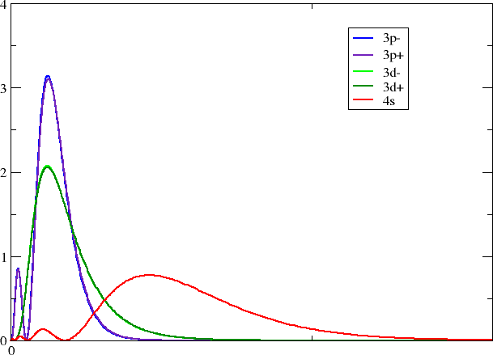

:orphan:

.. _GRASP_computer_exercises:

************************
GRASP computer exercises
************************

The following exercises are to be done in groups of 2-3 students. Each group shall cover different groups/atoms of the periodic table of elements.
At the end of the day, all groups should give a short presentation on their findings to the other groups.

In order to run a GRASP calculation you need an input file of arbitrary name, e.g. :file:`grasp.inp` which will be setup in the
following. The run-command inside your cluster run script looks as::

  $ grasp.x < grasp.inp > grasp.out

where the GRASP output is re-directed to the file :file:`grasp.out`. Make sure that you give a proper name to your output
file if you want to take a look at what you did back home.

Unless otherwise stated we will always use a Gaussian nuclear model in GRASP.

Exercises - Day 1
=================

Nuclear models in GRASP
-----------------------

The electron-nucleus interaction in the electronic Hamiltonian is :math:`V_{en}=-e\phi_{nuc}` 
where :math:`\phi_{nuc}`  is the nuclear scalar potential

.. math::

   \phi_{nuc}(\mathbf{r}_1) = \frac{1}{4\pi\varepsilon_0}\int\frac{\rho_{nuc}(\mathbf{r}_2)}{\left|\mathbf{r}_1-\mathbf{r}_2\right|}d^3\mathbf{r}_2

GRASP offers four different models for the nuclear charge distribution :math:`\rho_{nuc}` : the point charge, the homogeneously charged sphere, 
the Fermi 2-parameter charge distribution and the Gaussian charge distribution.
You find more information about these models `at this URL <http://www.few.vu.nl/~visscher/FiniteNuclei/FiniteNuclei.htm>`_ .
(Note that there is a systematic error in this source in that the potentials come with a negative sign whereas this comes from multiplication of 
the electron charge to give the electron-nucleus interaction).

We will start with calculations on a one-electron system for each of the four nuclear models.
The corresponding downloadable Grasp input file for is :download:`grasp_1el_atom.inp <grasp_1el_atom.inp>`.

This is how you change the nucleus model:
* point nucleus::

   NUC 0

* finite nucleus (Uniform Sphere)::

   NUC 1

* finite nucleus (Fermi)::

   NUC 2

* finite nucleus (Gaussian)::

   NUC 3

**Questions**:

1. How does the use of a finite-nucleus model affect the total energy of an atom compared to the point-nucleus model ?

2. What is the effect of nucleau model on the spin-orbit splitting ?

3. Do differences between finite-nuclear models increase or decrease with the increasing atom's nuclear charge *Z* ?

Exercises - Day 2
=================

.. note:: A database for atomic data can be found `here <http://physics.nist.gov/PhysRefData/Handbook/periodictable.htm>`_ .

Atomic numerical calculations
-----------------------------

In order to get started on "real" atoms we calculate the average level structure of two possible ground state configurations of coinage-metals (Cu, Ag, Au, Rg), using GRASP.
The input file for download is :download:`grasp_Cu.inp <grasp_Cu.inp>`.

Run all atoms of the coinage-metal series::

   Cu: Z = 29,  A =  63
   Ag: Z = 47,  A = 107
   Au: Z = 79,  A = 197
   Rg: Z = 111, A = 283

In order to generate a less biased average set of orbital solutions (degeneracy of the d :math:`^9` s :math:`^2`: 10; d :math:`^{10}` s :math:`^1`: 2), 
compare your results with results from an additional calculation using:

::

  AL 10 2

.. note:: We explicitly set the maximum number of SCF iterations ("SCF NITIT=10") in order to allow Cu to converge (default SCF iteration = 6)

**Questions**:

1. The two candidates for the ground state configuration are :math:`(n-1)d^{10}ns^{1}` and :math:`(n-1)d^{9}ns^{2}`. For each configuration what are the possible 
values of total angular momentum :math:`J` ? Your answer will help you identify the ground state configuration by looking at the list of energies of the individual 
atomic levels. 

2. Does the ground state configuration vary down the coinage-metal series?

3. How does the d-s excitation energy (:math:`(n-1)d^{10}ns^{1}\rightarrow (n-1)d^{9}ns^{2}`) change down the coinage-metal series?

Spin-orbit mixing within a group
--------------------------------

In this exercise we shall investigate how spin-orbit mixing evolves as we descend a column of the periodic table. 
We will consider group 14, that is, the carbon group. A sample input, for silicium is given :download:`grasp_Si.inp <grasp_Si.inp>`.

The :math:`3p^2` electron configuration of silicium gives rise the three LS-states: :math:`^3P`, :math:`^1D` and :math:`^1S`. 
With the introduction of spin-orbit coupling they are split into :math:`^3P_2`, :math:`^3P_1`, :math:`^3P_0`, :math:`^1D_2` and :math:`^1S_0` (verify this !) 
and states with the same :math:`J` may interact and mix. This means for instance that :math:`^3P_2` and :math:`^1D_2` interact, leading to singlet-triplet mixing, 
forbidden in a non-relativistic framework. There is also possibility of mixing between :math:`^3P_0` and :math:`^1S_0`.

In order to understand how to proceed, let us first look at what an average level (AL) calculation means: 

In the GRASP input we specify one or more electron configurations. Assume that we generate all possible Slater 
determinants :math:`\left\{\Phi_I\right\}` corresponding to the configurations, and then build and diagonalize the Configuration 
Interaction (CI) matrix in the space of the Slater determinants

.. math::

   H\mathbf{c}_K=E_K\mathbf{c}_K;\quad H_{IJ} = \left<\Phi_I\left|H\right|\Phi_J\right>

This gives us a set of electronic states expressed in terms of atomic state functions 

.. math::

   \Psi_K = \sum_I^{N}\Phi_I c_{IK}

whose number is determined by the degeneracy of the state and where :math:`N` refers to the total number of Slater determinants 
and therefore number of microstates/atomic state functions.

In order to build the CI matrix we need orbitals. Rather than optimizing them for an individual electronic state we shall 
determine them by optimizing the *average energy*

.. math::

   E^{av} = \frac{1}{N}\sum_K^N \left<\Psi_K\left|H\right|\Psi_K\right>

This looks rather impossible because the average energy contains the atomic state function that we do not know until we have diagonalized the CI 
matrix, which we can not build before we have orbitals available. However, if we expand the atomic state functions in terms of determinants 
we obtain

.. math::

   E^{av} = \frac{1}{N}\sum_K^N \sum_I^N\sum_J^N \left<\Phi_I\left|H\right|\Phi_J\right>c^*_{IK}c_{JK} = \frac{1}{N}\sum_K^N \left<\Phi_K\left|H\right|\Phi_K\right>

We arrive at the final result bwcause the atomic state functions are orthonormal such that the expansion coefficients :math:`\left\{c_{IK}\right\}` form 
a unitary matrix. Now the average energy is expressed in terms of our set of Slater determinants and we may proceed. In fact, GRASP will first optimize the
orbitals by an SCF procedure based on the above expression and then solve the CI problem to get the individual atomic state functions and atomic level energies.

The atomic state functions have well-defined total angular momentum :math:`J`. In the "ANG" input section of GRASP we specify the desired :math:`J` for 
each electron configuration. If we want all possible values, we simply set "-1" as in the present case. A single Slater determinant is in general not an 
eigenfunction of :math:`J^2`. GRASP therefore constructs configuration functions (CSFs), that is, linear combinations of Slater determinants with well-defined 
:math:`J` and parity. These are by default listed in the output, but in the exercises above we had set "ANG 7" to suppress this output. 
With the above input we find for instance that the first CSF is generated from the valence configuration :math:`3p_{1/2}^13p_{2/2}^1` and has :math:`J=2` and even parity.
At the end of the GRASP output the composition of atomic state functions in terms of CSFs is listed. Since the CSFs are orthonormal the weight CSF of index :math:`I` 
to an atomic state function of index :math:`K` is simply :math:`\left|c_{IK}\right|^2`.

In order to investigate singlet-triplet mixing we also need to know the composition of atomic state functions in terms of LS-coupled CSFs. 
The third number "2" in line 2 in the above input makes GRASP also set up CSFs in LS-coupling. The non-relativistic CSFs are listed after the relativistic ones. 
With the present input we find that the first non-relativistic CSF couples to :math:`^3P_2`. The weight of non-relativistic CSFs to atomic state functions is listed 
after the relativistic ones.

**Questions**:

1. Does the singlet-triplet mixing (*state interaction*) increase or decrease with increasing *Z*? You can investigate this by monitoring the mixing of :math:`^3P_2` and :math:`^1D_2` 
in the lowest atomic level of :math:`J=2`, making a graph showing how the weight of :math:`^1D_2` evolves with increasing *Z*.

2. How much of the ground state is described by the :math:`np_{1/2}^{2}` configuration with increasing *Z*?  You can investigate this by monitoring the composition of the ground-state 
in terms of relativistic CSFs. You can calculate the effective occupation number of the :math:`np_{1/2}` orbital by, for each CSF, multiplying its occupation by the weight of the CSF, 
then summing up these numbers. You can then plot the effective occupation number of the :math:`np_{1/2}` orbital as a function of increasing *Z*. How do you interpret your result ?

Speed of light and the non-relativistic limit
---------------------------------------------

* Run an average-of-configuration SCF calculation on the gold atom; downloadable input  :download:`grasp_Au.inp <grasp_Au.inp>`.

* GRASP allows you to vary the speed of light, *c*, between *Z* < *c* < :math:`\infty`::

   SCF CON=x.xDx

* perform a non-relativistic calculation using a very large *c* value, *c* :math:`>> 137`::

   SCF CON=1.0D6

**Questions**:

1. Is it possible to set *c < Z*?

2. Can you argue from a comparison of the relativistic ("regular" speed-of-light)  and non-relativistic calculation why gold is *golden*? What about Ag?

3. Which spinors are stabilized by relativistic effects and which are destabilized?

Radial densities for the d-/p block
-----------------------------------

* Plot radial density for heavy elements, compare *s* and *d* functions (*d* block) resp. p :math:`_{1/2}` and p :math:`_{3/2}` (p block). 

A simple FORTRAN code :download:`orbpri.F` for doing it is available. Here we shall demonstrate how to use it for the copper atom. 
First we remind you that the form of relativistic atomic orbitals is

.. math::

   \left[\begin{array}{c}R^L\chi_{\kappa,m}\\iR^S\chi_{-\kappa,m}\\\end{array}\right] = \frac{1}{r}\left[\begin{array}{c}P\chi_{\kappa,m}\\iQ\chi_{-\kappa,m}\\\end{array}\right]

so the radial density is

.. math::

   n(r)=\left(\left\{R^L\right)^2+\left(R^S\right)^2\right\}r^2=\left(P^2+Q^2\right).

The input file for download is :download:`grasp_Cu_aver.inp <grasp_Cu_aver.inp>`.

The line ORBOUT specifies that the radial functions :math:`P` and :math:`Q` (and other information) is printed to file. This file will have unit number 11, as specified by the final number following the MCDF line.

We start up orbpri.x::

   $orbpri.x
   *** OUTPUT from ORBPRI ***
   Give unit number of orbital file to read

and we enter unit number 11::

   11
   *** OUTPUT from ORBPRI ***
   * Atomic number:               29.0
   * Number of grid points:       2080
   * First grid point:       0.345E-07
   * Grid step size :        0.100E-01
      
   * Number of orbitals read:       10
      
   Do you want info on orbitals (y/n) ?

Well, why not ?::

   y
   Orb.        E                   P0                     Q0
    1  1s       -332.845231246527    353.946570713740      0.000000000000
    2  2s        -41.883350988707    110.925718644588      0.000000000000
    3  2p-       -36.527466295898      0.975314932490      9.217465299856
    4  2p        -35.763812849690    769.447328175348      0.000000000000
    5  3s         -5.353239297458     41.725471888184      0.000000000000
    6  3p-        -3.614445494458      0.362775735823      3.428505650010
    7  3p         -3.511783710417    286.145123083999      0.000000000000
    8  3d-        -0.674391837066      0.265542615160      5.019157934192
    9  3d         -0.661421437065    264.801381125017      0.000000000000
   10  4s         -0.289259556935      9.151716417086      0.000000000000
   Select one of the following:
     1. Print radial functions P and Q.
     2. Print radial functions R(large) and R(small).
     3. Print radial distribution of individual orbitals.
     4. Exit.

We choose to look at the density of individual orbitals::

   3
   Name atom (A3)

The rest is then rather straightforward::

   Cu
   Outer radial point = :   36.862
   Give index of orbital to print(-1 to quit):
   6
   Give index of orbital to print(-1 to quit):
   7
   Give index of orbital to print(-1 to quit):
   8
   Give index of orbital to print(-1 to quit):
   9
   Give index of orbital to print(-1 to quit):
   10
   Give index of orbital to print(-1 to quit):
   -1
   *** EXITING ORBPRI ***

Looking in your working directory you now see a series of files with self-explanatory titles.
With your favorite plotting program you may now make a plot like this one

Each group should pick one of their favorite block/group.

::

   calculate the 3d, 4d, 5d, 6d block (coinage metals)
   calculate the 3d, 4d, 5d, 6d block (group: "Zn, Cd, Hg, Cn")
   calculate the 2p, 3p, 4p, 5p, 6p, 7p block (group 14)
   calculate the 2p, 3p, 4p, 5p, 6p, 7p block (group 16)

**Questions**:

1. How does the radial overlap between *s* and *d* resp. p :math:`_{1/2}` and p :math:`_{3/2}` change down a group?

2. Where would you expect the most open-shell character (at the top or bottom of a group)?

Using a non-relativistic or relativistically optimized basis set for heavy atoms?
---------------------------------------------------------------------------------

* run the Thallium atom with a non-relativistic double-:math:`\zeta`  basis set 
  (download the input file :download:`grasp_Tl_dz_nonrel.inp <grasp_Tl_dz_nonrel.inp>`)

* run the Thallium atom with a relativistic double-:math:`\zeta`  basis set:
  (download the input file :download:`grasp_Tl_dz_rel.inp <grasp_Tl_dz_rel.inp>`)

**Questions**:

1. How does the spin-orbit splitting from both basis set calculation compare with the experimental reference?

2. Can you recommend to use a non-relativistically optimized basis set in relativistic (four-component) calculation?  Why/why not?

3. What are the major qualitative differences between both basis sets?

Basis set quality
-----------------

* run the Bi atom numerically (if not already done in `Radial densities for the d-/p block`_)
  (input file for download, :download:`grasp_Bi.inp <grasp_Bi.inp>`):

* repeat the calculation using Ken Dyall's

  * double-:math:`\zeta` basis set
    (input file for download, :download:`grasp_Bi_dz.inp <grasp_Bi_dz.inp>`)

  * triple-:math:`\zeta` basis set
    (input file for download, :download:`grasp_Bi_tz.inp <grasp_Bi_tz.inp>`)

  * quadruple-:math:`\zeta` basis set
    (input file for download, :download:`grasp_Bi_qz.inp <grasp_Bi_qz.inp>`)

**Questions**:

1. Look at the ground and lowest excited states - does a double-:math:`\zeta`  basis set suffice to reach a good agreement with the numerical solution?

2. Compare with experiment!

3. R.95 values as a measure for the density at the nucleus: would a quadruple-:math:`\zeta`  basis set be large enough to reach agreement with the numerical reference value? What may be missing?

Using *j*- or *l*-optimized basis sets ?
----------------------------------------

* use a *j*-optimized basis set to calculate the spin-orbit spliiting of the ground state of element 113.
  (input file for download, :download:`grasp_113_j-dz.inp <grasp_113_j-dz.inp>`)

* use an *l*-optimized double-:math:`\zeta`  basis set to calculate the spin-orbit spliiting of the ground state of element 113.
  (input file for download, :download:`grasp_113_l-dz.inp <grasp_113_l-dz.inp>`)

**Questions**:

1. Can you come up with an explanation for the differences in the spin-orbit splitting calculated with an *j*- and *l*-optimized basis set ?

2. Which calculation yields a value closer to the numerical reference and why ?

