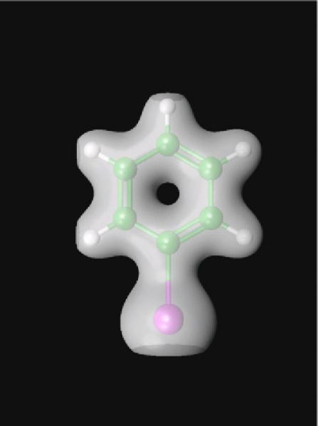
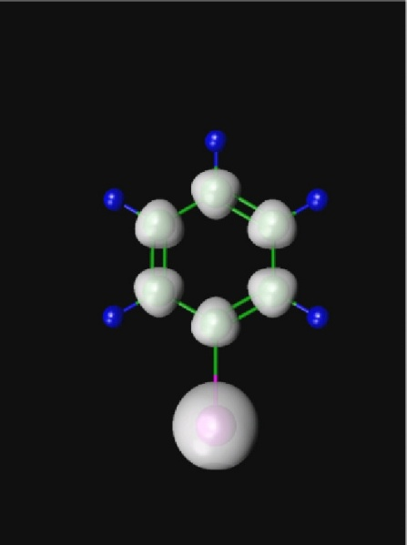
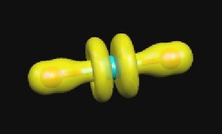

:orphan:
 

star(DENSITY)

The density can be dumped to formatted file in `CUBE file
format <http://local.wasp.uwa.edu.au/~pbourke/dataformats/cube/>`_ for
subsequent visualization (e.g. using
`Molekel <http://www.cscs.ch/molekel/>`_ or
`MOLDEN <http://www.cmbi.ru.nl/molden/molden.html>`_ or other programs;
see also `POV-Ray <http://www.povray.org/>`_).

The large and small component density is written to files rhol.cube and
rhoS.cube, respectively. They can be recovered from the work area by the
command

::

    pam -get ``rhoL.cube rhoS.cube ...

Note also that the coefficient file DFCOEF must be present in order to
generate the density.

::

    pam --incmo ...

Large component density of iodobenzene plotted using `Molekel <http://www.cscs.ch/molekel/>`_ (cutoff: 0.01):

Small component density of iodobenzene plotted using `Molekel <http://www.cscs.ch/molekel/>`_ (cutoff: 0.0001):

It is also possible to plot the density of an orbital by subtracting
densities generated from a given coefficient file, varying the
occupation. The figure shows the large component density of the HOMO of
the uranyl cation obtained by subtracting from the density generated
from regular occupation the density generated by reducing the occupation
by two electrons.

keyword(ORBITALS)

This keyword is only available in the Development version of Dirac. Make
individual cube files for each give orbital, instead of the total
density.

*Example:*

::

    .ORBITALS
     4..9
     1,3

This generates cube files for gerade orbitals 4-9 and ungerade orbitals
1 and 3. The numbering starts from the first occupied orbital, so
"positronic" orbitals have negative indices. Be aware that the cube
generation can be rather slow for large basis sets. Writing hundreds of
cube files can take much more time than a SCF calculation.

keyword(DOCUBE)

Specify large/small component density generation (1 = on; 0 = off).

*Default:*

::

    .DOCUBE
     1 1

keyword(NCUBE)

Number of cells along the sides of the cube.

*Default:*

::

    .CUBE
     80 80 80

keyword(CUBADJ)

Adjust the volume of the cube.

*Arguments:* Real CUBADJ(1), CUBADJ(2)

*Default:*

::

    .CUBADJ
     4.0 8.0

DIRAC will look at atomic positions and then try to place the cube such
that most density is included. The origin of the cube is determined by
finding the minimum atomic position in the x-, y-and z-direction
separately and then add CUBADJ(1). The length of the vectors spanning
the cube (parallelepiped) are analogously defined by maximal atomic
positions, with CUBADJ(2) added.

keyword(PRINT)

Print level.

*Default:*

::

    .PRINT
     0

