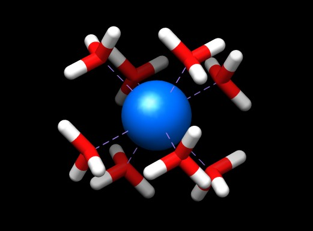

:orphan:
 

Atomic start guess
==================

Initial SCF run
---------------

We consider the Hartree-Fock calculation of plutonium dioxide cluster

In order to help convergence we will employ an atomic start.

Preparing the atomic start
--------------------------
For each atom we run a SCF calculation in full (linear) symmetry based on the atomic ground state configuration.
For open-shell atoms this amounts to an average-of-configuration (AOC) calculation at the HF level, and a fractional
occupation calculation at the DFT level. 

Hydrogen atom
~~~~~~~~~~~~~

We run the hydrogen atom as a one-electron system. The input file ``H.inp`` accordingly reads: ::

  **DIRAC
  .WAVE FUNCTION
  .ANALYZE
  **GENERAL
  .ACMOUT
  **HAMILTONIAN
  .ONESYS
  **WAVE FUNCTIONS
  .SCF
  *SCF
  .CLOSED SHELL
  2 0
  **ANALYZE
  .MULPOP
  *END OF

The molecular input ``H.mol`` is ::

  BASIS
  
  
  C   1              A
          1.    1
  H      0.0000000000        0.0000000000        0.0000000000
  LARGE BASIS cc-pVDZ
  FINISH

We run pam ::

  pam --inp=H.inp --mol=H.mol --get=ACMOUT
  mv DFACMO ac.H

Oxygen atom
~~~~~~~~~~~

The input file ``O.inp`` reads: ::

  **DIRAC
  .WAVE FUNCTION
  .ANALYZE
  **GENERAL
  .ACMOUT
  **WAVE FUNCTIONS
  .SCF
  *SCF
  .CLOSED SHELL
  4 0
  .OPEN SHELL 
  1
  4/0,6
  **ANALYZE
  .MULPOP
  *END OF

The molecular input ``O.mol`` is ::

  BASIS
  
  
  C   1              A
          8.    1
  O      0.0000000000        0.0000000000        0.0000000000
  LARGE BASIS cc-pVDZ
  FINISH

We run the calculation ::

  pam --inp=O.inp --mol=O.mol --get=DFACMO
  mv DFACMO ac.O

Plutonium atom
~~~~~~~~~~~~~~

For plutonium we employ the :math:`[Rn]5f^4` configuration of the :math:`Pu^{4+}` cation. The input file ``Pu.inp`` accordingly reads: ::

  **DIRAC
  .WAVE FUNCTION
  .ANALYZE
  **GENERAL
  .ACMOUT
  **WAVE FUNCTIONS
  .SCF
  *SCF
  .CLOSED SHELL
  42 44
  .OPEN SHELL
  1
  4/0,14
  **INTEGRALS
  *READIN
  .UNCONTRACT
  **ANALYZE
  .MULPOP
  *END OF

The molecular file 'Pu.mol' reads ::

  BASIS
  
  
  C   1              A
         94.    1
  Pu     0.0000000000        0.0000000000        0.0000000000
  LARGE BASIS dyall.v2z
  FINISH

We run the calculation ::

  pam --inp=Pu.inp --mol=Pu.mol --get=DFACMO
  mv DFACMO ac.Pu

Running the atomic start
------------------------

We are now ready to run the atomic start.  The input file 'PuO2.inp' reads::

  **DIRAC
  .WAVE FUNC
  .ANALYZE
  #.INPTES
  **WAVE FUN
  .SCF
  *SCF
  .ATOMST
  AFPUXX 2
  1..43
  1.00
  44..50
  0.286
  AFOXXX 2
  1,2
  1.00
  3..5
  0.667
  AFHXXX 1 
  1
  0.50
  .CLOSED SHELL
  84 86
  **ANALYZE
  .MULPOP
  **END OF

The keyword ``ATOMST`` is followed by input for each atomic type. The
occupations chosen corresponds to those of the atomic runs, but the user may
modify this at will.  Please note that the order of atoms corresponds to the
order they appear in the molecule file.  The molecular input file 'PuO2.mol'
reads::

  DIRAC
  
  
  C   3    0         A
         94.    1
  Pu     0.0000000000        0.0000000000        0.0000000000
  LARGE BASIS dyall.v2z
  	8.    8
  O      1.3490000000        1.3490000000        1.3490000000
  O      1.3490000000        1.3490000000       -1.3490000000
  O     -1.3490000000        1.3490000000        1.3490000000
  O     -1.3490000000        1.3490000000       -1.3490000000
  O      1.3490000000       -1.3490000000        1.3490000000
  O      1.3490000000       -1.3490000000       -1.3490000000
  O     -1.3490000000       -1.3490000000        1.3490000000
  O     -1.3490000000       -1.3490000000       -1.3490000000
  LARGE BASIS cc-pVDZ
         0.5   24
  H      1.9263502692        0.7716497308        1.9263502692
  H      1.9263502692        0.7716497308       -1.9263502692
  H     -1.9263502692        0.7716497308        1.9263502692
  H     -1.9263502692        0.7716497308       -1.9263502692
  H      1.9263502692       -0.7716497308        1.9263502692
  H      1.9263502692       -0.7716497308       -1.9263502692
  H     -1.9263502692       -0.7716497308        1.9263502692
  H     -1.9263502692       -0.7716497308       -1.9263502692
  H      1.9263502692        1.9263502692        0.7716497308
  H      1.9263502692        1.9263502692       -0.7716497308
  H     -1.9263502692        1.9263502692        0.7716497308
  H     -1.9263502692        1.9263502692       -0.7716497308
  H      1.9263502692       -1.9263502692        0.7716497308
  H      1.9263502692       -1.9263502692       -0.7716497308
  H     -1.9263502692       -1.9263502692        0.7716497308
  H     -1.9263502692       -1.9263502692       -0.7716497308
  H      0.7716497308        1.9263502692        1.9263502692
  H      0.7716497308        1.9263502692       -1.9263502692
  H     -0.7716497308        1.9263502692        1.9263502692
  H     -0.7716497308        1.9263502692       -1.9263502692
  H      0.7716497308       -1.9263502692        1.9263502692
  H      0.7716497308       -1.9263502692       -1.9263502692
  H     -0.7716497308       -1.9263502692        1.9263502692
  H     -0.7716497308       -1.9263502692       -1.9263502692
  LARGE BASIS cc-pVDZ
  #SMALL KINBAL
  FINISH

Before running the calculation the user must make provide links to the atomic coefficient files ::

  ln -s ac.Pu AFPUXX
  ln -s ac.C AFCXXX
  ln -s ac.H AFHXXX

and the calculation was then run as ::

  pam --mol=PuO2.mol --inp=PuO2.inp --copy="AF*" --outcmo  --mw=105 --mpi=32

This calculation converges smoothly after 9 iterations ::

                                     SCF - CYCLE
                                     -----------
  
  * Convergence on norm of error vector (gradient).
    Desired convergence:1.000D-07
    Allowed convergence:1.000D-06
  
  * ERGVAL - convergence in total energy
  * FCKVAL - convergence in maximum change in total Fock matrix
  * EVCVAL - convergence in error vector (gradient)
  --------------------------------------------------------------------------------------------------------------------------------
             Energy               ERGVAL    FCKVAL    EVCVAL      Conv.acc    CPU          Integrals   Time stamp
  --------------------------------------------------------------------------------------------------------------------------------
  It.    1    -30262.16062810      3.03D+04  0.00D+00  0.00D+00   Atomic s    8min27.160s   LL SL          Sun Dec  2
  It.    2    -29246.11569530     -1.02D+03 -4.18D+01  1.15D+01              18min50.650s   LL SL          Sun Dec  2
  It.    3    -29248.64080628      2.53D+00  4.35D+00  5.49D+00   DIIS   2   18min31.760s   LL SL          Mon Dec  3
  It.    4    -29248.86829228      2.27D-01 -1.32D+00  2.81D-01   DIIS   3   17min35.410s   LL SL          Mon Dec  3
  It.    5    -29248.86879546      5.03D-04  3.32D-02  3.76D-02   DIIS   4   16min51.240s   LL SL          Mon Dec  3
  It.    6    -29248.86880842      1.30D-05  8.21D-03  8.29D-04   DIIS   5   15min15.820s   LL SL          Mon Dec  3
  It.    7    -29248.86880842      3.88D-09 -5.99D-05  5.49D-05   DIIS   6   13min26.070s   LL SL          Mon Dec  3
  It.    8    -29248.86880843      3.43D-09  8.30D-06  1.55D-06   DIIS   7   11min31.390s   LL SL          Mon Dec  3
  It.    9    -29248.86880842     -7.49D-10 -1.04D-06  4.71D-08   DIIS   7    9min 3.550s   LL SL          Mon Dec  3
  --------------------------------------------------------------------------------------------------------------------------------

