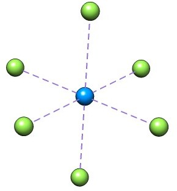

:orphan:

.. _UF6anion: 

========================
The :math:`UF_6` anion
========================

The problem
-----------

This case study, suggested by `Kirk Peterson <http://tyr0.chem.wsu.edu/~kipeters/>`_ concerns the 
calculation of the :math:`UF_6` anion using effective core potentials (ECP)

We start from the molecular input ``UF6.mol``

.. literalinclude:: UF6.mol

and the menu file ``UF6.inp``

.. literalinclude:: UF6.inp1

The problem is that this calculation simply does not converge.

Analysis
--------

The neutral molecule is a simple closed shell molecule and using the menu file

.. literalinclude:: UF6neutral.inp

the SCF converges nicely in 26 iterations. Before proceeding we investigate the electronic structure
of this species using projection analysis, see :cite:`Dubillard2006` and 
`this tutorial <../../analysis/projection_analysis.html>`_. 
Looking at the input file above, one may note that we already prepared for
this by invoking the keyword :ref:`GENERAL_.ACMOUT` in order to recover the :math:`C_1` MO coefficients::

   pam --inp=UF6  --mol=UF6 --outcmo --get "DFACMO=ac.UF6"

We now generate orbitals for the constituent atoms of :math:`UF_6` in their electronic ground state. 
For the fluorine atoms this is straightforwardly obtained using the molecular input ``F.mol``

.. literalinclude:: F.mol

and the menu file ``F.inp``

.. literalinclude:: F.inp

using the command::

   pam --inp=F  --mol=F --outcmo --get "DFACMO=ac.F"
   mv DFCOEF cf.UF6

Note that since no effective core potential has been given for the fluorine we prefer to calculate it using 
the X2C Hamiltonian.

The corresponding molecular input for the uranium atom is

.. literalinclude:: U.mol

For the uranium atom, the calculation of the occupation easily converges by using the keyword :ref:`SCF_.KPSELE` introduced in DIRAC21.

.. literalinclude:: U_KPSELE.inp

using the command::

   pam --inp=U  --mol=U --get "DFACMO=ac.U"

The projection analysis is carried out in :math:`C_1` symmetry to make all fluorines symmetry-independent.
The proper molecular input for :math:`UF_6` is found as an *xyz*-file in the DIRAC output

.. literalinclude:: UF6.xyz

whereas the menu file ``prj.inp`` is given by

.. literalinclude:: prj.inp

Before running the analysis we have to create symbolic links for the reference files::

   ln -s ac.U AFUXXX
   ln -s ac.F AFF1XX
   ln -s ac.F AFF2XX
   ln -s ac.F AFF3XX
   ln -s ac.F AFF4XX
   ln -s ac.F AFF5XX
   ln -s ac.F AFF6XX

The analysis is now run using::

   cp ac.UF6 DFCOEF
   pam --inp=prj  --mol=UF6.xyz --incmo --copy="AF*"

Looking at the end of the output we find

.. literalinclude:: prj_UF6.out

showing that the polarization contribution is rather small. It can be eliminated completely 
by adding the keyword ``.POLREF`` under the ``*PROJEC`` section (valid from DIRAC13).
The gross population of the uranium valence orbitals is then given by

.. literalinclude:: prjpol_UF6.out

We can identify the various orbitals from orbital energies and degeneracies or by looking in the 
Mulliken output of the atomic calculation. It is seen that the fluorines have charges -0.57 and uranium +3.45.
The electronic configuration of uranium in the neutral molecule is :math:`5f^{1.23}6d^{1.32}7s^{0.06}`.

Calculating the anion
---------------------

Now let us consider adding an electron. From the output of the neutral molecule we find that the HOMO 
(*ungerade*) has energy -0.642 :math:`E_h` and the LUMO (*ungerade*) comes in at -0.115 :math:`E_h`.
In fact, Mulliken population analysis shows that the first seven virtual orbitals are indeed basically f orbitals. 
We therefore attempt a straightforward calculation starting from the coefficients of the neutral molecule
and using the menu file ``UF6a.inp``

.. literalinclude:: UF6anion.inp

and the command::

   pam --copy="cf.UF6=DFCOEF" --inp=UF6a --mol=UF6 --outcmo

Note that we activate static overlap selection to keep occupied orbitals in place. 
However, this calculation does not converge. Also, in the Mulliken population analysis
we activate the ``SHELL`` keyword to simplify identification of atomic orbitals, see
:ref:`MULPOP_.LABEL`

Looking at the open-shell orbitals 
we find that they are essentially f orbitals. However, we also note that the 
HOMO of the closed shell orbitals comes in at -0.40353915 :math:`E_h` and the 
lowest occupied open-shell orbitals is almost degenerate, having orbital energy
-0.39634956 :math:`E_h`. Clearly this almost degeneracy creates artificial mixing 
which perturbs convergence. We therefore add an open-shell level shift::

  .OLEVEL
  0.200

and now the SCF converges in 38 iterations. Curiously, convergence is extremely sensitive 
to the choice of the level shift. Even changing it by 0.005 breaks convergence !

.. include:: UF6_anion2.rst
