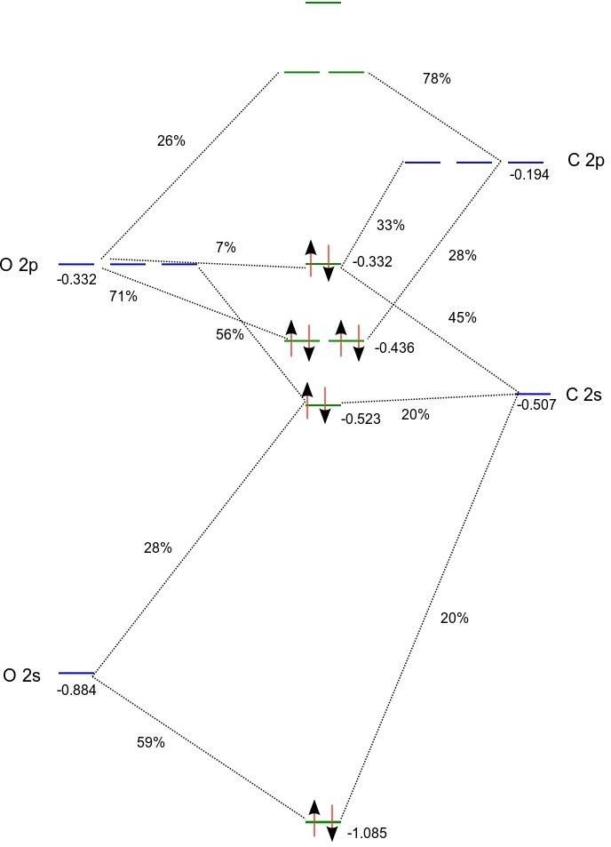

:orphan:
 

================================
A TDDFT study of carbon monoxide
================================

Introduction
============

To illustrate the TDDFT capabilities of DIRAC we will consider excited states of the carbon monoxide molecule. 
The experimental spectrum can be found `at this page <http://webbook.nist.gov/cgi/cbook.cgi?Formula=CO&NoIon=on&Units=SI&cDI=on>`_ .
Note that this source gives only adiabatic excitation energies :math:`T_e`, that is, the energy difference between the 
minima of the potential curve of the ground and excited state, whereas the TDDFT calculations give vertical excitation
energies :math:`T_v`. The experimental adiabatic excitation energies has been converted to vertical ones by :cite:`Nielsen_JCP1980`.
We will begin this tutorial in spinfree mode to faciliate the connection to the non-relativistic domain.
In the following we employ the molecular input file `CO.mol` (:download:`download <CO.mol>`):

.. literalinclude:: CO.mol

Here we do not provide any symmetry information, meaning that we ask DIRAC to detect it.
DIRAC will find that the full group is :math:`C_{\infty v}`. With the spin-orbit coupling DIRAC
will then activate the linear supersymmetry, but in the spin-orbit free case it will simply use
the highest Abelian single point group, that is :math:`C_{2v}`. Irreps of :math:`C_{\infty v}` and :math:`C_{2v}` 
correlate as follows:

+----------------------+------------------+
| :math:`C_{\infty v}` | :math:`C_{2v}`   |
+======================+==================+
| :math:`\Sigma^{+}`   | :math:`A_1`      |
+----------------------+------------------+
| :math:`\Sigma^{-}`   | :math:`A_2`      |
+----------------------+------------------+
| :math:`\Pi`          | :math:`B_1, B_2` |
+----------------------+------------------+
| :math:`\Delta`       | :math:`A_1, A_2` |
+----------------------+------------------+

Ground state electronic structure
=================================

Before actually doing TDDFT let us first have a look at the electronic structure of the ground state of CO.
We therefore carry out Kohn-Sham DFT (see :ref:`*DFT`)  using the PBE functional and the eXact 2-Component (:ref:`HAMILTONIAN_.X2C`) Hamiltonian 
followed by Mulliken population analysis using the input file `SCF.inp` (:download:`download <SCF.inp>`):

.. literalinclude:: SCF.inp

Based on orbital energies and the Mulliken population analysis we can set up the following MO diagram:

(Orbital energies for the atoms were obtained from atomic calculations using fractional occupation)

According to the above MO diagram the valence electron configuration of carbon monoxide is
:math:`1\sigma^{2}2\sigma^{2}1\pi^{4}3\sigma^{2}`. From the projection analysis we find that the electron configurations
of the carbon and oxygen atoms in the molecule are :math:`1s^{2.0}2s^{2.0}2p^{2.0}` and :math:`1s^{2.0}2s^{1.7}2p^{4.3}` , respectively, 
with a slight negative charge of -0.3 on oxygen. We note that the HOMO is a :math:`\sigma` orbital dominated (~90 %) by carbon (2s,2p), 
whereas the doubly degenerate LUMO is a :math:`\pi` orbital with about 75% C *2p* and 25% O *2p*. The LUMO+1 is :math:`\sigma` orbital
with a combination of carbon and oxygen *3s* dominated by the former atom.

Excited states
==============

Preparing the input files
-------------------------

The excited states will be calculated in a "bottoms-up" fashion for each irrep by expansion of the solution vector in trial vector :cite:`Bast2009`.
For each irrep the user specifies the number of desired excitations. It may be a good idea of including some extra excitations in case of
root flipping during the iterative solution of the TDDFT equations. We are working within the adiabatic approximation of TDDFT
and consider single excitations from a closed-shell ground state. The final states will be therefore be singlet or triplets in the spin-orbit 
free case. We need to tell DIRAC how these states are distributed on the four irreps of :math:`C_{2v}`. 
At this point we should emphasize that DIRAC will employ the *total* symmetry of the final states,
that is the combined spin and spatial symmetry. A singlet spin function 

.. math::

   S_0=\frac{1}{\sqrt{2}}\left(\alpha_1\beta_2-\beta_1\alpha_2\right)

is totally symmetric (:math:`A_1`), whereas the
triplet spin functions transform as rotations. We know the triplet functions as:

.. math::

   T_{-1} = \alpha_1\alpha_2;\quad T_0=\frac{1}{\sqrt{2}}\left(\alpha_1\beta_2+\beta_1\alpha_2\right);\quad T_{+1}=\beta_1\beta_2

but for our purposes it will be more convenient to form the combinations:

.. math::

   T_x=\frac{1}{\sqrt{2}}\left(T_{-1}-T_{+1}\right);\quad T_y=\frac{i}{\sqrt{2}}\left(T_{-1}+T_{+1}\right);\quad T_z=T_0

which transform as rotations :math:`R_x\left(B_{2}\right)` , :math:`R_y\left(B_{1}\right)` and :math:`R_z\left(A_{2}\right)` , respectively. 
For a given point group you find the symmetry of the rotations in most standard character tables (for instance 
`here <http://www.webqc.org/symmetry.php>`_ ).

As an example of how to determine total symmetry of the final states let us consider single excitations
HOMO into the LUMO (:math:`\pi`) and LUMO+1 (:math:`\sigma`) orbitals. This leads to :math:`2 \times\ 6 = 12` 
determinants which translate into the following final states:

+---------------------------------+----------------------+
| Configuration                   | States               |
+=================================+======================+
| :math:`3\sigma^{-1}2\pi^{1}`    | :math:`^{1,3}\Pi`    |
+---------------------------------+----------------------+
| :math:`3\sigma^{-1}4\sigma^{1}` | :math:`^{1,3}\Sigma` |
+---------------------------------+----------------------+

We can now set up the following correlation of states:

+----------------------+-----------------------------+----------------------+------------------------------------------------------------------+  
| State                | Spin                        | Spatial              | Spin :math:`\otimes` Spatial                                     |
+======================+=============================+======================+==================================================================+  
|  :math:`^1\Sigma`    | :math:`A_1`                 | :math:`A_1`          | :math:`A_1`                                                      |
+----------------------+-----------------------------+----------------------+------------------------------------------------------------------+  
|  :math:`^1\Pi_{x,y}` | :math:`A_1`                 | :math:`B_{1}, B_{2}` | :math:`B_{1}, B_{2}`                                             |
+----------------------+-----------------------------+----------------------+------------------------------------------------------------------+
|  :math:`^3\Sigma`    | :math:`B_{2}, B_{1}, A_{2}` | :math:`A_1`          | :math:`B_{2}, B_{1}, A_{2}`                                      |
+----------------------+-----------------------------+----------------------+------------------------------------------------------------------+  
|  :math:`^3\Pi_{x,y}` | :math:`B_{2}, B_{1}, A_{2}` | :math:`B_{1}, B_{2}` | :math:`\left(A_2, A_{1}, B_2\right), \left(A_1, A_2, B_2\right)` |
+----------------------+-----------------------------+----------------------+------------------------------------------------------------------+  

(The group multiplication table is found in the DIRAC output.)

Counting total symmetries we find that the 12 microstates are evenly distributed amongst the four irreps of :math:`C_{2v}`:

+---+-------------+-------------------------------------------------------+
|   |  Irrep      | Valence-excited state                                 |
+===+=============+=======================================================+
| 1 | :math:`A_1` | :math:`^1\Sigma, ^{3(y)}\Pi_{x}, ^{3(x)}\Pi_{y}`      |
+---+-------------+-------------------------------------------------------+
| 2 | :math:`B_1` | :math:`^{1}\Pi_{x}, ^{3(y)}\Sigma, ^{3(z)}\Pi_{y}`    |
+---+-------------+-------------------------------------------------------+
| 3 | :math:`B_2` | :math:`^{1}\Pi_{y}, ^{3(x)}\Sigma, ^{3(z)}\Pi_{x}`    |
+---+-------------+-------------------------------------------------------+
| 4 | :math:`A_2` | :math:`^{3(z)}\Sigma, ^{3(x)}\Pi_{x}, ^{3(y)}\Pi_{y}` |
+---+-------------+-------------------------------------------------------+

Note that the order of the irreps follows the output of DIRAC. 

We now set up the following menu file `TDDFT.inp` (:download:`download <TDDFT.inp>`) for our calculation

.. literalinclude:: TDDFT.inp

We base our TDDFT calculation on the long-range corrected CAMB3LYP functional :cite:`Yanai_CPL2004` 
which provides a better description of Rydberg and charge-transfer excitations than 
standard continuum functionals. We furthermore ask for oscillator strengths within the electric dipole
approximation. Finally we ask for analysis of what orbitals contribute to the various excitations. 
For this the Mulliken population analysis may come in handy as reference.

Looking at the output
---------------------

Energy levels
~~~~~~~~~~~~~

After running the calculation, let us now look at the output. There is output for each symmetry, but we go directly to 
the final output at the end where we first find a list of levels

.. literalinclude:: TDDFT_CO_spf_exc1

The degeneracies indicated in parenthesis for each level generally arise from both spatial and spin degrees of freedom. 
DIRAC assumes degeneracy when energies are within :math:`1.0\cdot10^{-9}\ E_h`. As we shall see this is not a foolproof scheme.

To learn more about the nature of the excitated states we look at the following list of energy levels, now in other units
(eV and cm :math:`^{-1}`) and with symmetry information:

.. literalinclude:: TDDFT_CO_spf_exc2

The first level is simply the ground state. The reference state for calculation excitation energies is presently limited 
to closed-shell and so this is :math:`^1A_1` (:math:`C_{2v}`), corresponding to :math:`^1\Sigma^+` of :math:`C_{v\infty}`.
Linear (super)symmetry is not implemented for spin-orbit free calculations, so DIRAC gives symmetry information with respect to :math:`C_{2v}`.
DIRAC, however, is able to separate spin and spatial symmetries. We see for instance the the next level is six-fold degenerate 
with equal contributions from :math:`^3B_1` and :math:`^3B_2`. Looking at the above correspondence table between :math:`C_{2v}` and
:math:`C_{v\infty}` that a degenerate level of :math:`B_1` and :math:`B_2` spatial symmetries corresponds to a :math:`\Pi` term, 
so we identify the first excited level of CO as :math:`^3\Pi`. The correspondence table also allows us to distinguish mirror symmetry
about the molecular axis for :math:`\Sigma` states, so we identify the second excited state as :math:`^{3}\Sigma^{+}`. Proceeding 
in this manner, we also see some failures of the degeneracy detection in DIRAC. Level 4 and 5 are classified as :math:`^3A_1` and 
:math:`^3A_2`, respectively, and are clearly components of a :math:`^3\Delta` state. Reducing the threshold for degeneracies would 
bring them together, as well as level 7 (:math:`^1A_2`) and 8 (:math:`^1A_1`), which are component of a :math:`^1\Delta` state.
However, level 6 is seen to contain both a singlet :math:`^1A_2` (:math:`^1\Sigma^-`) and a triplet
:math:`^3A_2` (:math:`^3\Sigma^-`) which are clearly not allowed to mix without spin-orbit interaction, so here a *larger* threshold would 
be needed to distinguish them. 

Below we give a summary of results obtained with a variety of functionals available in DIRAC.
The assignment and energy of states may be compared to :cite:`Tozer_JCP1998`. 

+------------------------------+-------------+-------------+----------+-------+-------+-------+-------+-------+
|                              | :math:`T_e` | :math:`T_v` | CAMB3LYP | LDA   | PBE   | PBE0  | BLYP  | B3LYP |
+==============================+=============+=============+==========+=======+=======+=======+=======+=======+
| :math:`a\ ^{3}\Pi`           | 6.04        | 6.32        | 5.93     | 5.98  | 5.77  | 5.76  | 5.85  | 5.88  |
+------------------------------+-------------+-------------+----------+-------+-------+-------+-------+-------+
| :math:`a\ ^{3}\Sigma^{+}`    | 6.92        | 8.51        | 7.95     | 8.43  | 8.12  | 7.85  | 8.10  | 7.93  |
+------------------------------+-------------+-------------+----------+-------+-------+-------+-------+-------+
| :math:`A\ ^{1}\Pi`           | 8.07        | 8.51        | 8.49     | 8.19  | 8.26  | 8.45  | 8.25  | 8.41  |
+------------------------------+-------------+-------------+----------+-------+-------+-------+-------+-------+
| :math:`d\ ^{3}\Delta`        | 7.58        | 9.36        | 8.70     | 9.21  | 8.78  | 8.64  | 8.72  | 8.66  |
+------------------------------+-------------+-------------+----------+-------+-------+-------+-------+-------+
| :math:`e\ ^{3}\Sigma^{-}`    | 7.96        | 9.88        | 9.72     | 9.89  | 9.87  | 9.79  | 9.79  | 9.73  |
+------------------------------+-------------+-------------+----------+-------+-------+-------+-------+-------+
| :math:`I\ ^{1}\Sigma^{-}`    | 8.07        | 9.88        | 9.72     | 9.89  | 9.87  | 9.79  | 9.79  | 9.73  |
+------------------------------+-------------+-------------+----------+-------+-------+-------+-------+-------+
| :math:`D\ ^{1}\Delta`        | 8.17        | 10.23       | 10.11    | 10.36 | 10.21 | 10.21 | 10.03 | 10.05 |
+------------------------------+-------------+-------------+----------+-------+-------+-------+-------+-------+
| :math:`b\ ^{3}\Sigma^{+}`    | 10.39       | 10.4        | 10.27    | 9.59  | 9.35  | 10.12 | 9.29  | 9.95  |
+------------------------------+-------------+-------------+----------+-------+-------+-------+-------+-------+
| :math:`B\ ^{1}\Sigma^{+}`    | 10.78       | 10.78       | 10.90    | 9.95  | 9.78  | 10.72 | 9.65  | 10.43 |
+------------------------------+-------------+-------------+----------+-------+-------+-------+-------+-------+
| :math:`j\ ^{3}\Sigma^{+}`    | 11.28       | 11.3        | 10.27    | 10.37 | 10.09 | 10.84 | 10.09 | 10.71 |
+------------------------------+-------------+-------------+----------+-------+-------+-------+-------+-------+
| :math:`C\ ^{1}\Sigma^{+}`    | 11.40       | 11.4        | 11.29    | 10.68 | 10.56 | 11.25 | 10.49 | 11.05 |
+------------------------------+-------------+-------------+----------+-------+-------+-------+-------+-------+
| :math:`E\ ^{1}\Pi`           | 11.52       | 11.53       | 11.46    | 10.70 | 10.58 | 11.36 | 10.49 | 11.13 |
+------------------------------+-------------+-------------+----------+-------+-------+-------+-------+-------+
| :math:`c\ ^{3}\Pi`           | 11.55       | 11.55       | 11.31    | 10.31 | 10.31 | 11.12 | 10.30 | 10.97 |
+------------------------------+-------------+-------------+----------+-------+-------+-------+-------+-------+
| MAE (all states)             |             |             | 0.29     | 0.49  | 0.62  | 0.29  | 0.68  | 0.39  |
+------------------------------+-------------+-------------+----------+-------+-------+-------+-------+-------+
| MAE (valence)                |             |             | 0.30     | 0.15  | 0.26  | 0.31  | 0.31  | 0.33  |
+------------------------------+-------------+-------------+----------+-------+-------+-------+-------+-------+
| MAE (Rydberg)                |             |             | 0.29     | 0.89  | 1.05  | 0.26  | 1.11  | 0.46  |
+------------------------------+-------------+-------------+----------+-------+-------+-------+-------+-------+

For all functionals we provide the mean absolute error (MAE), and it can indeed be seen that the performance of CAMB3LYP is quite good.
PBE0 is also display nice performance, whereas its GGA equivalent comes out significantly worse. However, if we do separate error
analysis of the valence states (the first seven states) and the Rydberg states (the last six states), we see that PBE performs well for
the valence states, but not for the Rydberg states. This is connected to the wrong asymptotic behaviour of LDA/GGA functionals.

The performance of standard LDA/GGA functionals can be improved by invoking asymptotic corrections. One option is the statistical average of orbital potentials (SAOP).
Below we show the result of SAOP-corrected functionals.

+------------------------------+-------------+-------------+----------+-------+-------+-------+-------+-------+
| SAOP-corrected               | :math:`T_e` | :math:`T_v` | SAOP     | LDA   | PBE   | PBE0  | BLYP  | B3LYP |
+==============================+=============+=============+==========+=======+=======+=======+=======+=======+
| :math:`a\ ^{3}\Pi`           | 6.04        | 6.32        | 6.33     | 6.11  | 5.76  | 5.76  | 5.84  | 5.87  |
+------------------------------+-------------+-------------+----------+-------+-------+-------+-------+-------+
| :math:`a\ ^{3}\Sigma^{+}`    | 6.92        | 8.51        | 8.65     | 8.47  | 7.88  | 7.88  | 8.19  | 8.00  |
+------------------------------+-------------+-------------+----------+-------+-------+-------+-------+-------+
| :math:`A\ ^{1}\Pi`           | 8.07        | 8.51        | 8.60     | 8.47  | 8.57  | 8.57  | 8.61  | 8.64  |
+------------------------------+-------------+-------------+----------+-------+-------+-------+-------+-------+
| :math:`d\ ^{3}\Delta`        | 7.58        | 9.36        | 9.39     | 9.30  | 8.64  | 8.64  | 8.79  | 8.71  |
+------------------------------+-------------+-------------+----------+-------+-------+-------+-------+-------+
| :math:`e\ ^{3}\Sigma^{-}`    | 7.96        | 9.88        | 10.04    | 10.00 | 9.77  | 9.77  | 9.84  | 9.76  |
+------------------------------+-------------+-------------+----------+-------+-------+-------+-------+-------+
| :math:`I\ ^{1}\Sigma^{-}`    | 8.07        | 9.88        | 10.04    | 10.00 | 9.77  | 9.77  | 9.84  | 9.76  |
+------------------------------+-------------+-------------+----------+-------+-------+-------+-------+-------+
| :math:`D\ ^{1}\Delta`        | 8.17        | 10.23       | 10.50    | 10.49 | 10.27 | 10.27 | 10.39 | 10.31 |
+------------------------------+-------------+-------------+----------+-------+-------+-------+-------+-------+
| :math:`b\ ^{3}\Sigma^{+}`    | 10.39       | 10.4        | 10.48    | 10.87 | 10.49 | 10.49 | 10.21 | 10.52 |
+------------------------------+-------------+-------------+----------+-------+-------+-------+-------+-------+
| :math:`B\ ^{1}\Sigma^{+}`    | 10.78       | 10.78       | 10.97    | 11.25 | 11.21 | 11.21 | 10.83 | 11.22 |
+------------------------------+-------------+-------------+----------+-------+-------+-------+-------+-------+
| :math:`j\ ^{3}\Sigma^{+}`    | 11.28       | 11.3        | 11.42    | 11.70 | 11.34 | 11.34 | 11.20 | 11.43 |
+------------------------------+-------------+-------------+----------+-------+-------+-------+-------+-------+
| :math:`C\ ^{1}\Sigma^{+}`    | 11.40       | 11.4        | 11.73    | 11.97 | 11.80 | 11.80 |       |       |
+------------------------------+-------------+-------------+----------+-------+-------+-------+-------+-------+
| :math:`E\ ^{1}\Pi`           | 11.52       | 11.53       | 11.89    |       | 11.97 | 11.97 |       |       |
+------------------------------+-------------+-------------+----------+-------+-------+-------+-------+-------+
| :math:`c\ ^{3}\Pi`           | 11.55       | 11.55       | 11.76    | 11.73 | 11.68 | 11.68 | 11.42 | 11.70 |
+------------------------------+-------------+-------------+----------+-------+-------+-------+-------+-------+
| MAE (all states)             |             |             | 0.17     | 0.24  | 0.29  | 0.29  | 0.20  | 0.26  |
+------------------------------+-------------+-------------+----------+-------+-------+-------+-------+-------+
| MAE (valence)                |             |             | 0.12     | 0.12  | 0.32  | 0.32  | 0.24  | 0.29  |
+------------------------------+-------------+-------------+----------+-------+-------+-------+-------+-------+
| MAE (Rydberg)                |             |             | 0.21     | 0.42  | 0.25  | 0.25  | 0.12  | 0.21  |
+------------------------------+-------------+-------------+----------+-------+-------+-------+-------+-------+

Orbital contributions
~~~~~~~~~~~~~~~~~~~~~

We can also get information about dominant (single) excitations leading to each excited state. We then go to the section starting with::

   Analysis of response solution vectors
   -------------------------------------

For the first excitation of :math:`A_1` total (space+spin) symmetry we find for example

.. literalinclude:: TDDFT_CO_spf_exc3

This is an excitation to the first :math:`^3\Delta` state, combining a :math:`T_y` spin function with :math:`B_1` spatial symmetry.
The dominant inactive orbital is orbital 7 and if we look at the Mulliken population analysis we find

.. literalinclude:: TDDFT_CO_spf_exc4

showing that this is the HOMO, which is a :math:`\sigma` orbital with 51 \% carbon *s* and 36 \% carbon *p* character.
The dominant virtual orbital is orbital 8

.. literalinclude:: TDDFT_CO_spf_exc5

which is clearly a :math:`\pi` orbital dominated by carbon :math:`p_x`.

Oscillator strenghts
~~~~~~~~~~~~~~~~~~~~

DIRAC also allows provides oscillator strenghts corresponding to the calculated (single) excitations.
The general definition of an oscillator strenght is

.. math::

   f_{0n} = \frac{2m}{e^2\hbar\omega_{0n}}\left|T_{0n}\right|^2

where :math:`\hbar\omega_{0n}` and :math:`T_{0n}` are the corresponding excitation energy and transition moment, respectively.
The calculation of oscillator strengths is invoked through::

   .INTENS
   0

which means that we ask for oscillator strengths to order zero in the wave vector. This corresponds to the electric dipole approximation.
Starting from DIRAC21, oscillator strengths have been implemented to *arbitrary* order in the wave vector, in both the length and velocity
representation, see :cite:`List_JCP2020`. In addition DIRAC also allows the use of the *full* semi-classical light-matter interaction.
Presently, we limit ourselves to the electric-dipole approximation.
The isotropic dipole length-dipole length oscillator strenghts are given as

.. math::

   f^{(0)iso}_{0n} = \frac{2m}{3e^2\hbar}\omega_{0n}\left|\mu_{0n}\right|^2

and are found to be

.. literalinclude:: TDDFT_CO_spf_exc6

Corresponding rates of spontaneous emission are given by

.. math:: A_{0n} = \frac{2e^2\omega_{0n}^2}{4\pi\varepsilon_0 mc^3}f_{0n} .

This is a spin-orbit free calculation and so we only see oscillator strength to 
singlet states (clearly dominated by :math:`C\ ^{1}\Sigma^{+}`). Things change is we 
activate spin-orbit interaction (that is, remove the :ref:`HAMILTONIAN_.SPINFREE` keyword). 
We see that the energy levels split up

.. literalinclude:: TDDFT_CO_exc

and that oscillator strength goes to more states

.. literalinclude:: TDDFT_CO_exc5

reflecting that triplet states "steal" intensity from singlet ones.

