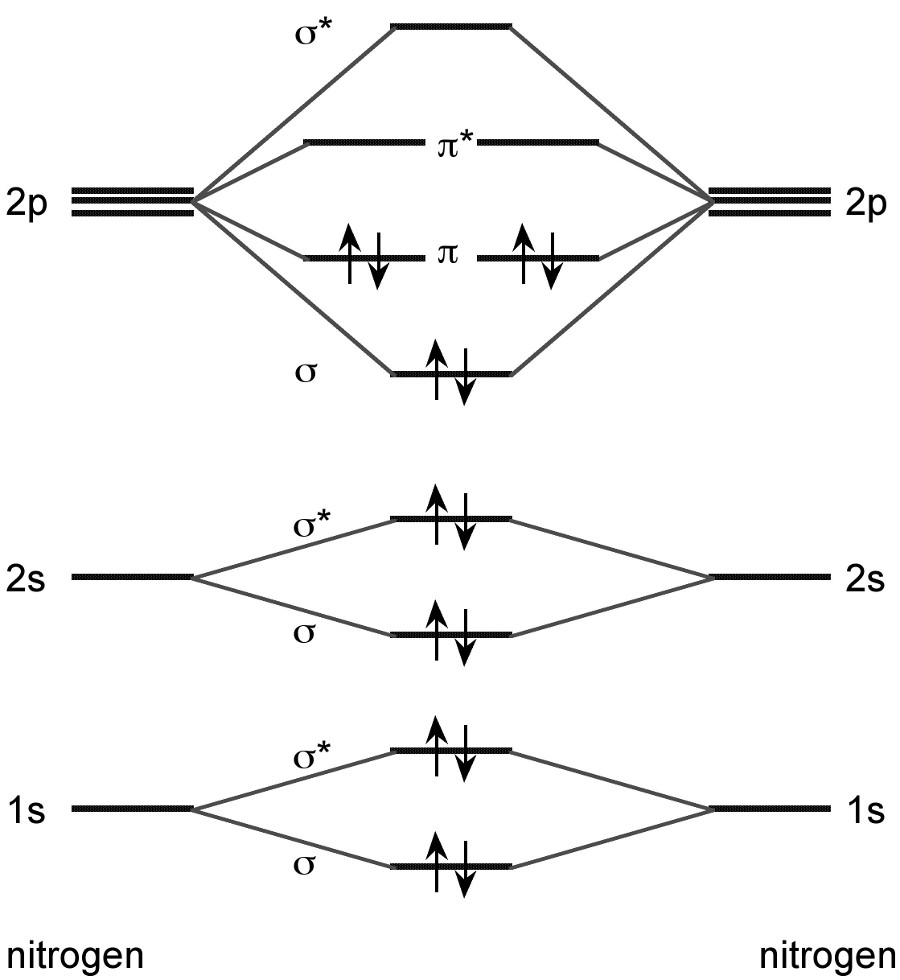

:orphan:
 

1s core-ionization of N2 by TD-DFT
==================================

Introduction
------------

We want to study the excitation of a 1s electron of the :math:`N_2` molecule to an empty orbital.
More precisely we shall look at the excitation of an electron from the bonding 
:math:`1s\sigma_g` or anti-bonding :math:`1s\sigma_u` -orbitals to the vacant :math:`2p\pi_g` or :math:`2p\sigma_u` orbitals (see MO-diagram below). 

Note that this diagram does not take spin-orbit into account, but we shall consider
this interaction later on. Let us first consider the possible final states. 
One electron leaves from one of four spin-orbitals and enters one of six spin-orbitals.
This gives 24 determinants which translates into the following states:

+-----------------------------------+------------------------+
| Configuration                     | States                 |
+===================================+========================+
| :math:`1s\sigma_g^{-1}2p\pi_g`    | :math:`^{1,3}\Pi_g`    |
+-----------------------------------+------------------------+
| :math:`1s\sigma_g^{-1}2p\sigma_u` | :math:`^{1,3}\Sigma_u` |
+-----------------------------------+------------------------+
| :math:`1s\sigma_u^{-1}2p\pi_g`    | :math:`^{1,3}\Pi_u`    |
+-----------------------------------+------------------------+
| :math:`1s\sigma_u^{-1}2p\sigma_u` | :math:`^{1,3}\Sigma_g` |
+-----------------------------------+------------------------+

Spin-orbit free calculation
---------------------------

Preparing the input files
~~~~~~~~~~~~~~~~~~~~~~~~~

We employ the following molecular input file `N2.mol` 

.. literalinclude:: N2.mol

Here we do not provide any symmetry information, meaning that we ask DIRAC to detect it.
DIRAC will find that the full group is :math:`D_{\infty h}`. With spin-orbit coupling DIRAC
will then activate linear supersymmetry, but in the spin-orbit free case it will simply use
the highest Abelian single point group, that is :math:`D_{2h}`. For the final states DIRAC
will  employ the *total* symmetry, that is the combined spin and spatial symmetry.
Here we shall keep in mind that the singlet spin function is totally symmetric (:math:`A_g`), whereas the
triplet spin functions transform as rotations. We know the triplet functions as:

.. math::

   T_{-1} = \alpha_1\alpha_2;\quad T_0=\frac{1}{\sqrt{2}}\left(\alpha_1\beta_2-\beta_1\alpha_2\right);\quad T_{+1}=\beta_1\beta_2

but for our purposes it will be more convenient to form the combinations:

.. math::

   T_x=\frac{1}{\sqrt{2}}\left(T_{-1}-T_{+1}\right);\quad T_y=\frac{i}{\sqrt{2}}\left(T_{-1}+T_{+1}\right);\quad T_z=T_0

which transform as rotations :math:`R_x\left(B_{3g}\right)` , :math:`R_y\left(B_{2g}\right)` and :math:`R_z\left(B_{1g}\right)` , respectively. 

We can now set up the following correlation of states:

+------------------------+--------------------------------+------------------------+----------------------------------------------------------------------------+  
| State                  | Spin                           | Spatial                | Spin :math:`\otimes` Spatial                                               |
+========================+================================+========================+============================================================================+  
|  :math:`^1\Sigma_g`    | :math:`A_g`                    | :math:`A_g`            | :math:`A_g`                                                                |
+------------------------+--------------------------------+------------------------+----------------------------------------------------------------------------+  
|  :math:`^1\Sigma_u`    | :math:`A_g`                    | :math:`B_{1u}`         | :math:`B_{1u}`                                                             |
+------------------------+--------------------------------+------------------------+----------------------------------------------------------------------------+  
|  :math:`^1\Pi_{x,y;g}` | :math:`A_g`                    | :math:`B_{3g}, B_{2g}` | :math:`B_{3g}, B_{2g}`                                                     |
+------------------------+--------------------------------+------------------------+----------------------------------------------------------------------------+  
|  :math:`^1\Pi_{x,y;u}` | :math:`A_g`                    | :math:`B_{3u}, B_{2u}` | :math:`B_{3u}, B_{2u}`                                                     |
+------------------------+--------------------------------+------------------------+----------------------------------------------------------------------------+  
|  :math:`^3\Sigma_g`    | :math:`B_{3g}, B_{2g}, B_{1g}` | :math:`A_g`            | :math:`B_{3g}, B_{2g}, B_{1g}`                                             |
+------------------------+--------------------------------+------------------------+----------------------------------------------------------------------------+  
|  :math:`^3\Sigma_u`    | :math:`B_{3g}, B_{2g}, B_{1g}` | :math:`B_{1u}`         | :math:`B_{2u}, B_{3u}, A_{u}`                                              |
+------------------------+--------------------------------+------------------------+----------------------------------------------------------------------------+  
|  :math:`^3\Pi_{x,y;g}` | :math:`B_{3g}, B_{2g}, B_{1g}` | :math:`B_{3g}, B_{2g}` | :math:`\left(A_g, B_{1g}, B_{2g}\right), \left(B_{1g}, A_g, B_{3g}\right)` |
+------------------------+--------------------------------+------------------------+----------------------------------------------------------------------------+  
|  :math:`^3\Pi_{x,y;u}` | :math:`B_{3g}, B_{2g}, B_{1g}` | :math:`B_{3u}, B_{2u}` | :math:`\left(A_u, B_{1u}, B_{2u}\right), \left(B_{1u}, A_u, B_{3u}\right)` |
+------------------------+--------------------------------+------------------------+----------------------------------------------------------------------------+  

Counting total symmetries we find the 24 microstates are evenly distributed amongst the eight irreps of :math:`D_{2h}`:

+----------------+-------------------------------------------------------------+-----------------------+
| Irrep          | Core-ionized state                                          |                       |
+================+=============================================================+=======================+
| :math:`A_g`    | :math:`^1\Sigma_g, ^{3(x)}\Pi_{x;g}, ^{3(y)}\Pi_{y;g}`      | :math:`x^2, y^2, z^2` |
+----------------+-------------------------------------------------------------+-----------------------+
| :math:`B_{3u}` | :math:`^{1}\Pi_{x;u}, ^{3(y)}\Sigma_u, ^{3(z)}\Pi_{y;u}`    | :math:`x`             |
+----------------+-------------------------------------------------------------+-----------------------+
| :math:`B_{2u}` | :math:`^{1}\Pi_{y;u}, ^{3(x)}\Sigma_u, ^{3(z)}\Pi_{x;u}`    | :math:`y`             |
+----------------+-------------------------------------------------------------+-----------------------+
| :math:`B_{1g}` | :math:`^{3(z)}\Sigma_g, ^{3(y)}\Pi_{x;g}, ^{3(x)}\Pi_{y;g}` | :math:`xy`            |
+----------------+-------------------------------------------------------------+-----------------------+
| :math:`B_{1u}` | :math:`^1\Sigma_u, ^{3(y)}\Pi_{x;u}, ^{3(x)}\Pi_{y;u}`      | :math:`z`             |
+----------------+-------------------------------------------------------------+-----------------------+
| :math:`B_{2g}` | :math:`^{1}\Pi_{y;g}, ^{3(y)}\Sigma_g, ^{3(z)}\Pi_{x;g}`    | :math:`xz`            |
+----------------+-------------------------------------------------------------+-----------------------+
| :math:`B_{3g}` | :math:`^{1}\Pi_{x;g}, ^{3(x)}\Sigma_g, ^{3(z)}\Pi_{y;g}`    | :math:`yz`            |
+----------------+-------------------------------------------------------------+-----------------------+   
| :math:`A_{u}`  | :math:`^{3(z)}\Sigma_u, ^{3(x)}\Pi_{x;u}, ^{3(y)}\Pi_{y;u}` | :math:`xyz`           |
+----------------+-------------------------------------------------------------+-----------------------+

From these considerations we now set up the following menu file for our calculation

.. literalinclude:: N2spf.inp

In the :ref:`*SCF` section we give the electron occupation of :math:`N_2`: 6 and 8 electrons in *gerade* and *ungerade* orbitals, respectively.
We also ask for a Mulliken population analysis (:ref:`ANALYZE_.MULPOP`) for the occupied orbitals and the orbitals involved in the core excitation.

Let us  now look at how we set up the calculation of excitation energies under `*EXCITATION ENERGIES`. We have seen that there are three
excitations per boson irrep. Note that the numbering of irreps follow what you for instance find in the :math:`D_{2h}` direct product
table in the output::

  |   | Ag   B3u  B2u  B1g  B1u  B2g  B3g  Au 
  -----+----------------------------------------
  Ag  | Ag   B3u  B2u  B1g  B1u  B2g  B3g  Au 
  B3u | B3u  Ag   B1g  B2u  B2g  B1u  Au   B3g
  B2u | B2u  B1g  Ag   B3u  B3g  Au   B1u  B2g
  B1g | B1g  B2u  B3u  Ag   Au   B3g  B2g  B1u
  B1u | B1u  B2g  B3g  Au   Ag   B3u  B2u  B1g
  B2g | B2g  B1u  Au   B3g  B3u  Ag   B1g  B2u
  B3g | B3g  Au   B1u  B2g  B2u  B1g  Ag   B3u
  Au  | Au   B3g  B2g  B1u  B1g  B2u  B3u  Ag 

Note also that we skip excitations in :math:`B_{2u}` and :math:`B_{2g}`, since they are related by symmetry
to the excitations of :math:`B_{3u}` and :math:`B_{3g}`, respectively. 

If nothing further is specified the excitation energies are calculated by a "bottoms-up" approach and so we will
get valence excitations only, since the core-excitations are much higher in energy. We therefore restrict the
excitations to the occupied :math:`1s\sigma_g` and :math:`1s\sigma_u` orbitals. 

We furthermore ask for transition moments to be calculated with respect to the component of the dipole moment operator.
These will be non-zero only for excitations in irreps :math:`B_{3u}, B_{2u}` and :math:`B_{1u}`.
Finally we ask for analysis of what orbitals contribute to the various excitations. For this the Mulliken population
analysis may come in handy as reference.

Looking at the output
~~~~~~~~~~~~~~~~~~~~~

After running the calculation, let us now look at the output.  The following excitation energies
were calculated

.. literalinclude:: N2spf_exc.txt

DIRAC assumes that excitation energies that are within :math:`10^{-9}\ E_h` of each other 
come from the same degenerate state. This threshold is somewhat arbitrary and we shall see that 
DIRAc is not always correct.

There is sufficient symmetry in the calculation (symmetry distinct rotation) to allow DIRAC to 
pinpoint the symmetry of the core-ionized state and we therefore find the following distribution

.. literalinclude:: N2spf_exc2.txt

The first and second block refers to singlet and triplet states, respectively. Based on the 
discussion in the preceeding section we see that levels 1, 2 and 3 all come from a :math:`^3\Pi_u` 
which in :math:`D_{2h}` splits into :math:`^3B_{2u}` and :math:`^3B_{3u}`. After careful inspection 
we can set up the following table

+-------+-----------------+--------------------+
| Level | eigenvalue (eV) |                    |
+=======+=================+====================+
|    0  |           0.000 | :math:`^1\Sigma_g` |
+-------+-----------------+--------------------+
| 1,2,3 |         388.780 | :math:`^3\Pi_u`    |
+-------+-----------------+--------------------+
| 4,5,6 |         388.831 | :math:`^3\Pi_g`    |
+-------+-----------------+--------------------+
|     7 |         389.916 | :math:`^1\Pi_u`    |
+-------+-----------------+--------------------+
|     8 |         389.936 | :math:`^1\Pi_g`    |
+-------+-----------------+--------------------+
|  9,10 |         399.834 | :math:`^3\Sigma_g` |
+-------+-----------------+--------------------+
| 11,12 |         399.876 | :math:`^3\Sigma_u` |
+-------+-----------------+--------------------+
|    13 |         400.519 | :math:`^1\Sigma_g` |
+-------+-----------------+--------------------+
|    14 |         400.568 | :math:`^1\Sigma_u` |
+-------+-----------------+--------------------+

Looking further down in the output we find dominant inactive and virtual orbitals. 
Restricting attention to :math:`B_{3u}` total symmetry we find that the first excited state :math:`^3\Pi_u`, 
at 388.78 eV, is dominated by the excitation `1(i:E1u) --->      4(v:E1g)`, 
which, as can be inferred from the Mulliken population analysis, corresponds to :math:`1s\sigma_u \rightarrow 2p\pi_{y;g}`. 
The second excited state :math:`^1\Pi_u`, at 389.91 eV, corresponds to `1(i:E1u) --->      5(v:E1g)` (:math:`1s\sigma_u \rightarrow 2p\pi_{x;g}`), 
whereas the third excited state :math:`^3\Sigma_u`, at 399.88 eV, is dominated by `1(i:E1g) --->      5(v:E1u)` 
(:math:`1s\sigma_g \rightarrow 2p\sigma_u`).

Within the electric dipole approximation only singlet states get oscillator strengths. In the output we find

.. literalinclude:: N2spf_osc.txt

showing intensity to the :math:`^1\Pi_u` and :math:`^1\Sigma_u` states.

Including spin-orbit
--------------------

Spin-orbit is included by simply commenting out the keyword :ref:`HAMILTONIAN_.SPINFREE` in the input above::

  **HAMILTONIAN
  !.SPINFREE

This leads to the following states:

.. literalinclude:: N2so_exc.txt

with the following distribution on linear symmetries:

.. literalinclude:: N2so_exc2.txt

Comparing with the preceeding section we see the following spin-orbit decomposition of the :math:\Lambda-S` states:

+-------+-----------------+----------------------+------------------------------------------------------------------------------------------------+
| Level | eigenvalue (eV) |                      |                                                                                                |
+=======+=================+======================+================================================================================================+
|    0  |           0.000 | :math:`^1\Sigma^+_g` | :math:`0_g^+` (0.000)                                                                          |
+-------+-----------------+----------------------+------------------------------------------------------------------------------------------------+
| 1,2,3 |         388.780 | :math:`^3\Pi_u`      | :math:`0^+_u` (388.771), :math:`0^-_u` (388.771), :math:`1_u` (388.780), :math:`2_u` (388.788) |
+-------+-----------------+----------------------+------------------------------------------------------------------------------------------------+
| 4,5,6 |         388.831 | :math:`^3\Pi_g`      | :math:`0^+_g` (388.821), :math:`0^-_g` (388.822), :math:`1_g` (388.830), :math:`2_g` (388.839) |
+-------+-----------------+----------------------+------------------------------------------------------------------------------------------------+
|     7 |         389.916 | :math:`^1\Pi_u`      | :math:`1_u` (389.916)                                                                          |
+-------+-----------------+----------------------+------------------------------------------------------------------------------------------------+
|     8 |         389.936 | :math:`^1\Pi_g`      | :math:`1_g` (389.936)                                                                          |
+-------+-----------------+----------------------+------------------------------------------------------------------------------------------------+
|  9,10 |         399.834 | :math:`^3\Sigma^+_g` | :math:`0^-_g` (399.834), :math:`1_g` (399.834)                                                 |
+-------+-----------------+----------------------+------------------------------------------------------------------------------------------------+
| 11,12 |         399.876 | :math:`^3\Sigma^+_u` | :math:`0^-_u` (399.876), :math:`1_u` (399.876)                                                 |
+-------+-----------------+----------------------+------------------------------------------------------------------------------------------------+
|    13 |         400.519 | :math:`^1\Sigma^+_g` | :math:`0^+_g` (400.519)                                                                        |
+-------+-----------------+----------------------+------------------------------------------------------------------------------------------------+
|    14 |         400.568 | :math:`^1\Sigma^+_u` | :math:`0^+_u` (400.568)                                                                        |
+-------+-----------------+----------------------+------------------------------------------------------------------------------------------------+

Note that the energies are given relative to the lowest level, that is, the ground state and that it is somewhat stabilized by spin-orbit coupling.

The effect of spin-orbit coupling shows up in the oscillator strengths:

.. literalinclude:: N2so_osc.txt

What we see is the :math:`0_u^+` and :math:`1_u` components of the :math:`^3\Pi_u` state stealing intensity from 
the singlet states. This change is not very spectacular since the nitrogen molecule is composed of
light atoms for which relativistic effects are not very strong. We can mimic a more strongly relativistic system by reducing
the speed of light to e.g. 20 a.u.::

  **GENERAL                                                                                           
  .CVALUE                                                                                             
  20.0D0

We now see

.. literalinclude:: N2so20_osc.txt

Simulating the core-excitation spectrum using complex response
--------------------------------------------------------------

`Gas Phase Core Excitation Database <http://unicorn.mcmaster.ca/corex/cedb-title.html>`_
