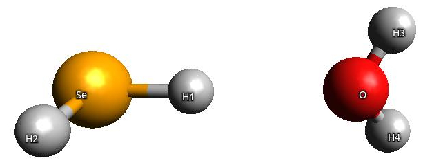

:orphan:

.. _FDENMR:

==========================================================================================
NMR shieldings in Frozen Density Embedding (FDE) scheme with London atomic orbitals (LAOs)
==========================================================================================

In this tutorial we will show how to calculate the NMR shielding tensor with London atomic orbitals
within the FDE scheme. 

NMR shielding tensor in FDE scheme - theory overview
====================================================

In order to calculate the NMR shielding tensor with LAOs, one must take into account 
modifications of the property gradient due to the use of perturbation-dependent basis sets (see :cite:`Ilias2009`).
In FDE scheme, further modifications are needed, since the property gradient includes not only terms from
isolated subsystems (here marked as "I" and "II"), 
but also a contribution from the interaction energy between these subsystems (see :cite:`Hofener2013`).

For instance, these new contributions to the property gradient of subsystem "I" can be written as (see :cite: `olejniczak2017`):

.. math::
   :label: fde_pg

    E_{[1],emb}^{[B]} = - \int v_{emb}^I \Omega_{ia}^{B,I} - \iint w_{emb}^{I,I} \Omega_{ia}^{I} \Omega_{jj}^{B,I} - \iint w_{emb}^{I,II} \Omega_{ia}^{I} \Omega_{jj}^{B,II}

where :math:`\Omega_{pq}^{B}` is the first-order perturbed overlap distribution, which in a basis of London orbitals consists of two terms

.. math::
   :label: mo_lao_b

    \Omega_{pq}^{B} = \frac{i}{2} (R_{MN} \times r) \Omega_{pq} + (T_{pt}^{B*} \Omega_{tq} + \Omega_{pt}T_{tq}^B),

"direct" LAO term (the first term) and "reorthonormalization" term (in parenthesis).
The :math:`v_{emb}^I` is the embedding potential of subsystem I, :math:`w_{emb}^{I,I}` is the embedding kernel involving subsystem I 
and :math:`w_{emb}^{I,II}` is the embedding kernel coupling subsystem I and subsystem II.

In this tutorial we will show how to include each of these contributions to the property gradient in the
calculations of the NMR shielding tensor. We will also demonstrate how to calculate and plot the first-order
perturbed current density induced by magnetic field and how to use it in analysis of the NMR shielding tensor.

A sample calculation of NMR shielding tensor within FDE
=======================================================

We will consider a simple system of SeH\ :sub:`2`\ - H\ :sub:`2`\ O, in which SeH\ :sub:`2`\ 
constitutes an active subsystem (subsystem I) and H\ :sub:`2`\ O\ is an environment (subsystem II):

 
The computational protocol is different depending on whether the coupling between two
subsystems is included or not (through the term dependent on :math:`w_{emb}^{I,II}`).
To avoid confusion, we will describe these two protocols separately.

We will need two molecular input files. File ``h2se.mol``, corresponding to an active subsystem I, reads:

.. literalinclude:: h2se.mol

and file ``h2o.mol``, standing for a subsystem II ('environment'):

.. literalinclude:: h2o.mol

In this example we will use the four-component relativistic DC Hamiltonian and DFT/LDA with small grid and small basis sets.

Calculations without the FDE coupling terms
-------------------------------------------

Here we demonstrate how to include the first two terms of Eq. :eq:`fde_pg` in the property gradient: 
terms dependent on the embedding potential and the uncoupled embedding kernel.

In this tutorial, we use a coarse grid generated in DIRAC in preceeding calculations
on SeH\ :sub:`2`\ - H\ :sub:`2`\ O 'supermolecule', which was then exported on a ``numerical_grid`` file.
In DIRAC the ``numerical_grid`` file, which can be retrieved from DFT calculations, is divided into 
batches of points. However, FDE module is able to read only the continuous list of grid points,
therefore such ``numerical_grid`` file has to be reformatted.
This can be done by the script which can be found in ``utils`` directory of DIRAC,
``dft_to_fde_grid_convert.py``, which should be called from the directory where the ``numerical_grid`` file is:

.. literalinclude:: grid_convert

This script will overwrite the ``numerical_grid`` and save its original version as ``numerical_grid.ORIG``.

Step 1: SCF calculation on the subsystem II
~~~~~~~~~~~~~~~~~~~~~~~~~~~~~~~~~~~~~~~~~~~

The first step is the calculation on subsystem II, the aim of which is
to export its density and electrostatic potential on a text file.

The menu file ``getfrozen.inp`` reads:

.. literalinclude:: getfrozen.inp

and we make sure to get the text file ``GRIDOUT`` (related to the :ref:`FDE_.GRIDOU` keyword).
We should also remember to supply two files, 
related to keywords :ref:`FDE_.GRIDOU` (``GRIDOUT``) and :ref:`FDE_.EXONLY` (``FILEEX``),
which are copies of a numerical grid file:

.. literalinclude:: getfrozen.run

After this step, the ``GRIDOUT`` file will be updated: additional columns on that file
correspond to the electrostatic potential and the density of subsystem II
calculated in each point of a grid.

Step 2: SCF and response calculation on the subsystem I
~~~~~~~~~~~~~~~~~~~~~~~~~~~~~~~~~~~~~~~~~~~~~~~~~~~~~~~

Now we can use the information about the subsystem II written on the ``GRIDOUT`` file for constructing
the embedding potential, :math:`v_{emb}^{I}`, and embedding kernel, :math:`w_{emb}^{I,I}`.
In order to do that, we use the ``GRIDOUT`` file saved from Step 1 and copy it to a ``FROZEN`` file,
which is given as an argument to the :ref:`FDE_.FRDENS` keyword.

We use the following input file for the SCF step:

.. literalinclude:: updatefrozen.inp

and the ``pam`` command is:

.. literalinclude:: updatefrozen.run

To calculate the NMR shielding tensor, we use the following input file:

.. literalinclude:: shield_v_w11.inp

in which the keyword :ref:`FDE_.LAO11` denotes that the contributions from the embedding potential, :math:`v_{emb}^{I}`,
and the uncoupled embedding kernel, :math:`w_{emb}^{I,I}`, will be added to the property gradient.
The corresponding ``pam`` command is:

.. literalinclude:: shield_v_w11.run

This is the advised option. However, as the calculations of the uncoupled embedding kernel terms in the property
gradient may be expensive, one may want to restrict the FDE-LAO contributions to the part dependent on the
embedding potential only. 
In this case, the input file reads:

.. literalinclude:: shield_v.inp

and the corresponding ``pam`` command is:

.. literalinclude:: shield_v.run

Additionally, we may want to save the ``PAMXVC`` and ``TBMO`` files, if we are interested in
visualization of the NMR shielding density and/or magnetically-induced current density.
The calculation on our test molecule give the following results for the isotropic part of the shielding tensor of Se atom:

    ===================================  =========
    terms included in property gradient    value
    ===================================  =========
    None                                 2469.8091
    v                                    2370.3941
    v+w11                                2370.2488
    ===================================  =========

``None`` in the table denotes calculations performed with no "new" FDE-LAO terms in the property gradient (the gauge origin is in the center of mass of SeH2).
Also, in this test case the value obtained with the embedding potential and the uncoupled embedding kernel in the property gradient (``v+w11``) 
is very close to the result of calculations with the embedding potential only (``v``), but for heavier nuclei the difference between these two setups may
be significant.

Calculations with the FDE coupling terms
----------------------------------------

Here we will demonstrate how to include the coupling between two subsystems in the property gradient 
(term dependent on :math:`w_{emb}^{I,II}`).

Step 1: SCF and response calculation on the subsystem II
~~~~~~~~~~~~~~~~~~~~~~~~~~~~~~~~~~~~~~~~~~~~~~~~~~~~~~~~

In the first step we perform the calculations on subsystem II, the aim of which is
to get its density and electrostatic potential written on a text file.
In addition, we will export the perturbed density of subsystem II. 
We will need the DFCOEF file of subsystem II, which can be taken from ``getfrozen.inp`` run with the following input:

.. literalinclude:: getfrozen.inp

with the ``pam`` command:

.. literalinclude:: getfrozen.run

(exactly as done in calculations without the FDE coupling terms presented above). 
From this step we save the ``GRIDOUT.h2o`` file.
In order to get the density perturbed by an external magnetic field in LAO basis, the following input can be used:

.. literalinclude:: getfrozenpert.inp

with the keyword :ref:`NMR_.EXPPED` asking the program to save the contributions to the perturbed density on two files ``pertden_direct_lao.FINAL`` and ``pertden_reorth_lao.FINAL``. The corresponding pam command is:

.. literalinclude:: getfrozenpert.run

NOTE: This step has to be run in serial mode for the moment.

Step 2: Response calculation on the subsystem I
~~~~~~~~~~~~~~~~~~~~~~~~~~~~~~~~~~~~~~~~~~~~~~~

Now we can finally calculate the FDE contributions to the NMR shielding tensor of an active subsystem (H2Se) 
which depend on the embedding kernel including the coupling terms between two subsystems. 
If the SCF step on an active subsystem was not done before, we should run the following input:

.. literalinclude:: updatefrozen.inp

with the ``pam`` command:

.. literalinclude:: updatefrozen.run

The response input is then the following:

.. literalinclude:: shield_v_w11_w12_nocoulomb.inp

with two new keywords: :ref:`FDE_.LAOFRZ` and :ref:`FDE_.PERTIM`. The corresponding ``pam`` command is:

.. literalinclude:: shield_v_w11_w12_nocoulomb.run

This input does not include the computationally expensive Coulomb term in the embedding kernel, only the nonadditive
exchange-correlation and kinetic parts of the embedding kernel. 
If the Coulomb term is to be calculated then an additional keyword is required in the input, :ref:`FDE_.LFCOUL`.
Instead of using the :ref:`FDE_.LFCOUL` and the :ref:`FDE_.LAOFRZ` keywords together, it is possible to use a single :ref:`FDE_.LAO12` keyword,
which represents both contributions to the coupled embedding kernel:

.. literalinclude:: shield_v_w11_w12.inp

with an analogous ``pam`` command:

.. literalinclude:: shield_v_w11_w12.run

This input contains all the necessary contributions to the property gradient.
Additionally, we may want to save the ``PAMXVC`` and ``TBMO`` files, if we are interested in
visualization of the NMR shielding density and/or magnetically-induced current density.
With this setup the calculations on the test system gave the following results:

    ===================================  =========
    terms included in property gradient    value
    ===================================  =========
    v+w11+w12, no Coulomb                2370.2536
    v+w11+w12, ALL terms                 2370.2536
    ===================================  =========

Here the two results are the same within 0.0001 ppm accuracy, as the contributions from the Coulomb embedding contribution to the perturbed Fock matrix are very small (can be printed in the output with the print level set at least to 5 under ``**PROPERTIES`` section).

