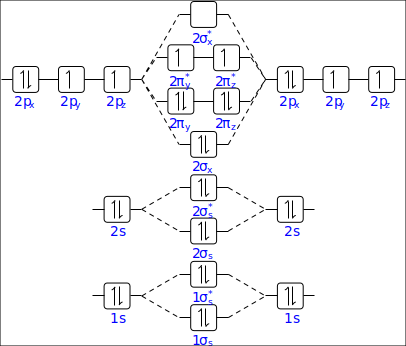

:orphan:

.. _O2_highspin_relcc:

Relativistic Coupled-Cluster calculations on the dioxygen molecule
==================================================================

A simple example of a high-spin open shell state treated with the single reference CCSD(T) method is the dioxygen molecule.

Hartree-Fock reference
----------------------

We start with the description of the single-determinant reference state.
The ground state with two unpaired electrons corresponds to the triplet state.
In the :math:`D_{2h}` / :math:`D_{\infty h}`  symmetries the electrons are placed as follows:

::

   .CLOSED SHELL
    6 8
   .OPEN SHELL
   1
   2/4,0

(See the :download:`DIRAC.INP <../../../../test/fscc_highspin/hf.inp>` and 
the :download:`MOLECULE.MOL <../../../../test/fscc_highspin/O2.mol>` input files, 
and the associated :download:`output file <../../../../test/fscc_highspin/result/hf_O2.out>`.)

The overall electronic occupation of the oxygen molecule 
can be displayed in the following MO diagram (`see also here <https://en.wikipedia.org/wiki/Triplet_oxygen>`_):

Coupled-Cluster description
----------------------------

Let us continue with the correlated treatment of the oxygen molecule at the Coupled-Cluster level.

The 1s electrons of each oxygen atom are kept frozen. The active space then consists of 12 electrons, 
of which there are 10 closed shell electrons.

The closed shell electrons occupy the nonbonding 2s :math:`\sigma_g` and :math:`\sigma_u` 
orbitals and the bonding 2p :math:`\sigma_g` and :math:`\pi_u` orbitals, while the 2 open shell electrons are distributed over the 
two antibonding 2p :math:`\pi_g` orbitals. 

Let us suppose that we want to take the :math:`M_S=1` state as our reference 
and assign alpha spin to both our open shell electrons. In the double group (:math:`D_{2h}^*`) we do not distinguish between 
:math:`\sigma` and :math:`\pi`, so we need to add all alpha electrons in gerade orbitals (2s :math:`\sigma_g` + 2p :math:`\sigma_g` 
+ 2p :math:`\pi_g` = 4), beta electrons in gerade orbitals (2s :math:`\sigma_g` + 2p :math:`\sigma_g` = 2), 
alpha electrons in ungerade orbitals (2s :math:`\sigma_u` + 2p :math:`\pi_u` = 3) 
and beta electrons in ungerade orbitals (2s :math:`\sigma_u` + 2p :math:`\pi_u` = 3). 
This gives - at the Coupled Cluster level - the following occupation::

  .NELEC
  4 2 3 3

(See the :download:`input file <../../../../test/fscc_highspin/uccsd.inp>`
and the :download:`output file <../../../../test/fscc_highspin/result/uccsd_O2.out>`.)

Note that this determinant does not represent the exact ground state of the oxygen molecule as this triplet is split by a few wave numbers 
due to spin-spin and (second order) spin-orbit interactions. 

The lowest state is the :math:`\Omega=0` component that cannot be 
represented by a single determinant. This state can be calculated using the Fock space Coupled Cluster method, see below.

Utilizing the linear symmetry
~~~~~~~~~~~~~~~~~~~~~~~~~~~~~

Coming back to our example, the oxygen molecule, we now show how the Coupled-Cluster occupation can be refined in the linear symmetry.

We again want to take the :math:`M_S=1` state as our reference. The irreps of :math:`D_{\infty h}^*` are ordered as 
1/2, -1/2, 3/2, -3/2,.... so we need to consider the :math:`\Omega` value (giving the projection on the molecular axis of both spin 
and orbital angular momentum) of the occupied orbitals. The :math:`\sigma` -orbitals go in the irreps 1/2 and -1/2 
while the :math:`\pi` -orbitals span the four irreps (1/2, -1/2, 3/2, -3/2). Putting an alpha electron in a :math:`\sigma` orbital will give 
an :math:`\Omega` value of 1/2, while putting it in a :math:`\pi` -orbital can either give -1/2 
(when put in the orbitals with orbital momentum -1) or 3/2 (when put in the +1 orbital). 
Similarly the beta electrons go in irreps -1/2 (for the :math:`\sigma`), -3/2 and 1/2 (for the :math:`\pi`). 
This makes the input for our example: ::

  .NEL_F1
  2 3 1 0
  .NEL_F2
  2 2 1 1 

(The :download:`input file <../../../../test/fscc_highspin/uccsd_linsym.inp>`,
and the resulting :download:`output file <../../../../test/fscc_highspin/result/uccsd_linsym_O2.out>`.)

Fock-space Coupled-Cluster calculations
----------------------------------------
An example of the use of the Fock space method concerns the calculation
of the lowest three states of the molecular oxygen. 

These are obtained by
distributing two electrons in the degenerate :math:`\pi^{*}_g` orbitals. The
X ground state is a triplet that is split by the second-order spin-orbit
coupling and the spin-spin interactions in a lowest  :math:`M_S=0` 
component and two higher  :math:`M_S=\pm 2` components. 

In the Fock space approach we first perform a calculation on
the closed-shell :math:`O_{2}^{2+}` and calculate the three X states, the
degenerate open shell singlet a and the singlet b state in one single
Fock space run, which involves sectors sequence of (0,0)->(0,1)->(0,2).

The complete FSCCSD input 
:download:`reads then <../../../../test/fscc_highspin/fsccsd.inp>`. 
The corresponding output file is
:download:`here <../../../../test/fscc_highspin/result/fsccsd_O2.out>`.
These FSCCSD correlated energy states can be compared against the uncorrelated COSCI states, 
see :download:`here <../../../../test/fscc_highspin/result/hf_O2.out>`.

Another way of running FSCCSD calculations is starting from the closed-shell anion, :math:`O_{2}^{2-}`, 
and removing two-electrons in the sequence of (0,0)->(1,0)->(2,0) sectors.
The FSCCSD input file is
:download:`here <../../../../test/fscc_highspin/fsccsd_IE2.inp>`,
and the downloadable output file is
:download:`here <../../../../test/fscc_highspin/result/fsccsd_IE2_O2.out>`.

The reader can check the experimental values of excitation energies in the 
`NIST web page <http://webbook.nist.gov/cgi/cbook.cgi?ID=C7782447&Units=SI&Mask=1000#Diatomic>`_.

