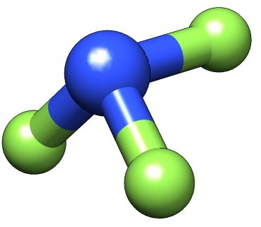

:orphan:

=============================================
Magnetizabilities with London Atomic Orbitals
=============================================

Introduction
------------

In this tutorial we will look at the calculation of (static) magnetizabilities with DIRAC.
For more details about the method, see :cite:`Ilias2013`.

The component :math:`\zeta_{\alpha\beta}` of the static :math:`3\times 3` magnetizability tensor describes
connects component :math:`\alpha` of first-order induced magnetic dipole to component :math:`\beta` of the
external inducing homogeneous magnetic field

.. math::

   m^{(1)}_\alpha = \sum_\beta \zeta_{\alpha\beta} B_{\beta} = \frac{1}{2}\int\left(\mathbf{r}_G\times\mathbf{j}^{B_\beta}\right)_{\alpha}d\tau

The first-order induced magnetic dipole is proportional to the direct product of the position vector :math:`\textbf{r}_G` with 
repect to some arbitrary (gauge) origin :math:`G` and the first-order induced current density :math:`\mathbf{j}^{\mathbf{B}}`.
Although the static induced magnetic dipole is formally independent of the gauge-origin this does not hold true in the finite 
basis approximation, where excruciating slow convergence of the  magnetizability with respect to basis set is typically observed.
London Atomic Orbitals (LAOs), also known as Gauge Including Atomic Orbitals (GIAOs), remove any reference to the arbitrary gauge 
origin by shifting the gauge origin to the centers of individual basis functions and effectively cure both problems.

Example: :math:`NF_3`
---------------------

We shall illustrate these features using the nitrogen trifluoride molecule. 

The molecular input file `NF3.mol` uses the experimental geometry and automatic symmetry detection.

.. literalinclude:: NF3.mol

Generating the HF wave function
~~~~~~~~~~~~~~~~~~~~~~~~~~~~~~~

We first run a Hartree-Fock calculation to generate orbitals and corresponding energies
using `scf.inp`

.. literalinclude:: scf.inp

and the command::

   pam --inp=scf --mol=NF3 --outcmo

You may notice in the output that DIRAC will center and rotate the molecule.
It detects the full :math:`C_{3v}` symmetry, but will run the calculation in 
the lower :math:`C_s` symmetry, with reflection in the *xy* -plane, with the 
:math:`C_3` rotation around the *x* -axis.

Magnetizabilities: first attempt
~~~~~~~~~~~~~~~~~~~~~~~~~~~~~~~~

We first calculate the magnetizability using the input file `cgo.inp`

.. literalinclude:: cgo.inp

where the (common) gauge origin has been set to the center of mass using the :ref:`NMR_.USECM` keyword.
Notice that we use :ref:`GENERAL_.RKBIMP` (? :ref:`PROPERTIES_.RKBIMP` ) to convert our molecular coefficients from restricted
to unrestricted kinetic balance (RKB :math:`\rightarrow` UKB), the former employed for the
generation of orbitals, and the latter employed for the response calculations, indicated by
:ref:`HAMILTONIAN_.URKBAL`. This corresponds to the use of `simple magnetic balance <../simple_magnetic_balance/tutorial.html>`_.
The calculation is run using::

   pam --inp=cgo --mol=NF3 --incmo

and gives the total magnetizability tensor

.. literalinclude:: cgo_NF3_total

here reported in atomic units :math:`e^2a_0^2/m_e`, corresponding to 7.89104 :math:`\cdot 10^{-29}` J/T.

Magnetizabilities using LAOs
~~~~~~~~~~~~~~~~~~~~~~~~~~~~

We now activate LAOs using the input file `lao.inp`

.. literalinclude:: lao.inp

which gives the total magnetizability tensor

.. literalinclude:: lao_NF3_total

which is markedly different from the CGO. The question now is: Which result is 'best' ?
From microwave spectroscopy (see :cite:`Stone1969`) the magnetizability anisotropy, defined as

.. math::

   \zeta_{ani} = \zeta_{\perp} - \zeta_\parallel 
   
has been found to be -0.63 :math:`(\pm 0.32)\ e^2a_0^2/m_e`. With CGO and LAOs we obtain +0.4421 and -0.6457 
:math:`e^2a_0^2/m_e`, respectively, clearly favoring the LAO calculation. However, it very often happens that 
one gets the right answer for the wrong reason, so let us investigate the gauge-origin independence of the
result as well as basis set convergence.

Gauge-origin dependence
~~~~~~~~~~~~~~~~~~~~~~~

To investigate gauge-origin dependence we do a CGO and LAO calculation with the gauge origin placed at::

   **INTEGRALS
   .GO ANG ! gauge origin in Angstrom
   10.00 0.0 0.0

that is, along the :math:`C_3` axis. Please note that when shifting the gauge origin in this manner you should 
limit the gauge origin to symmetry-independent points, that is, you should stay on symmetry elements like the
*xy* mirror plane in this case. The CGO calculation now gives

.. literalinclude:: cgo2_NF3_total

We see that the parallel component :math:`\zeta_\parallel` is unchanged, whereas the perpendicular component 
:math:`\zeta_\perp` is dramatically different. With LAOs we get

.. literalinclude:: lao2_NF3_total

where the numerical differences with respect to the original calculation is below
the convergence threshold of the linear response calculation. We can therefore see that the use of LAOs
removes the gauge dependence in the finite basis approximation.

Basis-set convergence
~~~~~~~~~~~~~~~~~~~~~

The basis set convergence is illustrated by the following table, taken from  :cite:`Ilias2013`, showing CGO(LAO) 
magnetizabilities (in :math:`e^2a_0^2/m_e`) for a wide range of basis sets. 

+----------+---------------------------+-----------------------+---------------------+---------------------+
|  Basis   | :math:`\zeta_{\parallel}` | :math:`\zeta_{\perp}` | :math:`\zeta_{iso}` | :math:`\zeta_{ani}` |
+----------+---------------------------+-----------------------+---------------------+---------------------+
|       DZ | -14.83 (-4.27)            | -9.78 (-4.87)         | -11.47 (-4.67)      | +5.04 (-0.60)       |
+----------+---------------------------+-----------------------+---------------------+---------------------+
|       TZ |  -7.88 (-4.36)            | -6.52 (-4.96)         |  -6.97 (-4.76)      | +1.37 (-0.60)       |
+----------+---------------------------+-----------------------+---------------------+---------------------+
|       QZ |  -5.65 (-4.43)            | -5.54 (-5.04)         |  -5.58 (-4.83)      | +0.11 (-0.61)       |
+----------+---------------------------+-----------------------+---------------------+---------------------+
|   aug-DZ |  -6.75 (-4.57)            | -6.31 (-5.22)         |  -6.46 (-5.00)      | +0.44 (-0.65)       |
+----------+---------------------------+-----------------------+---------------------+---------------------+
|   aug-TZ |  -5.01 (-4.64)            | -5.42 (-5.24)         |  -5.28 (-5.04)      | -0.41 (-0.60)       |
+----------+---------------------------+-----------------------+---------------------+---------------------+
|   aug-QZ |  -4.70 (-4.64)            | -5.26 (-5.24)         |  -5.08 (-5.04)      | -0.56 (-0.60)       |
+----------+---------------------------+-----------------------+---------------------+---------------------+
| d-aug-DZ |  -6.37 (-4.57)            | -6.18 (-5.22)         |  -6.24 (-5.00)      | +0.19 (-0.65)       |
+----------+---------------------------+-----------------------+---------------------+---------------------+
| d-aug-TZ |  -5.01 (-4.69)            | -5.45 (-5.27)         |  -5.31 (-5.08)      | -0.44 (-0.58)       |
+----------+---------------------------+-----------------------+---------------------+---------------------+
| d-aug-QZ |  -4.76 (-4.68)            | -5.31 (-5.28)         |  -5.13 (-5.08)      | -0.55 (-0.60)       |
+----------+---------------------------+-----------------------+---------------------+---------------------+

The basis set convergence is seen to be dramatically different, again clearly in favour of LAOs.
