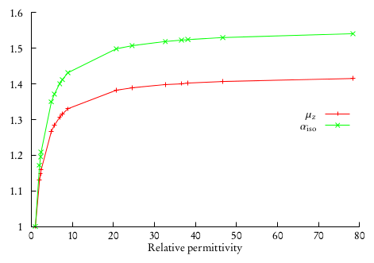

:orphan:

Calculation of electric properties in solution: dipole moments and polarizabilities
===================================================================================

The current implementation of the PCM in DIRAC allows for the calculation of electric
properties up to second order. This means that electric dipole moments and electric
dipole polarizabilities are available.

The analytical results can also be checked against a finite-field approach.
The Hamiltonian defined 
In the input the Hamiltonian definition is augmented by an explicit electric field. 
Repeating the calculation with different coupling strengths and electric field directions,
will enable the use of a stencil formula for the finite-difference calcultion of
energy derivatives, for example using a `Five-point stencil <http://en.wikipedia.org/wiki/Five-point_stencil>`_:

.. math::
   
   f'(x) &\simeq \frac{-f(x+2h) + 8f(x+h) - 8f(x-h) + f(x-2h)}{12h} \\
   f''(x) &\simeq \frac{-f(x+2h) + 16f(x+h) - 30f(x) + 16f(x-h) + f(x-2h)}{12h^2}

Electric dipole moments
-----------------------

We recall that the component :math:`I` of the electric dipole moment is defined as the first derivative, at zero perturbation strength, 
of the energy with respect to the component :math:`I` of an applied external electric field :math:`\mathbf{F}`.

Thanks to the Hellmann-Feynman theorem, this reduces to the calculation of the expectation value of the component
:math:`I` of the electric dipole moment operator:

.. math::
   \mu_I = -\left.\frac{\partial E(\mathbf{F})}{\partial F_I}\right|_{\mathbf{F}=0} = \langle 0|\hat{\mu}_I | 0\rangle

Calculation of dipole moments with PCM is quite straightforward. We just need to add the PCM section to
a dipole moment calculation input file::

   **DIRAC
   .WAVE FUNCTION
   .PROPERTIES
   **HAMILTONIAN
   .PCM
   **WAVE FUNCTION
   .SCF
   **PROPERTIES
   .DIPOLE
   *END OF

and of course use the appropriate PCMSolver input file::
    
    Units = Angstrom
    Medium {
    	 SolverType = CPCM
         Solvent = Cyclohexane 
    }
    
    Cavity {
                Type = GePol
                Area = 10.0 
                Mode = Explicit 
                Spheres = [0.0, 0.0, 0.0, 20.0]
    }

This PCMSolver input file requires the CPCM model with cyclohexane as solvent. The solute is enclosed
in a cavity made from a single sphere, centered at the origin and with a 20 angstrom radius.
Consider the following .mol file for water as an example::

    INTGRL
    Water
    
    C   2    0
            8.    1
    O      .0000000000        0.0000000000        -.2249058930
    LARGE BASIS cc-pVDZ
            1.    2
    H     1.4523499293         .0000000000         .8996235720
    H     -1.4523499293         .0000000000         .8996235720
    LARGE BASIS cc-pVDZ
    FINISH

The output for the dipole moment calculation looks just like usual::
             
         **************************************************************************
         *************************** Expectation values ***************************
         **************************************************************************
     
                                                        s0 t0
     ----------------------------------------------------------------------------
         Dipole length: X :     0.63076018E-12 a.u.      F   F
         Dipole length: Y :    -0.20258107E-15 a.u.      F   F
         Dipole length: Z :     0.813178997624 a.u.      F   F
     ----------------------------------------------------------------------------
         s0 = T : Expectation value zero by point group symmetry.
         t0 = T : Expectation value zero by time reversal symmetry.
     ----------------------------------------------------------------------------
     * Dipole moment:
     
               Electronic               Nuclear                  Total       
               contribution             contribution             contribution
     ----------------------------------------------------------------------------
     x         0.00000000 Debye         0.00000000 Debye         0.00000000 Debye
     y        -0.00000000 Debye         0.00000000 Debye        -0.00000000 Debye
     z         2.06691398 Debye         0.00000000 Debye         2.06691398 Debye
     ----------------------------------------------------------------------------
     x         0.00000000 a.u.          0.00000000 a.u.          0.00000000 a.u.
     y        -0.00000000 a.u.          0.00000000 a.u.         -0.00000000 a.u.
     z         0.81317900 a.u.          0.00000000 a.u.          0.81317900 a.u.
     ----------------------------------------------------------------------------
     
      1 a.u =   2.54177000 Debye

Electric dipole moment polarizabilities
---------------------------------------

We recall that the electric dipole polarizability is a second order property as is defined as
the second derivative, at zero field strength, of the energy:

.. math::
   \alpha_{IJ} = -\left.\frac{\partial^2 E(\mathbf{F})}{\partial F_I\partial F_J}\right|_{\mathbf{F}=0}

In a response theory framework, the polarizability tensor elements can be identified from the linear 
response function, see :cite:`Saue2002a`:

.. math::
   \alpha_{IJ} = -\langle\langle \mu_I; \mu_J\rangle\rangle

The polarizability is a rank-2 tensor and has six unique components. We can extract two invariant quantities
from the tensor: the isotropic and anisotropic polarizability:

.. math::
   \alpha_\mathrm{iso} = \frac{1}{3}(\alpha_{xx} + \alpha_{yy} + \alpha_{zz})

   \alpha_\mathrm{aniso} = \frac{1}{\sqrt{2}}\sqrt{(\alpha_{xx} - \alpha_{yy})^2 + (\alpha_{xx} - \alpha_{zz})^2 + (\alpha_{yy} - \alpha_{zz})^2 + 6(\alpha_{xy}^2 + \alpha_{xz}^2 + \alpha_{yz}^2)}

Again, we just need to add the PCM section to an electric dipole polarizability calculation input file::

   **DIRAC
   .PROPERTIES
   **HAMILTONIAN
   .PCM
   **WAVE FUNCTION
   .SCF
   **PROPERTIES
   .POLARIZABILITY
   *END OF

the same .mol file as above for water is used in this example. The following PCMSolver input file is used::   

   Units = Angstrom
   Medium {
                   Solvent = Water
   }
   
   Cavity {
                   Type = GePol
                   Area = 10.0
                   Mode = Implicit
   }

The output for the dipole moment calculation looks just like usual::

                         +--------------------------------+
                         ! Electric dipole polarizability !
                         +--------------------------------+
      
      
      
     @   Elements of the electric dipole polarizability tensor
     
     @   xx            7.76376447 a.u.   (converged)      
     @   yy            3.21397401 a.u.   (converged)      
     @   zz            5.57773363 a.u.   (converged)      
     
     @   average       5.51849070 a.u.
     @   anisotropy    3.941      a.u.
     
     @   xx            1.15047118 angstrom**3
     @   yy            0.47626180 angstrom**3
     @   zz            0.82653484 angstrom**3
     
     @   average       0.81775594 angstrom**3
     @   anisotropy    0.584      angstrom**3

----------------------------------------------

Influence of the relative permittivity on electric properties
-------------------------------------------------------------

It is interesting to analyze the effect of varying the relative permittivity
of the solvent on the calculation of electric properties. We will use 
the two input files strategy and exploit the string substitution mechanism
of the pam scripti. Consider the pcm-prop.inp input file::

    **DIRAC       
    .WAVE FUNCTION
    .PROPERTIES
    .PCM
    *PCM          
    *PCMSOLVER    
    .CAVTYPE      
     GEPOL        
    .NOSCALING    
    .AREATS       
     10          
    .SOLVERTYPE   
     IEFPCM       
    .SOLVNT       
     solvent  
    **WAVE FUNCTION
    .SCF           
    **PROPERTIES
    .DIPOLE
    .POLARIZABILITY
    *END OF        

Notice that instead of specifying a solvent name we put a placeholder string.
This can be exploited to run calculations selecting a different solvent::
    
    pam --inp=pcm-prop.inp --replace solvent=CYCLOHEXANE --mol=H2O.mol

or run this in a loop::

    # Declare array of solvents. Solvents are ordered by increasing relative permittivity
    declare -a solv_array=("N-HEPTANE" "CYCLOHEXANE" "CARBON TETRACHLORIDE" "BENZENE" "TOLUENE" "CHLOROFORM" "CHLOROBENZENE" "ANILINE" "TETRAHYDROFURANE" "METHYLENECHLORIDE" "1,2-DICHLOROETHANE" "ACETONE" "ETHANOL" "METHANOL" "ACETONITRILE" "NITROMETHANE" "DIMETHYLSULFOXIDE" "WATER")

    # Now loop over the array elements and substitute them to the string solvent in pcm-prop.inp
    for solv in "${solv_array[@]}"
    do
        echo "$solv"
        pam --inp=pcm-prop.inp --replace solvent=$solv --mol=H2O.mol
    done

This will produce a different output file for every different solvent in the array. One can collect the results for dipole moments and isotropic
polarizabilities and plot them against the relative permittivities. This was done in :cite:`DiRemigio2015` for the :math:`\mathrm{H}_2\mathrm{Po}`
molecule:

where it was also found that the difference between the values of the observables in solution and in vacuo can be fitted to
a linear rational function:

.. math::
   \alpha_\mathrm{iso}(\varepsilon_\mathrm{r}) - \alpha_\mathrm{iso}(1) = \frac{\varepsilon_\mathrm{r} - 1}{a\varepsilon_\mathrm{r} + b}\alpha_\mathrm{iso}(1)

An analogous relation was found to be valid also for the dipole moment. Notice that the :math:`a, b` coefficients are system-dependent.
