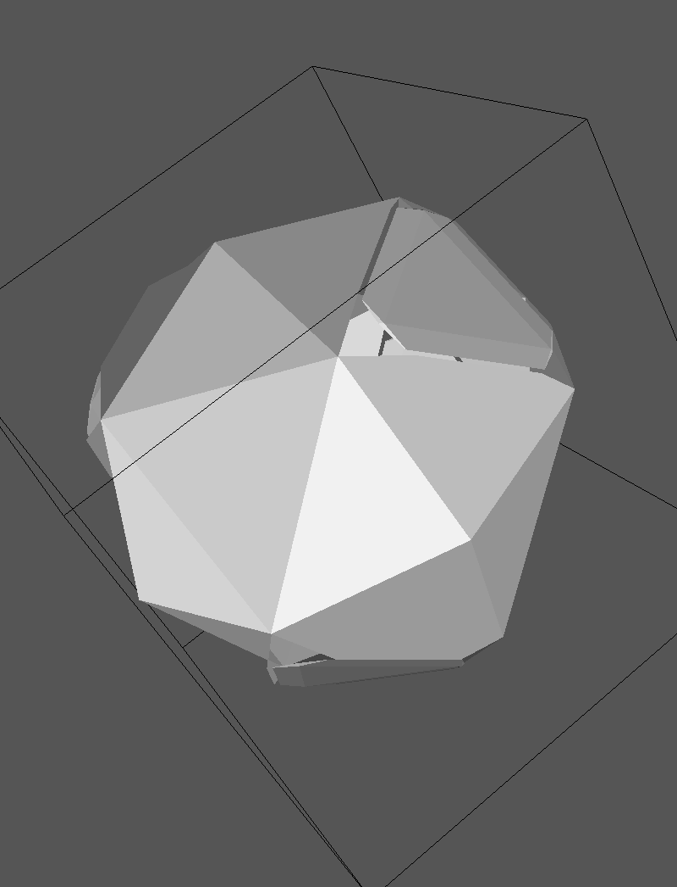

:orphan:

Hartree-Fock and DFT calculations in solution with the polarizable continuum model
==================================================================================

This tutorial will cover the set up of an Hartree-Fock and a DFT calculation using the
polarizable continuum model (PCM) to include solvent effects. The implementation
of the PCM-SCF algorithm in DIRAC is documented in the recent paper :cite:`DiRemigio2015`,
to which the reader is referred for further technical details.
The current implementation makes use of an external module for the PCM-related
tasks. The module needs some input information to run properly.

As explained in the `*PCMSOL` section of the reference manual, a PCM calculation can be set up in two ways:

* using **three** input files. The additional input file contains directives for the PCMSolver module;
* using **two** input files. The additional directives in the inp file are forwarded to the PCMSolver module.

The second method is not as flexible as the first one and we will cover both in this tutorial.

For further details, please refer to the PCM documentation in the reference manual.
Notice that the fact that a working implementation of the PCM-SCF algorithm gives access to
geometry optimizations based on a numerical gradient and finite-field approaches to the
calculation of response properties. The input files for DIRAC in these two cases need only be
modified to include the directives relevant for the PCM calculation.

We will use the extremely simple examples contained in the test/pcm_energy directory.
They are more than enough to show a simple workflow, possible gotchas and what to look for
in a PCM output.

.. warning:: Calculations with the polarizable continuum model **cannot** exploit molecular point group symmetry and/or 2-component Hamiltonians.

The .mol file is prepared in the exact same manner as for an in vacuo calculation.
In all the cases examined in the following,  we will use the methane molecule with a STO-3G basis set::

   INTGRL
   methane (a standard MOLFDIR test at that geometry)
   nonrelativistic contracted STO-3G basis
   C   2    0          
           6.    1
   C   0.0000    0.0000    0.0000
   LARGE BASIS STO-3G 
           1.    4
   H     .629889144   .629889144  .629889144
   H    -.629889144  -.629889144  .629889144
   H     .629889144  -.629889144 -.629889144
   H    -.629889144   .629889144 -.629889144
   LARGE BASIS STO-3G
   FINISH

An Hartree-Fock calculation using three input files
---------------------------------------------------

In this example, the first input method will be used. We have to prepare three input files.
The .inp file will feature some additional keywords::

   **DIRAC
   .WAVE FUNCTION
   **HAMILTONIAN
   .LEVY-LEBLOND
   .PCM
   *PCM
   .SEPARATE
   .PRINT
    6
   **WAVE FUNCTION
   .SCF
   *SCF
   .PRINT
   1
   *END OF

The `.PCM` keyword enables the addition of solvent terms to the Fock matrix. Details can be
controlled through directives under the `*PCM` section (to which the reader is referred for 
further details)
Using this input file a calculation using the Levy-Leblond Hamiltonian with PCM will be performed.
Notice that the nuclear and electronic molecular electrostatic potential (MEP) and apparent surface
charge (ASC) will be treated separately (`.SEPARATE` keyword)
The additional input for the PCMSolver module is::

   Units = AU
   Medium {
                   Solvent = Water
   }
   
   Cavity {
                   Type = GePol
                   Area = 357.106482748
       		   Scaling = False
                   Mode = Implicit
   }

The syntax for the PCMSolver module input is documented `here <http://pcmsolver.github.io/pcmsolver-doc/_input_description.html>`_
it is here important to note that the input is specified in atomic units and that the area parameter selects an extremely coarse tesselation. Such a huge value should never be used in production calculations! 
The above input disables scaling of the radii by the factor 1.2 This is only for testing purposes. In production calculations
the scaling by 1.2 should be **always** included.

Finally, the calculation can be run by issuing::

   pam --inp=levy.inp --mol=CH4.mol --pcm=pcmsolver.inp

The output file will be named levy_CH4_pcmsolver.out and the corresponding archive levy_CH4_pcmsolver.tgz
The archive contains the additional files: 

* cavity.off, an input to the `GeomView program <http://www.geomview.org/>`_ to visualize the cavity; 
* cavity.npz, a compressed NumPy array file. This can be given as input to PCMSolver to generate a restart cavity. Refer to the PCMSolver documentation for details;
* PEDRA.OUT, a detailed report from the cavity generator; 
* PCM_mep_asc, this lists the values of the **converged** MEP and ASC at cavity points.

From the cavity.off file one may generate the following plot. Notice how coarse the tesselation is:

Let us know highlight the additional information contained in the output:

* a summary of the setup of the PCM calculation is printed out when the Hamiltonian definition is completed::

    ===== Polarizable Continuum Model calculation set-up =====                                  
   * Polarizable Continuum Model using PCMSolver external module:
     . Converged potentials and charges at tesserae representative points written on file.
     . Calculate the SS block of the electrostatic potential matrix.
     . Separate potentials and apparent charges in nuclear and electronic.
     . Form One-Index Transformed ASC in a Linear Response calculation.
     . Print potentials at tesserae representative points.
                                                                                                
                                                                                                
   * PCMSolver, an API for the Polarizable Continuum Model electrostatic problem. Version 1.0.0
     Main authors: R. Di Remigio, L. Frediani, K. Mozgawa
      With contributions from:
       R. Bast            (CMake framework)
       U. Ekstroem        (automatic differentiation library)
       J. Juselius        (input parsing library and CMake framework)
     Theory: - J. Tomasi, B. Mennucci and R. Cammi:
              "Quantum Mechanical Continuum Solvation Models", Chem. Rev., 105 (2005) 2999
     PCMSolver is distributed under the terms of the GNU Lesser General Public License.

* the PCMSolver module is initialized. The cavity is formed, discretized and the PCM matrix is created. A report is printed out::

   ~~~~~~~~~~ PCMSolver ~~~~~~~~~~
   Using CODATA 2010 set of constants.
   Input parsing done API-side
   ========== Cavity 
   Cavity type: GePol
   Average area = 357.106 AU^2
   Probe radius = 2.61727 AU
   Number of spheres = 5 [initial = 5; added = 0]
   Number of finite elements = 80
   ========== Solver 
   Solver Type: IEFPCM, isotropic
   PCM matrix hermitivitized
   ============ Medium 
   Medium initialized from solvent built-in data.
   Solvent name:          Water
   Static  permittivity = 78.39
   Optical permittivity = 1.776
   Solvent radius =       1.385
   .... Inside 
   Green's function type: vacuum
   .... Outside 
   Green's function type: uniform dielectric
   Permittivity = 78.39

The parameters chosen in the PCMSolver input are printed out. The number of finite elements generated for the cavity surface are
also reported. The final section reports the value for the dielectric constant of the medium.

* at each iteration, the time spent in calculating the MEP and ASC is printed out::

   * NucMEP evaluation (CPU): 0.00000000s
   * NucASC evaluation (CPU): 0.00000000s
   * EleMEP evaluation (CPU): 0.00265500s
   * EleASC evaluation (CPU): 0.00000000s

Since the `.SEPARATE` keyword was given, nuclear and electronic MEP and ASC are handled separately.

* at each iteration, the MEP and ASC at cavity points are printed out. This is because the printlevel was set to 6 Here it's just a sample of the printout::
     
                                                            MEP and ASC at iteration           2
   Finite element #          Nuclear MEP                        Nuclear ASC                        Electronic MEP                     Electronic ASC
        1                     3.124762515511                    -0.279550006743                    -3.115288065165                     0.277466656220
        2                     3.124762515511                    -0.279550006743                    -3.115288065165                     0.277466656220
        3                     3.124762515511                    -0.279550006743                    -3.115288065165                     0.277466656220
        4                     3.100728688114                    -0.295176115078                    -3.099377710696                     0.296736937089

* the polarization energy components are also reported::

    Polarization energy components
       U_ee =   -30.13519885926173 , U_en =    30.18510529332953 , U_ne =    30.18510529332955 , U_nn =   -30.23554041057662

together with a more comprehensive report on the energy at the current iteration::

                                Output from ERGCAL
                                ------------------

    Total electronic energy            :   -62.564643386729145
    Nuclear potential energy           :    25.365934555796475
    Polarization energy                :    -0.000264341589633
    Total energy                       :   -37.198973172522301

the polarization energy reported from ERGCAL is the sum of the componets divided by 2.

* at the end of each iteration the time spent in forming the PCM Fock matrix contribution is reported::

    * PCM Fock matrix contribution  (CPU): 0.00269899s

* when the calculation is converged, the final energy report lists also the solvation energy, which is the sum of the polarization energy components divided by 2. The total energy already includes this contribution::

                                   TOTAL ENERGY
                                   ------------

    Electronic energy                        :    -62.567437447656800 
                                                                      
    Other contributions to the total energy
    Nuclear repulsion energy                 :     25.365934555796475
    Solvation energy                         :     -0.000171652208014
                                                                      
    Sum of all contributions to the energy
    Total energy                             :    -37.201674544068339

A nonrelativistic Hartree-Fock calculation using two input files
----------------------------------------------------------------

In this tutorial, the input to the PCMSolver module will be provided within the DIRAC input file
by adding the `*PCMSOLVER` section. Read the documentation for this section in the reference manual for
further details. Notice that this PCMSolver input is identical to the one given above in the separate file::

    **DIRAC       
    .WAVE FUNCTION
    **HAMILTONIAN 
    .NONREL       ! activates also point nuclei
    *PCM          
    .PRINT        
     6            
    *PCMSOLVER    
    .CAVTYPE      
     GEPOL        
    .NOSCALING    
    .AREATS       
     100          
    .SOLVERTYPE   
     IEFPCM       
    .SOLVNT       
     WATER        
    **WAVE FUNCTION
    .SCF           
    *SCF           
    .PRINT         
    1              
    *END OF        

The calculation is now run with::

    pam --inp=nonrel.inp --mol=CH4.mol

The PCMSolver report now is given by::

    ~~~~~~~~~~ PCMSolver ~~~~~~~~~~
    Using CODATA 2010 set of constants.
    Input parsing done host-side
    ========== Cavity 
    Cavity type: GePol
    Average area = 357.106 AU^2
    Probe radius = 2.61727 AU
    Number of spheres = 5 [initial = 5; added = 0]
    Number of finite elements = 80
    ========== Solver 
    Solver Type: IEFPCM, isotropic
    PCM matrix hermitivitized
    ============ Medium 
    Medium initialized from solvent built-in data.
    Solvent name:          Water
    Static  permittivity = 78.39
    Optical permittivity = 1.776
    Solvent radius =       1.385
    .... Inside 
    Green's function type: vacuum
    .... Outside 
    Green's function type: uniform dielectric
    Permittivity = 78.39

the only difference being that the module reports that input parsing has been done host-side.
Since we didn't specify the `.SEPARATE` keyword the total MEP and ASC are reported at tesserae centers
for each iteration. The polarization energy components are no longer showed.

A Dirac-Coulomb DFT calculation
-------------------------------

In this tutorial we will perform a DFT calculation using the Dirac-Coulomb Hamiltonian and the LDA functional::

    **DIRAC
    .WAVE FUNCTION
    **HAMILTONIAN
    .DFT
     LDA
    .PCM
    *PCM
    .PRINT
     6
    **WAVE FUNCTION
    .SCF
    *SCF
    .PRINT
     1
    *END OF

We use the three files input strategy, as we want to customize both the cavity formation and the solvent selection::

    Units = Angstrom
    Medium {
    	 SolverType = CPCM
         ProbeRadius = 1.385                            
         Solvent = Explicit                             
         Green<inside> {Type=Vacuum}             	   
    	 Green<outside> {                               
    	                 Type = UniformDielectric       
    	                 Eps = 15.04                    
    	 }                                              
    }
    
    Cavity {
                Type = GePol
                Area = 100.0 
                Mode = Atoms
    		Atoms = [1]
    		Radii = [1.55]
    }

Instead of using the IEFPCM we ask for the CPCM (Conductor-PCM), the solvent is also explicitly specified. 
The module is currently limited to the handling of homogeneous, uniform, isotropic dielectrics.    
The cavity is also customized. We use the atomic positions provided in the .mol file, but instead of using
the built-in value of 1.70 angstrom for the radius of atom 1 (carbon) we use 1.55 angstrom.
The calculation is run as usual and there is nothing more to highlight about the output in this case.
Notice that the solvent and solver specification could also be given using the two file input strategy.
The specification of custom cavities is **only** possible with the three file input strategy.

A Dirac-Coulomb, Hartree-Fock, PCM-SCC calculation
--------------------------------------------------

As explained in :cite:`DiRemigio2015`, the calculation of the molecular electrostatic potential integrals:

.. math::

   v_{\kappa\lambda}(\mathbf{s}_I) = \int\mathrm{d}\mathbf{r}\frac{-\Omega_{\kappa\lambda}(\mathbf{r})}{|\mathbf{r}-\mathbf{s}_I|}

needed for the PCM can be sped up by neglecting the Small-Small block and replacing the SS block of the potential by a simple Coulombic
correction :cite:`Visscher1997a`. This approximation is named PCM-SCC and the user can exploit it by specifying the `.SKIPSS` keyword in the 
`*PCM` section of the input::

   **DIRAC
   .WAVE FUNCTION
   **HAMILTONIAN
   .PCM
   *PCM
   .SKIPSS
   .PRINT
    6
   **WAVE FUNCTION
   .SCF
   *SCF
   .PRINT
    1
   *END OF

The PCM-SCC approximation makes sense only when the Dirac-Coulomb Hamiltonian is employed,
Notice that **by default** this integrals are never neglected in a PCM calculation. The user should exercise some care in using this 
option and test, when feasible, the impact on results of the PCM-SCC approximation.

