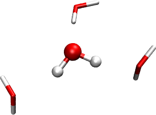

:orphan:

.. _pe_scf:

A Hartree-Fock calculation with the polarizable embedding (PE) model
====================================================================

In this tutorial we will cover the set up of a Hartree-Fock calculation using the
polarizable embedding (PE) model (:cite:`Olsen2010`, :cite:`Olsen2011`) to include
effects from a surrounding environment. Our example concerns a solvent effect, but the
PE model is general and can also handle other environments (e.g. proteins or mixed
solvents). The implementation of the model in DIRAC is documented in the paper
:cite:`Hedegaard2017`, and we refer to this paper for further technical details.
Our target system for this tutorial is a water molecule surrounded (or "microsolvated")
by three other water molecules. The system is shown in the figure below. The molecule in
ball-and-stick representation is the one that is described with Hartree-Fock, and the
three other water molecules are represented by an explicit PE potential. The underlying
structure is abstracted from an MD simulation on a larger water
cluster :cite:`Kongsted2002`. In real production calculations, PE would be used for the
full system (PE is intended for much larger environments than three molecules), but this
system is sufficient to show how the setup works.

The current implementation employs the external library
`PElib <https://gitlab.com/pe-software/pelib-public>`_ for the PE-related tasks.
The module is activated by the `.PEQM` keyword under the `**HAMILTONIAN` section.
A few additional (but also very simple) examples can be found in the test
directories.

The .mol file (``h2o.mol``) for the central water molecule is shown below::

   INTGRL
   H2O structure, taken from Kongsted et al. (2002)
   ------------------------
   C   2    0
           8.0   1
   O    0.0000000000   0.000000000    0.0000000000
   LARGE BASIS 6-31++G
           1.0   2
   H   -1.4301431032   0.000000000    1.1073930799
   H    1.4301431032   0.000000000    1.1073930799
   LARGE BASIS 6-31++G
   FINISH

The more experienced user will notice that the format is exactly the same as
for a vacuum calculation. The .inp file (``pe-hf.inp``) is given below::

   **DIRAC
   .TITLE
   H2O with PE
   .WAVE FUNCTION
   **HAMILTONIAN
   .PEQM            ! activate polarizable embedding
   **INTEGRALS
   *TWOINT
   .SCREEN
   1.0D-12
   *READIN
   .UNCONT
   **WAVE FUNCTIONS
   .SCF
   *SCF
   .CLOSED SHELL
   10
   *END OF

PElib is activated by the `.PEQM` keyword under `**HAMILTONIAN`.
Specification of `.PEQM` will thus make the program calculate the PE-specific term of
the Fock (or Kohn-Sham) matrix and add them to the vacuum part (see Eqs. (19)-(22)
in :cite:`Hedegaard2017`). Additional PE-related keywords are given under the `*PEQM`
section. This potential has to be generated but for now we can use the pre-generated
potential (``3_h2o.pot``) given below

.. literalinclude:: 3_h2o.pot  

The potential contains coordinates for three water molecules surrounding the central water.
The three water molecules are represented by multipoles up to 2nd order (charges, dipole, and
quadrupoles) and anisotropic dipole-dipole polarizabilities. Now we have all the ingredients
needed to start the calculation::

   pam --inp=pe-hf.inp --mol=h2o.mol --pot=3_h2o.pot

The output file will be named pe-hf_h2o_3_h2o.out. When the calculation is converged, the final
energy report contains an additional entry; the "Embedding energy", which is also included in
the total energy::

                                   TOTAL ENERGY
                                   ------------

   Electronic energy                        :    -85.261494639123399

   Other contributions to the total energy
   Nuclear repulsion energy                 :      9.195432882420004
   Embedding energy                         :     -0.063104845058299
   SS Coulombic correction                  :      0.000000028807992

   Sum of all contributions to the energy
   Total energy                             :    -76.108136383446379

A PE-DFT calculation can be run in exactly the same manner, but by additionally specifying DFT
under the `**HAMILTONIAN` section (see e.g. the follow-up :ref:`tutorial <pe_response>`).

Things to note
--------------

* Currently, the PE model is only implemented for Hartree-Fock and Kohn-Sham DFT.
* X2C Hamiltonian works with the PE model, but the embedding operator is not transformed.

