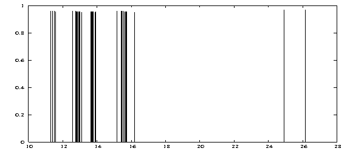

:orphan:
 

Computing Electronic Excitations using the Propagator Module POLPRP
===================================================================

Introduction
------------

We want to calculate absorption spectra corresponding to electronic excitations in atoms and molecules. Hereby
the absorption energies and the corresponding transition moments are of predominant interest. The POLPRP module 
allows for the spectra calculation in the valence region of atoms and molecules with an accuracy very simliar to
CC-2. The numerical solution of the underlying polarization propagator (POLPRP) is based on the ADC-Method (algebraic
diagrammatic construction). This terminology is a bit outdated since the emergence of intermediate state representation
technique (ISR) where a correlated many-particle basis is constructed by application of perturbation theory. 
By this, size-consistency
of the method can be achieved. At the same time the obtained eigenvectors which represent a particular excited state
carry information about the degree of single-particle character of the excitation and the full configuration 
information in terms of particle-hole and 2p-2h contributions.

Currently, the strict second-order and the extended second-order ADC schemes are available for the solution of the
polarization propagator.

Considerations before submitting a POLPRP job
---------------------------------------------

The excitation space is constructed from all active occupied and virtual orbitals given to MOLTRA. From this
a very large number of possible excited configurations emerges also spanning a large energy range. For valence excitations
only the lowest excitation energies are relevant implying a Davidson diagonalization scheme as the most suitable one.

The calculation requires a SCF/MOLTRA step for calculation of energies only. If one is interested in configuration information
one should also do a Mulliken population analysis. Hereby it is strongly recommended to combine similar orbital types into
one group label (via the .LABDEF directive, see there) in order not to be flooded with too verbose information not adding to the
physical content. For the transition moments the dipole moment integrals **in MO basis** are needed. Our first example
of the argon atom will cover all these aspects in detail.

The results obtained have to be interpreted properly depending of the type of Hamiltonian used:

- NONREL: 2-component non-relativistic Hamiltonian with point nuclei. You can used contracted basis sets for all atoms, only the large component basis is used.
  In the various irreps of the final states you will find the singlet and one or more triplet components. In the absence of SOC triplets acquire zero transition moments (implying zero oscillator strengths) but the energies are calculated anyhow. For the classification of the individual irreps the same principles as for RELCCSD apply. A combination of linear symmetry and NONREL is not (yet) possible. The highest available symmetry is D\ :sub:`2h`\ .

- LEVY-LELBOND: 4-component non-relativistic Hamiltonian. You can used contracted basis sets for all atoms, only the large component basis is used.
  Same facts for singlet and triplet as for NONREL.

- SPINFREE: Same spin manifolds as for NONREL but you include all scalar relativistic effects up to infinite order. Triplet final states get no osc. strength.

- Four-component Dirac-Coulomb (default): The number of available final state irreps is very much reduced and the final states can no longer be classified as pure singlets or pure triplets. Depending on the nuclear charge the former (degenerate) triplet components will now undergo further splitting. One can normally identify the degenerate (SOC-free) parent state without any problems.  

- X2Cmmf: The results are generally very similar to the four-component case but you harvest all the advantages of the X2Cmmf method (in particular speed). In the valence space no loss of accuracy with respect to 4C was observed.

Creating POLPRP input (here: excitation spectrum of argon)
----------------------------------------------------------

Our argon molecular input file contains a basis with enough diffuse functions for a reasonably good result.
This way of giving the basis is a bit outdated but was necessary in order to exactly compare to another (nonrelativistic)
calculation. Any other basis from the basis set directory can be used as well.

.. literalinclude:: argon.mol

The complete input (here with line numbers) reads as 

.. literalinclude:: argon.inp

The UNCONTRACT directive (9) is unnecessary here since we plug in an uncontracted set. In a relativistic calculation with
SOC contracted basis sets need to be decontracted, however. To activate POLPRP we specify it in the wave function section (14).
Furthermore we need Mulliken analysis (18) also for the virtuals (21,22,23). In the MOLTRA section we see that all occupied orbitals
and nearly all virtuals are included in the active space (26,27). As mentioned above, for the calculation of transition moments
we need the dipole moment integrals in MO basis which is triggered in lines 28-35 of the MOLTRA section. In the POLPRP section we
indicate that we want to compute TMs (.DOTRMO) and all irreps where a possible final state can occur are calculated because the
.STATE keyword was omitted. Then the program determines all these symmetries by itself. The Print directive in line 38/39 is required
to generate the orbital list of active occupied and virtual spinors. You need this orbital list if the postprocessing tools are to be used.
The DAVIDSON section controls the 
iterative diagonalizer that is always called in conjunction with POLPRP. The additionally available LANCZOS diagonalizer used
in the one- and two-particle propagators is not applied here and can not be called. The keywords are described in the manual and choosing
reasonable values needs a little bit of experience with iterative diagonalizers. The DVMAXSP determines the maximum size of the
Hamilton operator projection (the Krylov space) and strongly influences memory demands of the routine.

Working with the output files
-----------------------------

Besides the usual Dirac .out file where a lot of technical information of the POLPRP calculation is printed some essential result
files are produced that can be used for further analysis and postprocessing. These are the file ADCEVECS.XX, ADCSTATE.XX and ADCTRMOM (the latter
only if TMs were activated). XX here stands for the corresponding irrep number that can be 01..32 at most (linear case).

The ADCEVECS.XX files contain the eigenvectors of the large ADC matrix in binary form and can be used for restarts of the module. If copied
to the scratch directory, the module reads them in and starts from these already converged eigenvectors.

The ADCSTATE.XX file contains human-readable information about the eigenstates of irrep XX where the most important
configurations appear first::

      Excited state:    1
       -----------------
      Exc. energy:  0.461708 au  12.563724 eV  PS:  0.960574 Err:  0.000033 Sym:   1
      Norm^2 of double exc. contr:       0.039426

      128 ( 3, 1Eu)  <----   9 ( 3, 1Eu)   0 ( 0,    )  <----   0 ( 0,    )        0.355139          0.126124
      152 ( 4, 2Eu)  <----  15 ( 4, 2Eu)   0 ( 0,    )  <----   0 ( 0,    )       -0.355139          0.126124
      151 ( 4, 2Eu)  <----  16 ( 4, 2Eu)   0 ( 0,    )  <----   0 ( 0,    )        0.348944          0.121762
      127 ( 3, 1Eu)  <----  10 ( 3, 1Eu)   0 ( 0,    )  <----   0 ( 0,    )       -0.348944          0.121762
      129 ( 3, 1Eu)  <----   8 ( 3, 1Eu)   0 ( 0,    )  <----   0 ( 0,    )       -0.226284          0.051205
      153 ( 4, 2Eu)  <----  14 ( 4, 2Eu)   0 ( 0,    )  <----   0 ( 0,    )        0.226284          0.051205
      154 ( 4, 2Eu)  <----  16 ( 4, 2Eu)   0 ( 0,    )  <----   0 ( 0,    )        0.184017          0.033862
      130 ( 3, 1Eu)  <----  10 ( 3, 1Eu)   0 ( 0,    )  <----   0 ( 0,    )       -0.184017          0.033862
      155 ( 4, 2Eu)  <----  15 ( 4, 2Eu)   0 ( 0,    )  <----   0 ( 0,    )       -0.156695          0.024553
      131 ( 3, 1Eu)  <----   9 ( 3, 1Eu)   0 ( 0,    )  <----   0 ( 0,    )        0.156695          0.024553
      128 ( 3, 1Eu)  <----  10 ( 3, 1Eu)   0 ( 0,    )  <----   0 ( 0,    )        0.153918          0.023691
      152 ( 4, 2Eu)  <----  16 ( 4, 2Eu)   0 ( 0,    )  <----   0 ( 0,    )       -0.153918          0.023691
      127 ( 3, 1Eu)  <----   9 ( 3, 1Eu)   0 ( 0,    )  <----   0 ( 0,    )        0.136675          0.018680
      151 ( 4, 2Eu)  <----  15 ( 4, 2Eu)   0 ( 0,    )  <----   0 ( 0,    )       -0.136675          0.018680

Hereby the excitation energy of the first state in symmetry (irrep) 1 is given in au and eV and PS 
stands for pole strength which is a bit misleading in this context but
describes the percentage of single-excitation character of this particular final state (96.06%). The next entry is the residual error
stemming from the Davidson diagonalizer. Obviously, the next line tells us that we have 3.94 % double excitation character.

The following rows now reveal the leading configurations this state is composed of. First let us focus on the two rightmost columns with
expansion coefficients (ISR basis!) and their squares. It is observed that these coefficients are pairwise identical apart from a sign
reflecting the fact of
Kramers pairing. All spinors occur twice in the corresponding Kramers irreps and possess identical orbital energies. Therefore the expansion
distributes equally over both possible one-particle configurations. The first number gives the absolute spinor number with respect to the 
active orbital list and the number in parenthesis is the relative spinor number within the given irrep. The corresponding first line tells us that our
first expansion term consists of a single-particle excitation from occupied spinor 9 into virtual spinor 128 with a coefficient of 0.355139 etc. The other zeros indicate the
single-particle character of this excitation and get nonzero for a 2h-->2p type. In the framework of ISR and perturbation theory one can approximately
think of expansion determinants that are described here. Strictly speaking, these are correlated singly excited configurations.
By analyzing all ADCSTATE.XX files you can generate a complete spectrum but without proper utilities (see below) this can become a bit tedious. 
The utilities can be obtained from the author of this module.

Let's now turn to the ADCTRMOM file that is generated when we asked for transition moments. Actually, there is only one file collecting the information of all symmetries::

 *********************************************
 **  Final State Symmetry:            1
 *********************************************

 State   1 symm   1 exc. energy    0.461708 (au)    12.563724 (eV)   PS    0.960574   @E
 Order               TM(x)_r        TM(x)_i          TM(y)_r        TM(y)_i          TM(z)_r        TM(z)_i
    0th            0.000000000    0.000000000 |     0.000000000    0.000000000 |     0.000000000    0.000000000
    1st            0.000000000    0.000000000 |     0.000000000    0.000000000 |     0.000000000    0.000000000
    2ndA           0.000000000    0.000000000 |     0.000000000    0.000000000 |     0.000000000    0.000000000
    2ndB           0.000000000    0.000000000 |     0.000000000    0.000000000 |     0.000000000    0.000000000
    2ndC           0.000000000    0.000000000 |     0.000000000    0.000000000 |     0.000000000    0.000000000
    2nd 2,1        0.000000000    0.000000000 |     0.000000000    0.000000000 |     0.000000000    0.000000000
    2nd 2,2        0.000000000    0.000000000 |     0.000000000    0.000000000 |     0.000000000    0.000000000
    2nd 2,3        0.000000000    0.000000000 |     0.000000000    0.000000000 |     0.000000000    0.000000000
    2nd 2,4        0.000000000    0.000000000 |     0.000000000    0.000000000 |     0.000000000    0.000000000
    2nd 2,5        0.000000000    0.000000000 |     0.000000000    0.000000000 |     0.000000000    0.000000000
    2nd 2,6        0.000000000    0.000000000 |     0.000000000    0.000000000 |     0.000000000    0.000000000
    2nd 2,7        0.000000000    0.000000000 |     0.000000000    0.000000000 |     0.000000000    0.000000000
    2nd 2,8        0.000000000    0.000000000 |     0.000000000    0.000000000 |     0.000000000    0.000000000
    2nd 2,9        0.000000000    0.000000000 |     0.000000000    0.000000000 |     0.000000000    0.000000000
    2nd 2,10       0.000000000    0.000000000 |     0.000000000    0.000000000 |     0.000000000    0.000000000
    2nd 2p2h A     0.000000000    0.000000000 |     0.000000000    0.000000000 |     0.000000000    0.000000000
    2nd 2p2h B     0.000000000    0.000000000 |     0.000000000    0.000000000 |     0.000000000    0.000000000
 ------------------------------------------------------------------------------------------------------------
    total          0.000000000    0.000000000 |     0.000000000    0.000000000 |     0.000000000    0.000000000
    Osc. strength:     -->>        0.00000000  a.u.      @O
 ------------------------------------------------------------------------------------------------------------

The first line is more or less reproducing the entries in ADCSTATE.XX. Next comes a detailed list of individual x,y,z
contributions to the transitions moments for each perturbational order and type of contraction. This is a speciality of the
ADC method and allows for detailed insights into individual contributions to the TM. TMs can be complex, so both real
and imaginary parts are given. The oscillator strength is calculated according to the usual formula using the sum of squares
of Tx, Ty and Tz. For easy grepping of energies and oscillator strengths in production the markers "@E" and "@O" were introduced.

In order to collect all the peaks representing an excited final state together with their oscillator strengths from the ADCTRMOM file
you can do the following::

   grep '@E' ADCTRMOM|cut -c1-84 > ex; grep '@O' ADCTRMOM|cut -c30-52 > os; paste ex os > stickspectrum

These lines generate the text file 'stickspectrum' with all relevant information of the excited 
states. Hereby all states within a specific symmetry
are listed together. This file can already be used for the generation of a simple gnuplot graph where we draw the peak heights/vs 
energies.::

  plot [:][0:1.0] "stickspectrum" u 9:12 w i lw 2

Keep in mind that this command plots all peaks irrespective of their experimental observability which is described by
the oscillator strength! (shaping up the graph is not discussed here)

We see that all peaks exhibit nearly the same height around 0.95. This points to prevailing single excitation character but does not
relate to experimental observability. Certainly, the obtained result is not ready for comparison with experiment. 
In order to arrive at physically meaningful spectra we refer 
you to the second chapter of the Spectroscopy II tutorial where we compute the excitation spectrum of the transition metal complex 
H\ :sub:`2`\ Os(CO)\ :sub:`4` in full scope and with additional utilites necessary to generate it.
In the following section we address some aids to interpret the Dirac .out file.

Comments on the POLPRP output (in order of appearance)
------------------------------------------------------
   
- The property handler is called when you ask for transition moments. It prepares the dipole moment integrals represented in MO basis.

- Generating (real/complex) Dav. start vectors (all symm.): The particle/hole matrix that is calculated for all possible symmetries at once is diagonalized and corresponding eigenvectors are written out that serve as start vectors for the Davidson iteration (file DAVSTART.XX). If you obtain a warning that Hermiticity is violated in the p/h blocks something serious wnet wrong. Check the list of active orbitals then.

-  Constructing real satellite part. In this section the coupling and satellite blocks of the ADC matrix are constructed and written out to disk (file: PP_ELE). In parallel runs this matrix is distributed over the compute nodes (files: PP_ELE.XX).  Some dimensions and block sizes are reported as well.

- The Davidson algorithm output reports about dimensions, start vectors, orthogonality (important!)  and user input.  

During the diagonalization you will be prompted the progress as::

   root    dim       exc.energy       error     status  time/root (s)
  ----------------------------------------------------------------------
  Time for constructing Krylov projection     19.97
  Time for constructing residual vectors      6.89

     1      40       0.5342178       0.5190262 o    XT                0.16
     2      41       0.5453888       0.5187599 o    XT                0.17
     3      42       0.5453888       0.5187599 o    XT                0.17
     4      43       0.5453888       0.5187599 o    XT                0.17

The 'XT' abbreviation hereby indicates a successful extension of the Krylov space by using the computed preconditioner.
The small 'o' denotes a nonconverged root whereas a '*' points to a converged one. Converged roots are no longer touched in
the algorithm increasing the efficiency. It can also happen that the preconditioner cannot determine a vector possessing enough
orthogonality to the already converged space. In this case a warning is issued and you should carefully examine the quality
of your calculations at the end of the run. A macroiteration denotes a cycle of one complete Krylov space construction followed
by collapsing the space (see publication for more details).

The verbose output in case of transition moment calculation can be more or less ignored because it is summarized in the ADCTRMOM
file. In the near future we will considerably shrink the output of POLPRP but for the moment it provides a high level of detail useful
for the analysis of difficult cases.

The sequence just described is now repeated for all irreps separately. It is a big advantage of the ADC/ISR method that the representation
matrices exhibit full block structure. So each symmetry (irrep) can be treated independently and the user can select the desired irreps by
the .STATE directive (see manual).

