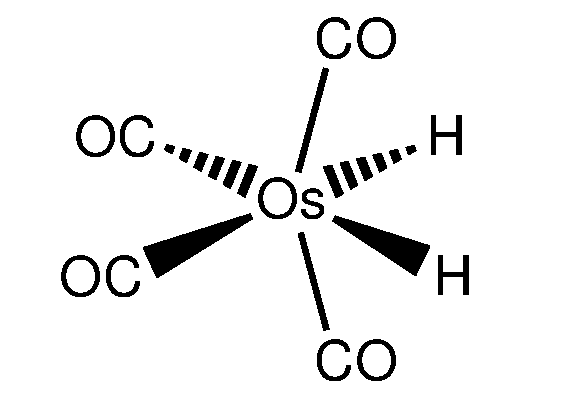
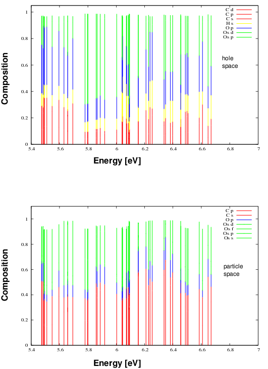
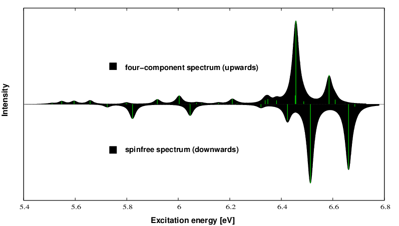

:orphan:
 

Full scope application of POLPRP to an osmium carbonyl complex
==============================================================

In this second section we describe a toolchain how to arrive at physically meaningful spectra suitable for
comparison to experiment and publication. This toolchain emerged over the years of application of propagator
code and has proven to be useful. Shortly, we will combine the individual small helpers to a combined postprocessing
module written in Python3 bringing about a lot of simplification.

The excitation spectrum of the osmium complex exhibits sizeable differences 
between a scalar relativistic and a four-component treatment. By this we extract the effect of pure spin-orbit
coupling on the spectrum.

Therefore two individual calculations once with the .SPINFREE and the .X2Cmmf Hamiltonian are necessary. Since the
postprocessing steps are identical for both pathways we do not need to repeat it. The molecule and X2Cmmf input read as

.. literalinclude:: oscom.mol

.. literalinclude:: oscom.inp

As you can see in the .mol file the complex has C2v symmetry and we use basis sets from the library shipped with DIRAC.
In the input file a large number of labdef labels are visible. This is necessary later on if we want to analyze the
eigenstate  composition in terms of atomic orbital contributions. Hereby the grouping occurs according to the angular
momentum of the atomic basis functions. A further distinction is not made and would lead to an excess of information in
larger systems. In order to generate the LABDEF labels we use the utility

labdefmaker

that automatically reads the::

                                GETLAB: SO-labels
                                -----------------

   * Large components:  215
     1  L A1 Os s        2  L A1 Os pz       3  L A1 Os dxx      4  L A1 Os dyy      5  L A1 Os dzz      6  L A1 Os fxxz
     7  L A1 Os fyyz     8  L A1 Os fzzz     9  L A1 Os g400    10  L A1 Os g220    11  L A1 Os g202    12  L A1 Os g040
     . . . . . . . . . 

section. A little disadvantage here is that the ordered LABDEF section should be available already for the Mulliken population
analysis for a proper labeling of the atomic contributions. So we recommend to run DIRAC with a preliminary input just producing
the GETLAB output. Application of labdefmaker produces the file "labdef" that can be included in the production input afterwards.
A manual sorting and grouping of labels is out of scope for larger systems. We perform a strict ADC-2 calculation where
the satellite block just consists of the diagonal of the orbital energies (see publications). Before we include the transition 
moments in our analysis we want to get an overview of the final state composition. Hereby the information of a Mulliken analysis,
the active orbital list and the ADCSTATE.XX files are required and their information combined. This is done by the two helper
programs

spimaker and excmaker

to be excuted in series. spimaker constructs an intermediate list of spinors relating the molecular and atomic basis and
excmaker combines this list with the state analysis obtained by the POLPRP calculation. The resulting 'xstates' file then serves
as the basis for the gnuplot drawing utility that generates a composition analysis of the hole and the particle space:

This graph shows sizeable osmium contributions in the hole and particle space being responsible for SO coupling effects in the
excitation spectrum (see below).

In the next step we want to utilize the physical information provided by the transition moments. For this purpose we multiply
the pole strength of the impulse peak with the oscillator strength which gives us a modulated spectrum according to the transition 
probability. This multiplication was done with a simple spreadsheet tool because the number of states is reasonably small.
afterwards the new stick spectrum is convoluted with a Lorentzian envelope in order to account for the spectral width. This final
step is performed by the 

specfolder

tool. You give the number of peaks, the desired number of graphic points and the spectral width in meV. The resulting graph file
can again be plotted by gnuplot and results in the following simulated spectrum:

Upwards we plot the X2Cmmf spectrum, downwards the SPINFREE spectrum which exhibits the pure effect of spin-orbit coupling on the
excitation spectrum. Soon an integrated python tool will come combining all the individual tasks from above.

