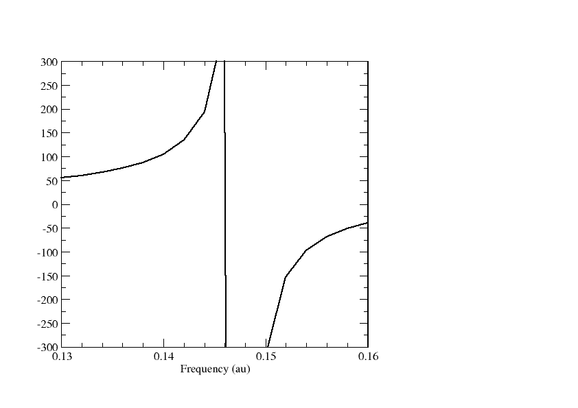
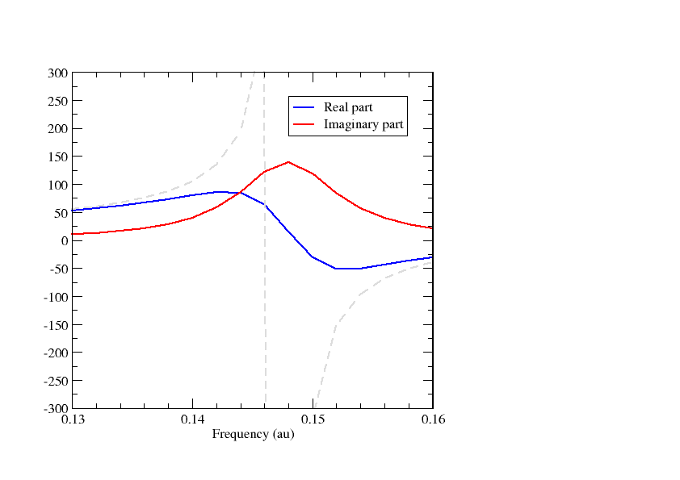

:orphan:

================
Complex response
================

In this tutorial we will look at a simple example of using the complex polarization propagator (CPP) method in DIRAC.
For more details on the implementation and the method, see :cite:`Villaume2010` and :cite:`Norman2011`, respectively.

We consider the LiH molecule::

  DIRAC
  LiH (Exp. geometry from Herzberg R=1.5949 A)
  
  C   2   0          A 
          3.    1
  Li      0.000000    0.000000   -0.398725
  LARGE BASIS aug-cc-pVDZ
         1.     1
  H       0.000000    0.000000    1.196175
  LARGE BASIS aug-cc-pVDZ
  FINISH

and generate the following menu file::

  **DIRAC
  .WAVE F
  .PROPERTIES
  **WAVE F
  .SCF
  **PROPERTIES
  *LINEAR RESPONSE
  .OPERATOR
   ZDIPLEN
  .FREQ INTERVAL
  0.13 0.16 0.002
  .SKIPEP
  **END OF

Here we ask for the frequency-dependent linear reponse function :math:`\left<\left<z;z\right>\right>_{\omega}` in the frequency window 0.13 - 0.16 a.u. with
a step length of 0.002 a.u., calculated at the Hartree-Fock level using the 4-component relativistic Dirac-Coulomb Hamiltonian. The negative 
of the above response function corresponds to the negative of the *zz*-component :math:`\alpha_{zz}` of the dipole-dipole polarisability. Plotting the polarizability we obtain the graph below

We observe a singularity around :math:`\omega` = 0.147 au, correspond to a dipole-allowed
electronic transition. The presence of the singularity allows us to read of excitation energies
from the dispersion (frequency-dependence) of the polarizability. However, it is an unphysical features
and corresponds to an infinitesimal small linewidth in the electronic spectrum.

The unphysical feature can be removed by introducing lifetimes into the response functions.
In practice a real frequency :math:`\omega` is replaced by complex :math:`z=\omega + i\gamma` where
:math:`\gamma` is a user-given parameter related to the inverse of the finite lifetimes of the 
excited states. Our input now looks like::

  **DIRAC
  .WAVE F
  .PROPERTIES
  **WAVE F
  .SCF
  **PROPERTIES
  *LINEAR RESPONSE
  .OPERATOR
   ZDIPLEN
  .FREQ INTERVAL
  0.13 0.16 0.002
  .DAMPING
   0.005
  .SKIPEP
  **END OF

Here we set :math:`\gamma` = 0.005 au, corresponding to 0.136057 eV. The linear response function
now becomes complex. The real and imaginary parts of  :math:`\alpha_{zz}` are plotted below.

