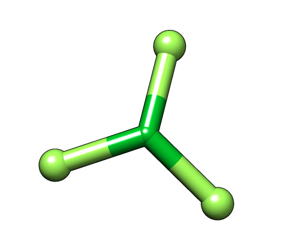

:orphan:
 

.. _atomic_huckel_start:

Extended Huckel start
=====================

Background
----------

The basis theory is given here: :cite:`Hoffman1963`.

The present development was further motivated by :cite:`Norman2012`.

The particularity of the present approach is that it employs pre-calculated atomic fragments.

A start guess is generated by solving the following general eigenvalue problem

.. math::

   H\mathbf{c} = S\mathbf{c}\varepsilon

where :math:`S` is the overlap matrix in terms of pre-calculated atomic orbitals. 
The Hamiltonian matrix is defined as

.. math::

   H_{ij} = \left\{\begin{array}{lcl}\epsilon_i;&\quad&i=j\\KS_{ij};&\quad&i\ne j\end{array}\right.

where :math:`K` is the Wolfsberg-Helmholtz constant. The default value is 1.75, but it can be changed with the keyword :ref:`SCF_.HUCPAR`.

Example
-------

We consider a Kohn-Sham calculation of the closed-shell :math:`LuF_3` molecule using the PBE functional.
We start from the molecular input file `LuF3.xyz`

.. literalinclude:: LuF3.xyz

and the menu file `PBE.inp`

.. literalinclude:: PBE.inp

This menu file includes specifications to use uncontracted integrals and  specifies a screening threshhold for 2-electron integrals. The the method is specified; Here the Kohn-Sham DFT will be used with the PBE functional. The molecule is defined as having 98 closed shell electrons (for the fermion irrep without inversion symmetry). Further more, the Mulliken population analysis is specified to provide labels for individual orbitals and lastly the basis sets used are defined. Note that a special basis set is used for the Lu atom. The basis set must be specified in the menu file when using an xyz file rather than a mol file.
Note that the keyword ``INPTES`` for testing the inputfile before the run is commented out.
Observe that the caclulation will take more than an hour.
Unfortunately, and curiously, this calculation does not converge

.. literalinclude:: PBE_LuF3.out

We therefore try the extended Hückel method for a better start guess. The input file `PBEhuc.inp` 
reads

.. literalinclude:: PBEhuc.inp

Using the keyword :ref:`SCF_.AD HOC` file names for the Lu and F atomic types are given, followed 
by orbital strings specifying what atomic orbitals to select (see
:ref:`orbital_strings` for the syntax). These files can be generated following the procedure outlined in the tutorial Atomic start for "Preparing the atomic start". Note, that the calculation is specified to be performed without the use of symmetry.
The calculation now converges in 20 iterations

.. literalinclude:: PBEhuc_LuF3.out

