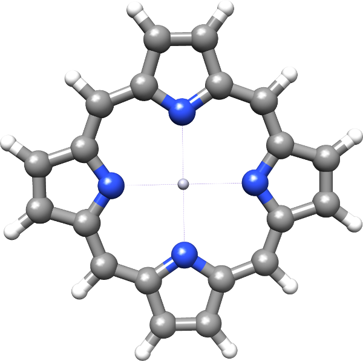

:orphan:

.. _atomic_start_guess:

Atomic start guess
==================

Initial SCF run
---------------

We consider the Hartree-Fock calculation of porphyrin with a mercury center

The SCF input file ``HF.inp`` reads::

  **DIRAC
  .WAVE FUNCTION
  .ANALYZE
  **WAVE FUNCTIONS
  .SCF
  *SCF
  .MAXITR
  20
  .PRINT 
  2
  .CLOSED SHELL
  120 120
  **ANALYZE
  .MULPOP
  *END OF

for an SCF calculation with a Mulliken population analysis. We specify the maximum number of iterations allowed for th caclulation to 20 and as we are chosing a molecule with inversion symmetry we specify the occupation number for both irreducible representations under the keyword ``CLOSED SHELL``. The print level is set to 2 in order to have the eigenvlues printed for each iteration. 
The molecular input ``hg-porphyrin.mol`` reads : ::

  BASIS
  6-31 and finite DK3 basis sets, geometry in au, ref ECP: Theor.Chim.Acta 1990,77,123 (from Gaussian)
  --------------------------------------------------------
  C   4    3  X Y Z
          7.    2
  N1    0.000000        4.1196801826    0.000000
  N2    4.1196801826    0.000000        0.000000
  LARGE BASIS 6-31G
          6.    5
  C1       4.642960672    4.642960672    0.000000
  C2       2.127242869    5.577562894    0.000000
  C3       1.2976452113   8.20576858026  0.000000
  C4       8.20576858026  1.2976452113   0.000000
  C5       5.577562894    2.127242869    0.000000
  LARGE BASIS 6-31G
          1.    3
  H1        6.1040918256  6.1040918256   0.000000
  H2        2.536971561   9.84908074236  0.000000
  H3        9.84908074236 2.536971561    0.000000
  LARGE BASIS 6-31G
         80.    1
  Hg    0.000000     0.000000     0.000000
  LARGE    4    1    1    1    1
  F  23   0    0                                        # s-functions
     5.4107818D+07
     1.2757417D+07
     3.8200687D+06
     1.2601464D+06
     4.4355086D+05
     1.6477405D+05
     6.4498870D+04
     2.6536057D+04
     1.1391885D+04
     5.0460108D+03
     2.2877229D+03
     1.0547293D+03
     4.9377065D+02
     2.3032535D+02
     1.1057622D+02
     4.7454363D+01
     2.4814292D+01
     1.0508682D+01
     5.3690964D+00
     1.7593797D+00
     8.2178073D-01
     1.6991016D-01
     5.9613310D-02
  F  23   0    0                                        # p-functions
     2.1202540D+07
     4.1579701D+06
     1.0372139D+06
     2.9906582D+05
     9.5123364D+04
     3.3364166D+04
     1.2858845D+04
     5.3680904D+03
     2.3907706D+03
     1.1241754D+03
     5.5303069D+02
     2.8249864D+02
     1.4871000D+02
     7.9474383D+01
     4.3674317D+01
     2.4527063D+01
     1.4058201D+01
     7.9450158D+00
     4.5067591D+00
     2.4440572D+00
     1.2660103D+00
     6.1522560D-01
     2.5113161D-01
  F  15   0    0                                        # d-functions
     1.4315825D+04
     3.7250818D+03
     1.3315379D+03
     5.5776192D+02
     2.5656959D+02
     1.2554901D+02
     6.3698254D+01
     3.3232923D+01
     1.7367497D+01
     8.9182853D+00
     4.5159858D+00
     2.1444878D+00
     9.7876159D-01
     4.1519292D-01
     1.5886171D-01
  F  10   0    0                                        # f-functions
     1.3065007D+03
     4.4185000D+02
     1.8456705D+02
     8.5884633D+01
     4.2090822D+01
     2.1327466D+01
     1.0817659D+01
     5.3881551D+00
     2.5585604D+00
     1.0775039D+00
  FINISH

The calculations are carried out in D2h symmetry, so that the Fock matrix is real. From the output file we read::

  Atoms and basis sets
  --------------------

  Number of atom types:     4
  Total number of atoms:   37

    label    atoms   charge   prim    cont     basis
    ----------------------------------------------------------------------
    N2          4       7      22       9      L  - [10s4p|3s2p]
                               58      58      S  - [4s10p4d|4s10p4d]
    C5         20       5      22       9      L  - [10s4p|3s2p]
                               58      58      S  - [4s10p4d|4s10p4d]
    H3         12       1       4       2      L  - [4s|2s]
                               12      12      S  - [4p|4p]
    Hg          1      80     282     282      L  - [23s23p15d10f|23s23p15d10f]
                              635     635      S  - [23s38p33d15f10g|23s38p33d15f10g]
    ----------------------------------------------------------------------
                              858     522      L  - large components
                             2171    2171      S  - small components
    ----------------------------------------------------------------------
    total:     37     220    3029    2693

showing that in AO-basis the Fock-matrix has the dimension 2693 x 2693
and thus requires 7252249 words. The SCF run will require something like three Fock matrices,
so in this case 21 Mwords.

Unfortunately, this HF does not converge: ::

                                     SCF - CYCLE
                                     -----------
  
  --------------------------------------------------------------------------------------------------------------------------------
             Energy               ERGVAL    FCKVAL    EVCVAL      Conv.acc    CPU          Integrals   Time stamp
  --------------------------------------------------------------------------------------------------------------------------------
  It.    1    -7794.747305914      0.00D+00  0.00D+00  0.00D+00              10.89634323s   Scr. nuclei    Fri Oct 19
  It.    2    -20119.30505450      1.23D+04 -9.63D+01  1.29D+02               4min 6.910s   LL SL          Fri Oct 19
  It.    3    -17230.23561991     -2.89D+03  1.95D+02  2.69D+02   DIIS   2    3min55.989s   LL SL          Fri Oct 19
  It.    4    -20286.13741996      3.06D+03 -8.61D+01  9.85D+01   DIIS   3    3min42.372s   LL SL          Fri Oct 19
  It.    5    -20126.54429484     -1.60D+02 -9.61D+01  4.27D+01   DIIS   4    3min52.176s   LL SL          Fri Oct 19
  It.    6    -18673.18452215     -1.45D+03  1.36D+02  1.55D+02   DIIS   5    3min48.236s   LL SL          Fri Oct 19
  It.    7    -18727.77909394      5.46D+01 -1.82D+00  1.48D+02   DIIS   6    3min53.450s   LL SL          Fri Oct 19
  It.    8    -18755.21459721      2.74D+01 -8.49D-01  1.45D+02   DIIS   7    4min 4.378s   LL SL          Fri Oct 19
  It.    9    -18760.27704618      5.06D+00 -1.58D-01  1.45D+02   DIIS   8    3min40.865s   LL SL          Fri Oct 19
  It.   10    -18773.33929407      1.31D+01 -4.09D-01  1.44D+02   DIIS   9    3min51.322s   LL SL          Fri Oct 19
  It.   11    -18779.70838778      6.37D+00 -1.28D-01  1.44D+02   DIIS   9    3min42.698s   LL SL          Fri Oct 19
  It.   12    -18953.17392936      1.73D+02 -4.17D+00  1.33D+02   DIIS   9    3min52.510s   LL SL          Fri Oct 19
  It.   13    -18938.57698783     -1.46D+01  5.29D-01  1.34D+02   DIIS   9    3min43.147s   LL SL          Fri Oct 19
  It.   14    -18744.84737430     -1.94D+02  8.55D+00  1.59D+02   DIIS   9    3min56.082s   LL SL          Fri Oct 19
  It.   15    -18164.22290167     -5.81D+02 -2.01D+02  4.93D+01   DIIS   9    3min48.373s   LL SL          Fri Oct 19
  It.   16    -16110.21649469     -2.05D+03  2.64D+02  2.90D+02   DIIS   9    3min47.714s   LL SL          Fri Oct 19
  It.   17    -16272.74479238      1.63D+02 -4.12D+00  2.75D+02   DIIS   9    3min49.219s   LL SL          Fri Oct 19
  It.   18    -16280.64616752      7.90D+00 -2.09D-01  2.74D+02   DIIS   9    3min40.992s   LL SL          Fri Oct 19
  It.   19    -16279.46291382     -1.18D+00  5.93D-02  2.75D+02   DIIS   9    3min37.488s   LL SL          Fri Oct 19
  It.   20    -16289.37827128      9.92D+00 -2.58D-01  2.74D+02   DIIS   9    3min42.223s   LL SL          Fri Oct 19

We see that the corrected bare nucleus start is quite far from the energies of subsequent iterations. Although the energy in the second iteration
drops considerably it bounces back and gets stuck. We will therefore switch to an atomic start :cite:`vanLenthe2006` . Observe that this caclulation will take more than an hour.

Preparing the atomic start
--------------------------
For each atom we now run a SCF calculation in full (linear) symmetry based on the atomic ground state configuration.
For open-shell atoms this amounts to an average-of-configuration (AOC) calculation at the HF level, and a fractional
occupation calculation at the DFT level. 

Nitrogen atom
~~~~~~~~~~~~~

The input file ``N.inp`` reads: ::

  **DIRAC
  .WAVE FUNCTION
  .ANALYZE
  **GENERAL
  .ACMOUT
  **WAVE FUNCTIONS
  .SCF
  *SCF
  .CLOSED SHELL
  4 0
  .OPEN SHELL
  1
  3/0,6
  **ANALYZE
  .MULPOP
  *END OF

Note the keywords ``ACMOUT`` asking that the MO coeffcients transformed to no symmetry and written to file ``DFACMO``. The open shell input specifies 1 open shell with 3 electrons in 0 and 6 spinors respectively for the two irriducible representations.
The molecular input ``N.mol`` is ::

  BASIS
  6-31 and finite DK3 basis sets, geometry in au, ref ECP: Theor.Chim.Acta 1990,77,123 (from Gaussian)
  --------------------------------------------------------
  C   1
          7.    1
  N      0.0 0.0   0.0
  LARGE BASIS 6-31G
  FINISH

The minimal pam command is ::

  pam --mol=N.mol --inp=N.inp --get=DFACMO                                                                           
  mv DFACMO ac.N

Other atoms
~~~~~~~~~~~

The input file for the other atoms are prepared in similar manner.
For carbon we use the occupation ::

  .CLOSED SHELL
  4 0
  .OPEN SHELL
  1
  2/0,6

For mercury we use ::

  .CLOSED SHELL
  42 38

whereas the hydrogen atom is run as a one-electron system, meaning that the keyword for ignoring two-particle interactions ``ONESYS`` will be invoked ::

  **DIRAC
  .WAVE FUNCTION
  .ANALYZE
  **GENERAL
  .ACMOUT
  **HAMILTONIAN
  .ONESYS
  **WAVE FUNCTIONS
  .SCF
  *SCF
  .CLOSED SHELL
  2 0
  **ANALYZE
  .MULPOP
  *END OF

(The occupation given above is simply to control orbitals printed in the subsequent Mulliken population analysis).

All atoms can be run in a single shot, e.g. using bash ::

  for atom in H C N Hg   
  do
    pam --mol=${atom}.mol --inp=${atom}.inp --get=DFACMO
    mv DFACMO ac.${atom}
  done   

We are now ready to run the atomic start.

Running the atomic start
------------------------

The input file ``atomstart.inp`` reads ::

  **DIRAC
  .WAVE FUNCTION
  .ANALYZE
  **WAVE FUNCTIONS
  .SCF
  *SCF
  .ATOMST
  AFNXXX 2
  1,2
  1.00
  3..5
  0.5
  AFCXXX 2
  1,2
  1.00
  3..5
  0.33
  AFHXXX 1
  1
  0.5
  AFHGXX 1
  1..40
  1.00
  .CLOSED SHELL
   120 120
  **ANALYZE
  .MULPOP
  *END OF

The keyword ``ATOMST`` is followed by input for each atomic type. The first input ``AFYYXX`` specifies the file to be read for an atomtype YY, and next to it a number specifying inversion symmtry (2) or not (1). Next, for each symmetry, the spinors of that symmetry is specified followed by the occupation of the spinors.
The occupations chosen corresponds to those of the atomic runs, but the user may
modify this at will.  Please note that the order of atoms corresponds to the
order they appear in the molecule file.

Before running the calculation the user must make provide links to the atomic coefficient files ::

  ln -s ac.N AFNXXX
  ln -s ac.C AFCXXX
  ln -s ac.H AFHXXX
  ln -s ac.Hg AFHGXX

and the calculation is then run as ::

  pam --mol=hg-porphyrin.mol --inp=atomstart.inp --copy="AF*" --outcmo

This calculation converges smoothly after 17 iterations ::

                                     SCF - CYCLE
                                     -----------

  * Convergence on norm of error vector (gradient).
    Desired convergence:1.000D-07
    Allowed convergence:1.000D-06

  * ERGVAL - convergence in total energy
  * FCKVAL - convergence in maximum change in total Fock matrix
  * EVCVAL - convergence in error vector (gradient)
  --------------------------------------------------------------------------------------------------------------------------------
             Energy               ERGVAL    FCKVAL    EVCVAL      Conv.acc    CPU          Integrals   Time stamp
  --------------------------------------------------------------------------------------------------------------------------------
  It.    1    -20645.07067749      2.06D+04  0.00D+00  0.00D+00   Atomic s   32.88100123s   LL SL          Mon Mar  4
  It.    2    -20633.15458108     -1.19D+01  6.07D-01  8.19D-01               1min11.442s   LL SL          Mon Mar  4
  It.    3    -20633.38854493      2.34D-01 -2.13D-01  3.24D-01   DIIS   2    1min 9.861s   LL SL          Mon Mar  4
  It.    4    -20633.41415475      2.56D-02  1.52D-01  1.72D-01   DIIS   3    1min 3.733s   LL SL          Mon Mar  4
  It.    5    -20633.42153720      7.38D-03 -6.24D-02  2.79D-02   DIIS   4    1min 2.223s   LL SL          Mon Mar  4
  It.    6    -20633.42175881      2.22D-04 -4.58D-03  8.00D-03   DIIS   5    1min 3.556s   LL SL          Mon Mar  4
  It.    7    -20633.42178693      2.81D-05  2.31D-03  3.88D-03   DIIS   6    1min 1.382s   LL SL          Mon Mar  4
  It.    8    -20633.42179098      4.05D-06 -1.68D-03  1.75D-03   DIIS   7   57.84219360s   LL SL          Mon Mar  4
  It.    9    -20633.42179253      1.55D-06  3.91D-04  5.46D-04   DIIS   8   57.79122925s   LL SL          Mon Mar  4
  It.   10    -20633.42179283      3.01D-07 -5.63D-05  2.16D-04   DIIS   9   55.75250244s   LL SL          Mon Mar  4
  It.   11    -20633.42179286      3.30D-08  1.89D-05  7.63D-05   DIIS   9   53.37689209s   LL SL          Mon Mar  4
  It.   12    -20633.42179287      4.12D-09 -1.74D-05  2.92D-05   DIIS   9   51.99108887s   LL SL          Mon Mar  4
  It.   13    -20633.42179287      7.42D-10  6.49D-06  8.29D-06   DIIS   9   51.30120850s   LL SL          Mon Mar  4
  It.   14    -20633.42179287      3.13D-10 -1.22D-06  2.61D-06   DIIS   9   48.06268311s   LL SL          Mon Mar  4
  It.   15    -20633.42179287     -2.18D-10  5.07D-07  5.08D-07   DIIS   9   48.58166504s   LL SL          Mon Mar  4
  It.   16    -20633.42179287     -2.15D-10 -2.13D-07  2.33D-07   DIIS   9   43.13543701s   LL SL          Mon Mar  4
  It.   17    -20633.42179287      5.42D-10  1.06D-07  9.96D-08   DIIS   9   42.37854004s   LL SL          Mon Mar  4
  --------------------------------------------------------------------------------------------------------------------------------
  * Convergence after   17 iterations.
