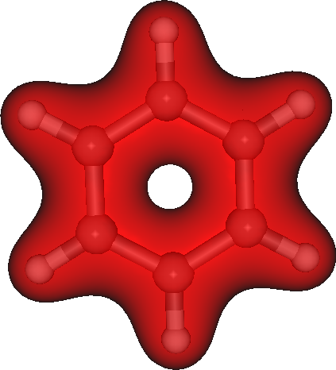
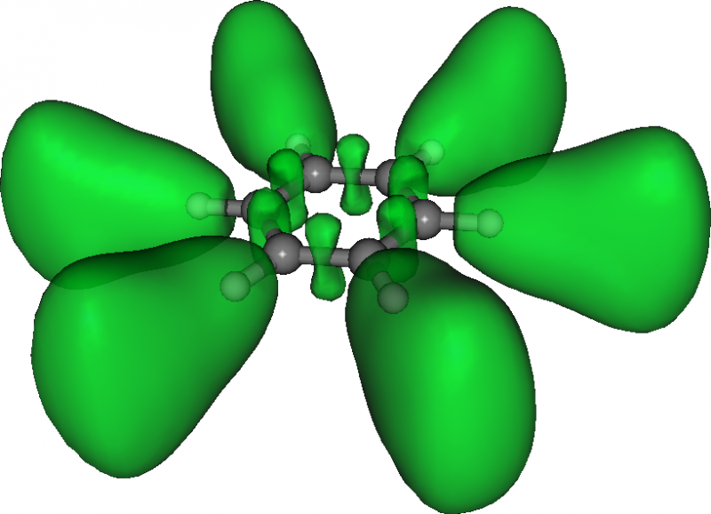

:orphan:
 

How to visualize densities and properties
=========================================

What we will need and cover
---------------------------

DIRAC is able to plot a variety of scalar and vector fields representing
unperturbed and perturbed densities. In this tutorial we will walk through a
couple of example calculations using the classic molecule benzene.

The visualization module in DIRAC always needs the unperturbed wave function,
DFCOEF.

For perturbed densities, in addition to DFCOEF, we also need the perturbed
"wave function" which comes out of a linear response calculation and is
typically saved in a file called PAMXVC.

It is useful to perform visualization runs is 3 steps:

-  Run the SCF calculation and save DFCOEF or run the response
   calculation and save DFCOEF and PAMXVC.
-  Calculate densities using DFCOEF (and PAMXVC) and produce data files.
-  Import data files to other programs
   (`Gnuplot <http://www.gnuplot.info/>`_,
   `Mathematica <http://www.wolfram.com/mathematica/>`_,
   `ParaView <http://www.paraview.org/>`_,
   `PyNGL <http://www.pyngl.ucar.edu/>`_, ...) to generate plots.

Note that all values (coordinates) are entered in atomic units (bohr),
not in ångstrøm.

Getting the unperturbed and perturbed wave function (example molecule: benzene)
-------------------------------------------------------------------------------

We will use the benzene molecule with a very poor basis set for demonstration
purposes only. For production calculation this basis set is certainly not
sufficient. In real life calculations the basis set needs to be well
calibrated. Also the quality of the molecular structural parameters is not
important here. We will call the following molecule file benzene.mol::

  DIRAC

  C   2              A
         1.     6
  H     0.000000   -2.472878    0.000000
  H    -2.141580   -1.236440    0.000000
  H     2.141580   -1.236440    0.000000
  H    -2.141580    1.236440    0.000000
  H     2.141580    1.236440    0.000000
  H     0.000000    2.472878    0.000000
  LARGE BASIS STO-3G
         6.     6
  C     0.000000   -1.391016    0.000000
  C    -1.204659   -0.695508    0.000000
  C     1.204659   -0.695508    0.000000
  C    -1.204659    0.695508    0.000000
  C     1.204659    0.695508    0.000000
  C     0.000000    1.391016    0.000000
  LARGE BASIS STO-3G
  FINISH

The molecule is oriented in the xy-plane and later we will place the magnetic
field vector along the perpendicular z-axis.

And here is a corresponding input file for the response calculation that we
will call response.inp::

  **DIRAC
  .WAVE FUNCTION
  .PROPERTIES
  **HAMILTONIAN
  .LVCORR
  .URKBAL
  **WAVE FUNCTION
  .SCF
  **PROPERTIES
  *LINEAR RESPONSE
  .A OPERATOR
   'B_z oper'
   ZAVECTOR
   'YDIPLEN'
   'XDIPLEN'
   COMFACTOR
   -68.517999904721
  .B OPERATOR
   'B_z oper'
   ZAVECTOR
   'YDIPLEN'
   'XDIPLEN'
   COMFACTOR
   -68.517999904721
  .ANALYZE
  *END OF

Later we will want to plot the magnetically induced current density so please
observe how we specify the perturbing operator for the magnetic field to be
perpendicular to the molecular plane::

  ...
  .B OPERATOR
   'B_z oper'
   ZAVECTOR
   'YDIPLEN'
   'XDIPLEN'
   COMFACTOR
   -68.517999904721
  ...

This is the operator for the magnetic field along z.  If you only want to plot
unperturbed densities than you can remove :ref:`DIRAC_.PROPERTIES` and everything
under :ref:`**PROPERTIES`.  Also note that in production calculation we really
should run with uncontracted basis sets::

  **INTEGRALS
  *READIN
  .UNCONTRACT

But here we will cheat and use a contracted set for speed.

Now we are ready to run the calculation (here done using MPI; finishes in ca.
10 seconds) and save the resulting DFCOEF and PAMXVC::

  pam [--mpi=8] --scratch=/tmp --mw=10 --inp=response.inp --mol=benzene.mol --get="DFCOEF PAMXVC"

Verify that you have the files DFCOEF and PAMXVC in your directory, we will
need them for the visualizations described further down.

You should also check that you have obtained the following response functions::

  grep "at freq" response_benzene.out

  << 1, 1>>: -0.23026724E+02 a.u.,     E--contribution at frequency    0.0000000000 a.u.
  << 1, 1>>:  0.99833086E+02 a.u.,     P--contribution at frequency    0.0000000000 a.u.
      76.80636218049 a.u. at frequency      0.00000000 a.u.    1.33E-06   (converged)

These are the paramagnetic ("E--contribution"), diamagnetic
("P--contribution"), and the total zz magnetizability tensor element,
respectively. Of course they will have nothing to do with experimental
magnetizabilities (because we use a poor basis set) but it does not
matter here.

We have given the molecule without symmetry information and let DIRAC
find the symmetry.

DIRAC correctly assigns the molecule symmetry but note how the molecule
is reoriented::

  Original Coordinates
  --------------------
     1         0.00000000    -4.67306218     0.00000000       1
     1        -4.04699969    -2.33653298     0.00000000       1
     1         4.04699969    -2.33653298     0.00000000       1
     1        -4.04699969     2.33653298     0.00000000       1
     1         4.04699969     2.33653298     0.00000000       1
     1         0.00000000     4.67306218     0.00000000       1
     6         0.00000000    -2.62863929     0.00000000       1
     6        -2.27647559    -1.31431964     0.00000000       1
     6         2.27647559    -1.31431964     0.00000000       1
     6        -2.27647559     1.31431964     0.00000000       1
     6         2.27647559     1.31431964     0.00000000       1
     6         0.00000000     2.62863929     0.00000000       1

  Symmetry class found: D(6h)

  Centered and Rotated
  --------------------
     6        -1.31431964     2.27647559     0.00000000       1
     6        -1.31431964    -2.27647559     0.00000000       1
     6         1.31431964     2.27647559     0.00000000       1
     6         1.31431964    -2.27647559     0.00000000       1
     6        -2.62863929     0.00000000     0.00000000       1
     6         2.62863929     0.00000000     0.00000000       1
     1        -2.33653298     4.04699969     0.00000000       1
     1        -2.33653298    -4.04699969     0.00000000       1
     1         2.33653298     4.04699969     0.00000000       1
     1         2.33653298    -4.04699969     0.00000000       1
     1        -4.67306218     0.00000000     0.00000000       1
     1         4.67306218     0.00000000     0.00000000       1

  The following elements were found:   X  Y  Z

It is important to remember that the "Centered and Rotated" geometry is
the one that we will probe in the visualization.

Example unperturbed densities
-----------------------------

Density in a plane
''''''''''''''''''

Let us plot the density in the plane spanned by the points (-8.0 -8.0
0.0), ( 8.0 -8.0 0.0), and (-8.0 8.0 0.0) with 100 steps along each
side::

  ...
  **VISUAL
  .DENSITY
   DFCOEF
  .2D
   -8.0 -8.0  0.0
    8.0 -8.0  0.0
    100
   -8.0  8.0  0.0
    100
  *END OF

And copy the generated plot.2d.scalar and plot.2d.vector files back from
the scratch directory::

  pam --mw=10 --inp=density_2d.inp --mol=benzene.mol --put=DFCOEF --get="plot.2d.scalar plot.2d.vector"

Here we are plotting a scalar quantity so the file plot.2d.vector will
contain many zeros. It is generated by default and becomes interesting
for vector quantities.

Density in 3D
'''''''''''''

In this example we plot the density in 3D and 80 points along each
direction::

  ...
  **VISUAL
  .DENSITY
   DFCOEF
  .3D
   80 80 80
  *END OF

together with the following runscript::

  pam --mw=10 --inp=density_3d.inp --mol=benzene.mol --put=DFCOEF --get="plot.3d.cube plot.3d.scalar"

The generated plot.3d.cube can be used read into `Molekel
<http://molekel.cscs.ch/wiki/pmwiki.php>`_ for instance to produce figure like
this one:

Integrating densities in 3D
'''''''''''''''''''''''''''

Densities can be integrated in 3D using the numerical DFT grid.
This example will integrate the unperturbed density to the number of
electrons::

  ...
  **VISUAL
  .DENSITY
   DFCOEF
  .3D_INT
  *END OF

Plotting the ELF in 3D
''''''''''''''''''''''

In this plot we visualize the electron localization function in benzene::

  ...
  **VISUAL
  .ELF
   DFCOEF
  .3D
   80 80 80
  .3D_ADD
   10.0
  *END OF

Observe how we have increased the cube size with :ref:`VISUAL_.3D_ADD` (default is 4.0
bohr)::

  pam --mw=10 --inp=elf_3d.inp --mol=benzene.mol --put=DFCOEF --get="plot.3d.cube plot.3d.scalar"

Here is the resulting ELF in benzene:

Densities and currents induced by a magnetic field
--------------------------------------------------

Current density
'''''''''''''''

We have arrived at the heart of this tutorial: here we will calculate and plot
the magnetically induced current density in benzene.

For this we will need DFCOEF and PAMXVC.

Let us first examine the PAMXVC file. For this we will use the rspread.x
utility to check what is on the PAMXVC file::

  ./rspread.x /path/to/PAMXVC

and we get::

   Solution vectors found on file : PAMXVC

   ** Solution vector : B_z oper         Irrep:   4 Trev:  -1
     1 Type : E- Freq.:     0.000000 Rnorm:   0.13E-05 Length:       157
     2 Type : P- Freq.:     0.000000 Rnorm:   0.13E-05 Length:      2835

In general PAMXVC can have many records. In this simple example it only
contains two records: first is the "paramagnetic" response ("E-" for
"electronic"), second is the "diamagnetic" response ("P-" for
"positronic").

Better names for the two records would be positive-positive energy
orbital response, and positive-negative orbital response.

So, if we want to get the paramagnetic current density we will only use
record 1, for the diamagnetic current density we will only use record 2,
and for the total current density we will use both records.

Let's start with the total current density. We choose a plane spanned by
the points (-6.0 -6.0 0.0), ( 6.0 -6.0 0.0), and (-6.0 6.0 0.0) with 100
steps along each side (this is the molecular plane)::

  **DIRAC
  #.WAVE FUNCTION
  **HAMILTONIAN
  .LVCORR
  .URKBAL
  **WAVE FUNCTION
  .SCF
  **VISUAL
  .J
   PAMXVC 1
  .J
   PAMXVC 2
  .2D
   -6.0 -6.0  0.0
    6.0 -6.0  0.0
    100
   -6.0  6.0  0.0
    100
  *END OF

Observe how we use both PAMXVC records to get the total current density.

If we wanted to see the diamagnetic current density we would only use the
record 2::

  ...
  **VISUAL
  #.J
  # PAMXVC 1
  .J
   PAMXVC 2

With the following pam command we provide DFCOEF and PAMXVC and copy
back the generated 2D plot::

  pam --mw=10 --inp=j_in_plane.inp --mol=benzene.mol --put="DFCOEF PAMXVC" --get=plot.2d.vector

How about the current above the molecular plane (say, 1 bohr)? This is
how it works::

  ...
  **VISUAL
  .J
   PAMXVC 1
  .J
   PAMXVC 2
  .2D
   -6.0 -6.0  1.0
    6.0 -6.0  1.0
    100
   -6.0  6.0  1.0
    100
  *END OF

with::

  pam --mw=10 --inp=j_above_plane.inp --mol=benzene.mol --put="DFCOEF PAMXVC" --get=plot.2d.vector

The generated file plot.2d.vector contains in this case 100\*100 lines
with 4 numbers each: the first 2 are the position coordinates, the other
2 are projections of the vector components along these coordinates.

Current density with London atomic orbitals
'''''''''''''''''''''''''''''''''''''''''''

In order to use London atomic orbitals in the calculation and visualization of magnetically induced current density,
there are only few modifications needed to be made to the protocol described above.

First, we need to save TBMO file from the preceding response calculation, in addition to DFCOEF and PAMXVC.
We should use the rspread.x utility in order to check which record of PAMXVC corresponds contains
response to each of components of magnetic field. 
An exemplary output may be analogous to::

   Solution vectors found on file : PAMXVC
   
   ** Solution vector : LAO-XRM1H1       Irrep:   1 Trev:  -1
     1 Type : E- Freq.:     0.000000 Rnorm:   0.90E-08 Length:     11448
     2 Type : P- Freq.:     0.000000 Rnorm:   0.90E-08 Length:     12744
   ** Solution vector : LAO-YRM1H1       Irrep:   1 Trev:  -1
     3 Type : E- Freq.:     0.000000 Rnorm:   0.83E-07 Length:     11448
     4 Type : P- Freq.:     0.000000 Rnorm:   0.83E-07 Length:     12744
   ** Solution vector : LAO-ZRM1H1       Irrep:   1 Trev:  -1
     5 Type : E- Freq.:     0.000000 Rnorm:   0.48E-07 Length:     11448
     6 Type : P- Freq.:     0.000000 Rnorm:   0.48E-07 Length:     12744

What identifies records 1 and 2 as containing the response to the "X"-component of an external magnetic field,
records 3 and 4 - to the "Y"-component and records 5 and 6 - to the "Z"-component.

Then, we need to change the visualization input slightly::

  ...
  **VISUAL
  .J
   PAMXVC 1
  .J
   PAMXVC 2
  .LONDON
   X

The argument "X" denotes which component of an external magnetic field is considered here as a perturbation and it has
to correspond to the relevant record on PAMXVC file, in this case - 1 and 2.
Thus, for instance to visualize the current density induced by the "Z"-component of an external magnetic field, the correct 
input is::

  ...
  **VISUAL
  .J
   PAMXVC 5
  .J
   PAMXVC 6
  .LONDON
   Z

Integrating the current density passing through a plane
'''''''''''''''''''''''''''''''''''''''''''''''''''''''

This is useful to get a number that can be used to quantify the
aromaticity.
For this molecule in the present orientation::

    ...

     Centered and Rotated
     --------------------
        6        -1.31431964     2.27647559     0.00000000       1
        6        -1.31431964    -2.27647559     0.00000000       1
        6         1.31431964     2.27647559     0.00000000       1
        6         1.31431964    -2.27647559     0.00000000       1
        6        -2.62863929     0.00000000     0.00000000       1
        6         2.62863929     0.00000000     0.00000000       1
        1        -2.33653298     4.04699969     0.00000000       1
        1        -2.33653298    -4.04699969     0.00000000       1
        1         2.33653298     4.04699969     0.00000000       1
        1         2.33653298    -4.04699969     0.00000000       1
        1        -4.67306218     0.00000000     0.00000000       1
        1         4.67306218     0.00000000     0.00000000       1

A good choice for an integration plane would be the y-z plane.

This is because in such an integration we do not want to cut through
nuclear centers. Close to the nuclei the current density can be very
large and non-uniform which leads to a very slow convergence with
respect to the numerical grid.

In DIRAC we use the Gauss-Lobatto quadrature. You have to specify a
plane, divide this plane into sufficiently many "tiles" (I would start
with 5-10 tiles along each side). You also have to specify the order of
the Legendre polynomial that is used to generate the roots and weights
on each tile.

Let us look at an explicit example::

  ...
  **VISUAL
  .J
   PAMXVC 1
  .J
   PAMXVC 2
  .2D_INT
   0.0  0.0  0.0
   0.0 10.0  0.0
   5
   0.0  0.0 10.0
   5
   10

This is a plane going from the origin to 10 bohr along y and z. So it is
a 10\*10 bohr plane. We consider here only the region "above" the
molecule. We can do this because of symmetry but have to remember to
multiply the result by 2.

The plane is divided into 5 tiles along each side and the order of the
Legendre polynomial is 10. To get converged results the plane has to be
sufficiently large to cover "all of the current density", with
sufficiently many tiles and sufficiently high polynomial order. You have
to experiment a bit.

And this is the interesting output (in atomic units)::

                         +----------------------------------------+
                         ! 2D Gauss-Lobatto numerical integration !
                         +----------------------------------------+

          plane is spanned by 3 points:

          "origin"     0.0000    0.0000    0.0000
          "right"      0.0000   10.0000    0.0000
          "top"        0.0000    0.0000   10.0000

          nr of pieces to "right"   5
          nr of pieces to "top"     5

          order                    10

          scalar              x-component         y-component         z-component

        0.0000000000E+00    0.5908630369E-01    0.0000000000E+00    0.0000000000E+00

The only significant contribution is along x as it should be (due to
symmetry).

If you want, you can plot and integrate at the same time by specifying a
plot plane (.2D) and an integration plane (.2D\_INT).

What else is there
''''''''''''''''''

Divergence of the current density::

    .DIVJ
     PAMXVC 1

Curl of the current density::

    .ROTJ
     PAMXVC 1

Spin magnetization density::

    .S
     PAMXVC 1

Divergence of the spin magnetization density::

    .DIVS
     PAMXVC 1

Curl of the spin magnetization density::

    .ROTS
     PAMXVC 1

Go and have fun experimenting with these!

Densities for a list of points in space
---------------------------------------

Let's say that somebody asks you to verify that the density at the
nuclear centers of the benzene molecule is same for all 6 centers. This
is how it could be done::

  ...
  **VISUAL
  .DENSITY
   DFCOEF
  .LIST
   6
   0.000000   -1.391016    0.000000
  -1.204659   -0.695508    0.000000
   1.204659   -0.695508    0.000000
  -1.204659    0.695508    0.000000
   1.204659    0.695508    0.000000
   0.000000    1.391016    0.000000
  *END OF

We ask for the unperturbed density, 6 points, followed by coordinates of
the 6 points.

Densities along a line
----------------------

For example between two carbon atoms in benzene (100 steps)::

  ...
  **VISUAL
  .DENSITY
   DFCOEF
  .LINE
   -1.31431964  2.27647559  0.0
   -1.31431964 -2.27647559  0.0
   100
  *END OF

Together with the following run script::

  pam --mw=10 --inp=density_line.inp --mol=benzene.mol --put=DFCOEF --get="plot.line.scalar"

where plot.line.scalar contains tuples of 4 numbers: x-, y-,
z-coordinate, and the scalar value.

For a vector density plot.line.vector contains tuples of 6 numbers: 3
for the position and 3 for the vector components.

Good practices and gotchas
--------------------------

Remember that the molecule can get reoriented if symmetry is detected
automatically.

When plotting perturbed densities it is important to use DFCOEF and PAMXVC from
the same run. During the visualization step the wave function should not be
allowed to (re)optimize.

When plotting orbital densities it is useful to do a 3D integration (.3D\_INT)
at the same time. As a sanity check the integrated number should be twice the
number of orbitals.
