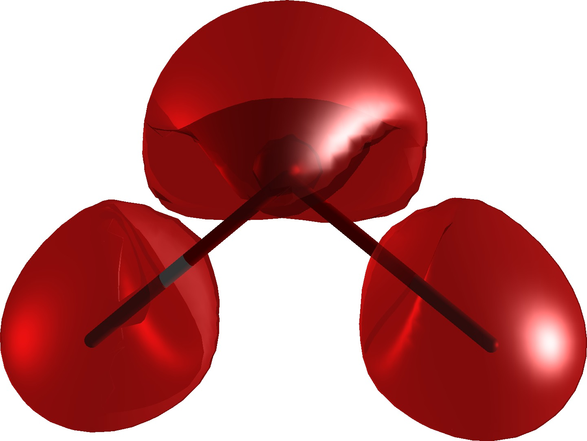

:orphan:

Magnetizability density
=======================

In this tutorial we will plot the CGO magnetizability density of the water
molecule.  We will do this in two steps: first we will run the SCF and response
calculation and save the DFCOEF and PAMXVC files, then we will restart from
these and calculate the magnetizability density on a grid of points and write
this into a cube file which can be opened by your favorite molecular
visualization program (the author of this tutorial likes Avogadro).

Getting the wave function and the response vectors
--------------------------------------------------

Let us use the following molecule input (h2o.mol):

.. literalinclude:: h2o.mol

Together with a simple job input (magnetizability.inp):

.. literalinclude:: magnetizability.inp

We can get the wave function with the following run script:

.. literalinclude:: magnetizability.run

After running the script you should see the files DFCOEF and PAMXVC in your
submit directory.

And here is the magnetizability tensor::

              Total magnetizability tensor (au)
              ---------------------------------

                       Bx                  By                  Bz

  Bx        -1.804460514289     -0.000000000000     -0.000000000001
  By        -0.000000000000     -1.617444735515      0.000000000000
  Bz        -0.000000000001     -0.000000000000     -1.709814652525

Plotting the magnetizability density
------------------------------------

We will use the following run script to generate the cube file:

.. literalinclude:: density.run

Together with the following job input (density.inp):

.. literalinclude:: density.inp

In the output we should verify that we integrate to the correct
isotropic magnetizability::

     scalar              x-component         y-component         z-component
    
  -0.1710573104E+01    0.0000000000E+00    0.0000000000E+00    0.0000000000E+00

Finally you can open plot.3d.cube with your favorite program and visualize the
density. By selectively deactivating contributions in density.inp you can
single out specific components or paramagnetic and diamagnetic contributions
separately.

And this is how the magnetizability density of water looks (isosurface 0.04 a.u.):

