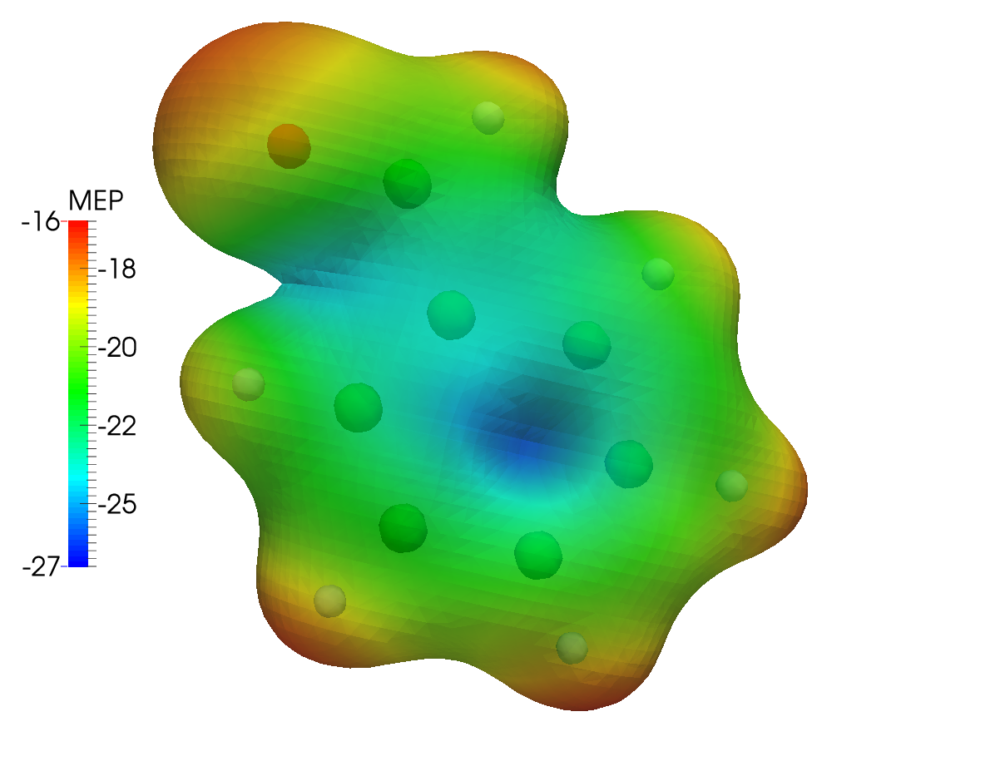
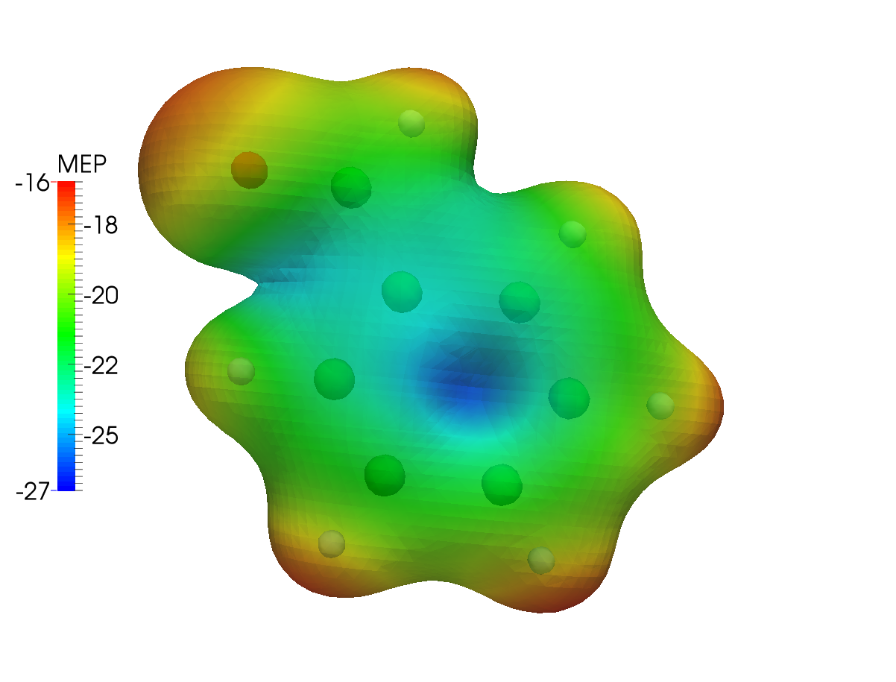
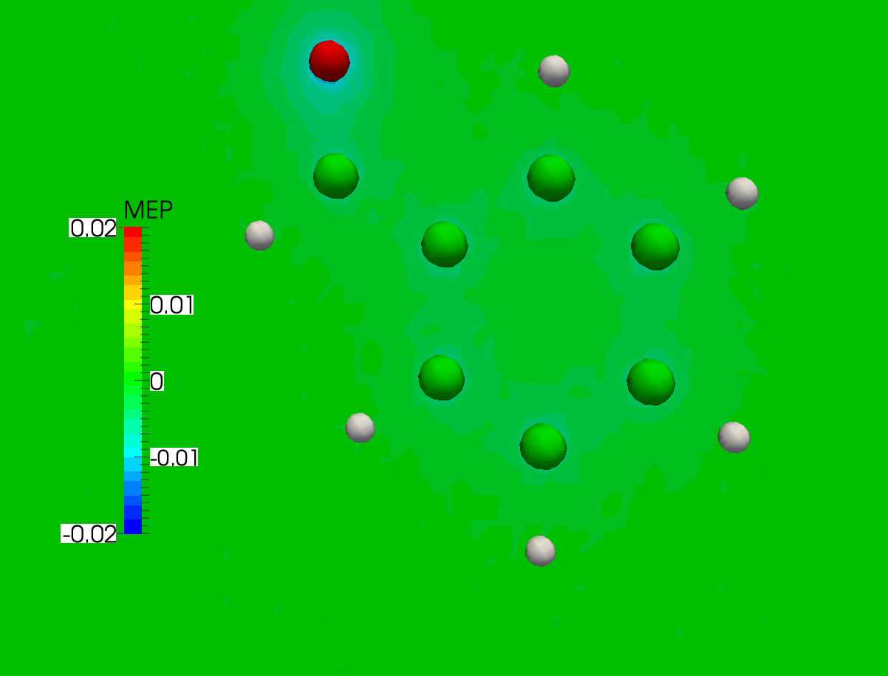

:orphan:
 

Molecular electrostatic potential
=================================

In this tutorial we will go through the steps necessary for the
visualization of the molecular electrostatic potentiali (MEP).
The MEP at a point :math:`\mathbf{r}` in space is:

.. math:: 
   
   \varphi(\mathbf{r}) = \sum_{A=1}^{N_\mathrm{atoms}} \frac{Z_A}{|\mathbf{R}_A - \mathbf{r}|} - \int\mathrm{d}\mathbf{r}^\prime\frac{\rho(\mathbf{r}^\prime)}{|\mathbf{r}-\mathbf{r}^\prime|}

As suggested in the main visualization tutorial, we first need to run an SCF calculation and save
the DFCOEF file. The cube files with the density and the MEP are then obtained.
From these files various plots can be obtained, using your favourite visualization tool.

SCF calculation and density cube file
-------------------------------------

The tutorial will use the benzaldehyde molecule. The file containing the geometry is called
benzaldehyde.mol::

   DIRAC                                               
   Benzaldehyde in 3-21G basis
   For the MEP tutorial
   C   3    0
           1.    6
   H_a          2.95439        1.18571        0.44306
   H_b          2.91616        2.31795       -1.77044
   H_c          0.74709        2.96481       -2.79885
   H_d         -1.38368        2.48172       -1.61822
   H_e         -2.61236        1.60741        0.22943
   H_f          0.82375        0.69840        1.63196
   LARGE BASIS 3-21G
           6.    7
   C_a          0.80849        1.19783        0.65538
   C_b          1.99910        1.47074       -0.01013
   C_c          1.97783        2.10389       -1.24794
   C_d          0.76341        2.46621       -1.82403
   C_e         -0.42791        2.19562       -1.16299
   C_f         -0.41073        1.55949        0.08111
   C_g         -1.70090        1.28473        0.76121
   LARGE BASIS 3-21G
           8.    1
   O_a         -1.79172        0.74000        1.83828
   LARGE BASIS 3-21G
   FINISH

By running::
 
  pam --scratch=/tmp --mol=benzaldehyde.mol --inp=dc_dens.inp --get "DFCOEF" --get "plot.3d.cube=dc_dens.cube"
  
where the dc-dens.inp file contains::

  **DIRAC
  .WAVE FUNCTION
  **WAVE FUNCTION
  .SCF
  **INTEGRALS
  *READIN
  .UNCONTRACT
  **VISUAL
  .DENSITY
   DFCOEF
  .3D
   80 80 80
  .3D_INTEGRATE
  *END OF

we run an SCF calculation using the Dirac-Coulomb Hamiltonian.
The DFCOEF file is then used to obtain the cube file with the density.
Both files are eventually retrieved by the pam script. 

The same is done when using the Levy-Leblond Hamiltonian, as in the ll-dens.inp file::

  **DIRAC
  .WAVE FUNCTION
  **HAMILTONIAN
  .LEVY-LEBLOND
  **WAVE FUNCTION
  .SCF
  **INTEGRALS
  *READIN
  .UNCONTRACT
  **VISUAL
  .DENSITY
   DFCOEF
  .3D
   80 80 80
  .3D_INTEGRATE
  *END OF

you will just need to change the relevant pam command above.

MEP cube file
-------------

Obtaining the MEP cube files requires an input similar to that for the density cube files.
By runnning::
 
  pam --scratch=/tmp --mol=benzaldehyde.mol --inp=dc_mep.inp --put="DFCOEF" --get="plot.3d.cube=dc_mep.cube"

where dc-mep.inp contains::
   
  **DIRAC
  **WAVE FUNCTION
  .SCF
  **INTEGRALS
  *READIN
  .UNCONTRACT
  **VISUAL
  .ESP
   DFCOEF
  .3DFAST
   80 80 80
  *END OF

Notice that no `.WAVE FUNCTION` directive is present, since we are restarting from a DFCOEF file.
Furthermore, the `.3DFAST` directive is used in the `**VISUAL` section.
To run using the Levy-Leblond Hamiltonian, just add the right keyword to the `**HAMILTONIAN` section,
as in ll-mep.inp::
   
  **DIRAC
  **HAMILTONIAN
  .LEVY-LEBLOND
  **WAVE FUNCTION
  .SCF
  **INTEGRALS
  *READIN
  .UNCONTRACT
  **VISUAL
  .ESP
   DFCOEF
  .3DFAST
   80 80 80
  *END OF

Obtaining the plots
-------------------

Once the cube files are ready we can use our favourite program to obtain the plots we need.
In the following the density cube file is referred to as dens.cube and the MEP cube file as mep.cube. 

.. warning:: The values in the cube files are in atomic units! That is :math:`ea_{0}^{-3}` for the density and :math:`E_\mathrm{h}e^{-1}` for the MEP.

In this tutorial `ParaView <http://www.paraview.org/>`_ was used.

.. warning:: The following instructions on how to use ParaView **are not** to be intendend as an exhaustive guide. They were redacted based on the personal experience of the author of this tutorial. Questions regarding the actual visualization of cube files **must** be addressed to the developers of the visualization program used.
           
The most common type of plot involving the MEP is maybe the color-mapping of an isodensity surface.
In ParaView, you will need to load the dens.cube file as base file and draw an isodensity contour. The mep.cube
file is then loaded and its value on that isodensity surface is used as color code:

* load the dens.cube file. In the Pipeline Browser you will see that your file has been loaded. Click on the Apply button; 
* select Output in the Pipeline Browser;
* go to Filters >> Common >> Glyph;
* in Properties >> Glyph Type select Sphere and apply;
* select Gridded Data in the Pipeline Browser;
* go to Filters >> Common >> Contour;
* in Properties select the isovalue you want and apply. The isovalue 0.2 was here selected;
* load the mep.cube file. Click on the Apply button; 
* select Gridded Data for this second file;
* go to Filters >> Alphabetical >> Resample With Dataset;
* in the pop-up window select Input on the left and Gridded Data for the second file on the right;
* now select Source on the left and Contour1 on the right;
* click Apply and you will see the raw result.

To get something better looking:
* click the Toggle Color Legend Visibility button to get a legend (you can change its name and position simply);
* click the Edit Color Map button;
* in the pop-up menu click Choose Preset and pick the color scale you prefer. Here the "Blue to Red Rainbow" has been used;
To save a screenshot, go to File >> Save Screenshot.

This results in the following dc\_dens-mep.png plot, for the Dirac-Coulomb MEP mapped onto an isodensity contour from the same
calculation setup:

The same type of plot is here presented for the Levy-Leblond case:

The differences are not striking: the electronic structure of benzaldehyde is not expected to be strongly affected by 
the inclusion of relativistic effects. As a further example, we can then plot the *difference* between the MEP calculated 
using the Dirac-Coulomb and the Levy-Leblond Hamiltonians.
You will need a way to obtain the difference cube file given the two mep.cube files obtained in the preceding steps
of this tutorial. The cubicle.py script provided `here <https://github.com/rbast/cubicle>`_ works great for this and other similar
types of tasks::

   cubicle.py --calc="1.0*dc_mep.cube -1.0*ll_mep.cube" > dc-ll_mep.cube

Once you have the MEP difference cube file, head over to ParaView and:

* load the dc-ll_mep.cube file. In the Pipeline Browser you will see that your file has been loaded. Click on the Apply button; 
* select Output in the Pipeline Browser;
* go to Filters >> Common >> Glyph;
* in Properties >> Glyph Type select Sphere and apply;
* select Gridded Data in the Pipeline Browser;
* go to Filters >> Common >> Slice;
* in Properties select the slicing plane and apply;
* click Apply and you will see the raw result. The color scale can be changed to your liking.

In the case at hand this results in the following plot. As you can see there is practically no difference
between the two cases:

.. warning:: As pointed out in :cite:`Wheeler2009`, it must always be kept in mind that the MEP at a given point is a weighted average of the charge density over all space.
