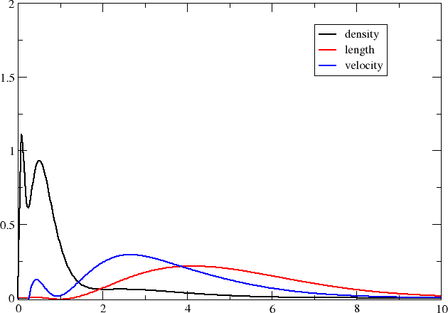
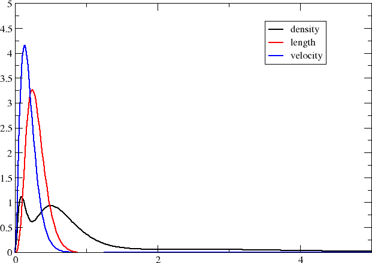

:orphan:

Plotting radial distributions
=============================

In this tutorial we will investigate the valence :math:`3s\rightarrow 3p` excitation of the
magnesium atom and investigate at what radial distances the corresponding electric dipole
transition moments pick up contributions.

Getting the wave function and transition moments
------------------------------------------------

We use the following atom input (Mg.xyz):

.. literalinclude:: Mg.xyz

together with the job input (Exc.inp):

.. literalinclude:: Exc.inp
    
to be discussed below. We run the job using the command ::
		      
   pam --inp=Exc --mol=Mg.xyz --get "DFCOEF PAMXVC"	    

such that we recover both the coefficient file DFCOEF and the file of solution vector PAMXVC.

The magnesium atom is a light atom, so we expect relativistic effects, spin-orbit interaction in particular, to be quite weak, and we can assume more or less pure singlets and triplets. Single excitations :math:`3s\rightarrow 3p` lead to

.. math::

   \left(\begin{array}{c}2\\1\end{array}\right)\left(\begin{array}{c}6\\5\end{array}\right) = 12

microstates, of which 9 are triplets and 3 are singlets. The atomic calculation will be run in the
:math:`D_{2h}` subgroup and we shall focus on excitations :math:`3s\rightarrow 3p` in the irrep     
:math:`B_{3u}`, which is the symmetry of the :math:`x`-coordinate. We start from a closed-shell reference, which is therefore totally symmetric. This means that the symmetry of the excitation is
also the symmetry of the excited state. One should note that the symmetry refers to the *total*	
symmetry, including both spatial and spin symmetry. Singlets :math:`S` are totally symmetric, whereas the components :math:`(T_x,T_y,T_z)` of the triplet transform as the rotations. From further symmetry analysis we deduce that there will be three :math:`3s\rightarrow 3p` excitations :math:`B_{3u}`:
i) a :math:`3s\rightarrow 3p_y` transition of the :math:`T_z` triplet component, 
ii) a :math:`3s\rightarrow 3p_z` transition of the :math:`T_y` triplet component, and 
iii) a :math:`3s\rightarrow 3p_x` transition of singlet character. From Hund's rules we expect the
triplet excitations to be the lowest one and will therefore focus on the third, singlet excitation,
which is not spin-forbidden. Indeed, when we look in the output we find     

.. literalinclude:: exc.snippet

showing that the first two excitations have essentially no oscillator strength, in contrast to the final one. 

Plotting radial distributions
-----------------------------

The oscillator strength is given by

.. math::

   f_{fi}=\frac{2\omega}{\hbar e^2}\left|\langle f|\hat{T}(\omega_{fi})|i\rangle\right|^2 

where the excitation energy is given by :math:`\Delta E = \hbar\omega_{fi}`. Within the electric dipole approximation the 
reduced interaction operator :math:`\hat{T}` is given by 

.. math::

   \hat{T}_{L}=\boldsymbol{\mu}\cdot\boldsymbol{\epsilon};\quad \boldsymbol{\mu}=-e\mathbf{r},

in the length representation and

.. math::

   \hat{T}_{V}=\frac{e}{\omega}c\boldsymbol{\alpha}\cdot\boldsymbol{\epsilon}

in the velocity representation. When the vector :math:`\boldsymbol{\epsilon}` indicating the
(polarization) orientation of the electric field component of the incident light is set to the    
Cartesian unit vector :math:`\boldsymbol{e}_{x}`, the interaction operator span the :math:`B_{3u}` irrep.
These are the operators specified in the input. However, in the velocity representation the reduced 
interaction operator :math:`\hat{T}_{V}` is frequency-dependent, and since we do not know excitation energies
before running our calculation, this part was not specified. The transition moments of the two interaction operators
are therefore strikingly different. However, is we take the transition moment of 0.358852917641 a.u. in the
velocity representation and divide by the excitation energy 0.14917197 a.u., we get 2.4056323560049524 a.u.,
which is rather close to the transition moment of 2.403791564532 a.u. obtained in the length representation.
It is close, but not identical, because we are using *finite* basis sets. The interaction operator in the two
representations may have different basis set requirements and this is what we shall investigate by looking at their
radial distribution.

As a reference we will use the number density of the atom, but we will scale all quantities such that they
integrate to one, in order to facilitate comparison. We start by getting the radial distribution for the
number density. The input (dens.inp) reads

.. literalinclude:: dens.inp

where we scale the density down by the 12 electrons of magnesium. We run the job using::

   pam --inp=dens --mol=Mg.xyz --put DFCOEF --get "plot.radial.scalar=dens.dat"

Next we turn to the transition moment densities. This requires a little bit more thought. 
Let us have a look at the file PAMXVC of solution vectors. This is an unformatted file, but
each entry comes with a label which can be read by the utility program *rspread.x*.
Assuming the program is in your path, you read this information by running::

   rspread.x PAMXVC

The output is

.. literalinclude:: rspread.snippet

Although there are *3* excitations, there are in fact *12* entries. This is because each solution vector is split into 
contributions :math:`E` corresponding to e-e rotations, and contributions :math:`P` corresponding to e-p rotations. 
Each component is further split into contributions :math:`X+` that are time symmetric and contributions :math:`X-`
that are time antisymmetric. The transition moments are obtained by contracting solution vectors with property gradients
(see :cite:`Bast2009` for details). A time-(anti)symmetric operator gives a non-zero contribution only by contraction with
the time-(anti)symmetric part of the solution vector. The reduced interaction operator in the lenght and velocity representations
is time-symmetric and time-antisymmetric, respectively. With this in mind we set up the following input (length.inp) for
generating the radial distribution of the transition moment in the length representation

.. literalinclude:: length.inp

and run the job using::

   pam --inp=length --mol=Mg.xyz --put "DFCOEF PAMXVC" --get "plot.radial.scalar=length.dat"

Using the same reasoning, the input (velocity.inp) for generating the radial distribution of the transition moment in the velocity representation reads

.. literalinclude:: velocity.inp

and we run the job using::

   pam --inp=velocity --mol=Mg.xyz --put "DFCOEF PAMXVC" --get "plot.radial.scalar=velocity.dat"

In both cases the densities are scaled such that the transition moments integrate up to one.
Note that we have to also include a sign change. For the length representation this is because
the keyword *.EDIPX* does not include the negative electron charge. For the velocity representation this is because the keyword *.JX* asks for the density of the :math:`x`-component of the current density, which does include the negative electron charge, whereas the interaction operator in the velocity operator does not. In the output of the first (length) calculation we find::

   The radial distribution integrates to:   0.98530240054333240

The integration is not very precise since the radial integration uses an even-spaced grid. This is why we have also requested proper 3D integration using the (ultrafine) DFT grid. It shows::

           scalar              x-component         y-component         z-component
   
       0.1000000000E+01    0.0000000000E+00    0.0000000000E+00    0.0000000000E+00

showing that the normalization is correct.

We now have three formatted files containing the radial distributions on our specified grid and you may now plot them using your
favourite plotting program (I used `xmgrace <http://plasma-gate.weizmann.ac.il/Grace/>`_ .)

Compared to the number density, the transition moment densities are very diffuse and it is clear that you may need to extend your basis set with diffuse functions in order to properly describe them. We may also note that the transition moment density in the velocity representation is more compact than the one in the length representation; we can in part understand this by the fact that the interaction operator contains a Dirac :math:`\alpha` matrix which couple large components to the rather compact small components.

Before closing it is interesting to compare the above plot with the one obtained by 	    
looking at core excitations :math:`1s\rightarrow 3p` rather than valence :math:`3s\rightarrow 3p` ones.
We straightforwardly obtain these excitations by specifying what occupied orbitals we may excite from in the
excitation energy section, that is::

   *EXCITATION ENERGIES
   .OCCUP
   1
   
   [...]  

This gives the plot below

The transition moment radial distributions are seen to be very much more compact (note the change of axes). We can understand this since the transition moment density now includes a compact core orbital. 
