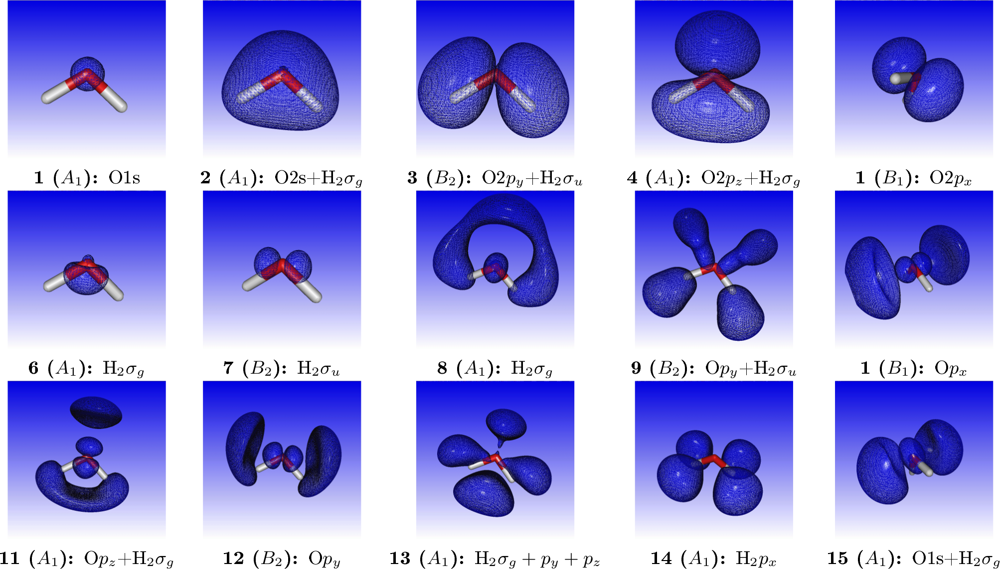

:orphan:
 

Core electron excitations and ionization in H2O at the HF and DFT levels
========================================================================

Introduction
------------

We want to study excitation of the oxygen 1s electron of water.

Restricted excitation window TD-HF (REW-TD-HF)
----------------------------------------------

Starting from the molecular input file `H2O.mol` 

.. literalinclude:: H2O.mol

and the menu file `H2O.inp` 

.. literalinclude:: H2O.inp

we first run a Hartree-Fock calculation of the ground electronic state::

   pam --mol=H2O --inp=H2O --outcmo

From Mulliken population analysis we confirm that the oxygen 1s orbital is the first orbital::

   * Electronic eigenvalue no.  1: -20.581089118212       (Occupation : f = 1.0000)           
   ==========================================================================================
   
   * Gross populations greater than 0.00010
   
   Gross     Total   |    L A1 O  s   
   --------------------------------------
    alpha    1.0000  |      1.0000
    beta     0.0000  |      0.0000

We now focus on electric dipole allowed transitions. The molecular symmetry is :math:`C_{2v}` where the components of the 
electric dipole operator :math:`-e(x,y,z)` span irreps :math:`(B_1,B_2,A_1)`. This leads us
to set up the following input

.. literalinclude:: H2O_O1s.inp

We run our calculation::

   pam --inp=H2O_O1s --mol=H2O --incmo

and find the isotropically averaged oscillator strenghts

.. literalinclude:: H2O_1s_spectrum

where we have added by hand the most important virtual orbitals. 
For reference, orbital densities of the fifteen first canonical HF orbitals of water are given below

We may simulating the spectrum using a Lorentzian lineshape with half-width at half-maximum (HWHM) equal to 0.005 a.u.

Complex response
----------------

We can alternatively obtain the above spectrum from complex response. The isotropically averaged 
ocillator strength associated within the electric dipole approximation is related to the 
isotropic electric dipole polarizability through the relation

.. math::

   f^{iso}\left(\omega\right)=\frac{2m\omega}{\pi e^2} Im\left[\alpha^{iso}\left(\omega+i\gamma\right)\right]

where :math:`\gamma` is a damping parameter corresponding to the half-width at half-maximum (HWHM) of 
the Lorentzian lineshape.

We can calculate the real and imaginary parts of the polarizability by complex response. By choosing a 
frequency window we can directly access the region of the spectrum of interest.

We use the input file

.. literalinclude:: cpp.inp

and the command::

   pam --incmo --mol=H2O --inp=cpp

To get enough data points we do a second run using::

   .FREQ INTERVAL
   20.01 21.0 0.02

Extracting the imaginary part of the frequency-dependent electric dipole polarizatibility and converting to oscillator strength 
we can directly plot the spectrum as below

In the above graph we have also included the results from REW-TDDFT and they completely overlap, except that a keen eyemay note that 
REW-TDDFT is missing the peak around 570 eV, simply because not enough excitations were specified in the input.

Localizing the K edge
---------------------

An interesting question is how to localize the K edge in the XANES spectrum.
A first approximation to the 1s ionization energy is provided by Koopmans' 
theorem. We find :math:`IP_{1s}\approx -\varepsilon_{1s} =` 20.581089 :math:`E_h` = 560.04 eV.
This is singificantly off the value 539.7 eV reported by Kai Siegbahn and co-workers
[*ESCA applied to free molecules* (1969)] :cite:`Siegbahn1969` 
( see also `here <http://srdata.nist.gov/xps/XPSDetailPage.aspx?AllDataNo=21090>`_ ,
but here the work function of the reference metal must be subtracted).
reported by Kai Siegbahn and co-workers in 1977(?). We know that Koopman's theorem ignores correlation and 
orbital relaxation. For valence ionization Koopman's theorem often provides a reasonable approximation 
since the errors tend to cancel each other. For core excitations orbital relaxation dominates such that 
Koopman's theorem greatly overestimates ionization energies. 

To see this we carry our a average-of-configuration (AOC) calculation of the 1s core-ionized system. 
Starting from the coefficients from the neutral system and the input

.. literalinclude:: H2O_1s.inp

and the command::

   pam --incmo --mol=H2O --inp=H2O_1s

we find a total energy of -56.287847 :math:`E_h` for the core ionized system compared to 
-76.115149 :math:`E_h` for the neutral system. This corresponds to a :math:`\Delta` SCF value 
of 539.52 eV for the ionization energy, tantalizingly close to experiment.

In passing we that note that in the first iteration of this calculation we obtain a total energy of -55.534060 :math:`E_h`. 
This is the energy of the core-ionized system obtained using the orbitals of the neutral system. Koopman's theorem is 
obtained by subtracting this energy from the energy of the neutral system. For the neutral system we obtained 
-76.115149  :math:`E_h`, so by taking the difference we obtain 20.581089 :math:`E_h`, which is exactly the *1s* orbital energy 
in the neutral system. 

You should also note that we easily converge to the core-ionized system using reordering and overlap selection: In the input we have specified eight electrons in four inactive (closed) orbitals, followed
by a single electron in an active (open) orbital. We want the O1s to be the active orbital, but this is not achieved automatically since DIRAC will normally order orbitals according to their energy.
We therefore start be reordering the orbitals such that the O1s orbital from the previous calculation on the neutral system comes out on top of the occupied orbitals. However, this is not enough to converge to the desired state since after the first diagonalization DIRAC will again by default order orbitals according to their energy. This is why we use *overlap selection*, that is, we ask DIRAC to
rather order orbitals according to their overlap with some reference orbitals. By default (dynamic overlap selection) this will be the orbitals from the previous iteration. However, in this case we activate *non-dynamic* overlap selection, which means that we order orbitals according to their overlap with the starting orbitals.

 .. note:: Overlap selection is nowadays marketed hard as MOM (Maximum Orbital Method, see :cite:`Gilbert_JPCA2008`), but this method has been included in DIRAC for at least two decades and goes back to the pioneering work of `Paul Bagus <http://cascam.unt.edu/people/psbagus.htm>`_ It was used in :cite:`Bagus_JCP1971`, but not reported explicitly. However, it is for instance documented in the `1975 manual of the ALCHEMY program <http://k-sek01.t-komazawa.ac.jp/msekiya/alchemy/scfm.pdf>`_ (On pdf page 15 you find a description of keyword MOORDR using a "maximum overlap criterion").

The  K edge obtained by :math:`\Delta SCF` does not correspond to that of our TD-HF or complex reponse calculations since they 
only allow linear reponse (orbital relaxation). 

In the figure below we have plotted oscillator strength per atom for 1s core excitation spectrum for
water, taken from the `Gas Phase Core Excitation Database <http://unicorn.mcmaster.ca/corex/cedb-title.html>`_ 
and recorded at 0.7 eV fwhm.

The vertical orange line corresponds to the O1s binding energy reported by Siegbahn and co-workers and 
seems to be too early. We have also plotted the spectrum obtained by REW-TDHF with a Lorentzian wideshape 
corresponding to the fwhm of the experiment. In green we plot the original spectrum, whereas in red it has 
been shifted so that our linear response estimate for the ionization energy has been aligned with the 
experimental O1s binding energy. We can see that the shift improves agreement, but
the spacing and relative intensities of peaks do not agree with experiment.

Static Exchange Approximation
-----------------------------

In order to incorporate orbital relaxation we carry out a STEX calculation.
At the moment symmetry is not implemented, so we turn off symmetry in the nolecular input file

.. literalinclude:: H2O_C1.mol

We then first run the ground state::

   pam --inp=H2O --mol=H2O_C1 --outcmo

followed by the 1s core-ionized state::

   pam --mol=H2O_C1 --inp=H2O_1s --incmo --get "DFCOEF=DFCOEF.ION"

   
We now run STEX using the input

.. literalinclude:: stex.inp

and the command::

    pam --inp=stex --mol=H2O_C1 --put "DFCOEF DFCOEF.ION"

We have plotted the STEX spectrum below together with the experimental one

Switching to DFT
----------------

Let us now look at what we can do with DFT. The first thing to note is that Koopman's theorem does not hold:

+------------------+--------------------------+-------------+-------------+-------------+-------------+-------------+
|                  |                          |  HF(AOC)    |  HF(focc)   |    LDA      |    PBE      |    PBE0     |
+------------------+--------------------------+-------------+-------------+-------------+-------------+-------------+
| Neutral          | Energy                   | -76.115149  | -76.115149  | -75.962033  | -76.438943  | -76.437412  |
+------------------+--------------------------+-------------+-------------+-------------+-------------+-------------+
|                  | :math:`\varepsilon_{1s}` | -20.581089  | -20.581089  | -18.620721  | -18.766629  | -19.223080  |
+------------------+--------------------------+-------------+-------------+-------------+-------------+-------------+
| :math:`1s^{-1}`  | Energy                   | -56.287847  | -55.070646  | -55.980781  | -56.300366  | -56.069079  |
+------------------+--------------------------+-------------+-------------+-------------+-------------+-------------+
|                  | Energy(0)                | -55.534060  | -54.347068  | -55.231846  | -55.540835  | -55.319556  |
+------------------+--------------------------+-------------+-------------+-------------+-------------+-------------+
| :math:`\Delta E` | relax                    | -19.827303  | -21.044503  | -19.981252  | -20.138577  | -20.368333  |
+------------------+--------------------------+-------------+-------------+-------------+-------------+-------------+
|                  | norelax                  | -20.581089  | -21.768082  | -20.730186  | -20.898108  | -21.117856  |
+------------------+--------------------------+-------------+-------------+-------------+-------------+-------------+

+------------------+--------------------------+-------------+-------------+-------------+------------+
|                  |                          |    BP86     |    BLYP     |   B3LYP     |  CAMB3LYP  |
+------------------+--------------------------+-------------+-------------+-------------+------------+
| Neutral          | Energy                   | -76.525093  | -76.508410  | -76.487092  | -76.496078 |
+------------------+--------------------------+-------------+-------------+-------------+------------+
|                  | :math:`\varepsilon_{1s}` | -18.786866  | -18.791935  | -19.145210  | -19.219699 |
+------------------+--------------------------+-------------+-------------+-------------+------------+
| :math:`1s^{-1}`  | Energy                   | -56.366800  | -56.340103  | -56.148003  | -56.115449 |
+------------------+--------------------------+-------------+-------------+-------------+------------+
|                  | Energy(0)                | -55.606191  | -55.582410  | -55.398934  | -55.366886 |
+------------------+--------------------------+-------------+-------------+-------------+------------+
| :math:`\Delta E` | relax                    | -20.158293  | -20.168307  | -20.339089  | -20.380629 |
+------------------+--------------------------+-------------+-------------+-------------+------------+
|                  | norelax                  | -20.918902  | -20.926000  | -21.088158  | -21.129191 |
+------------------+--------------------------+-------------+-------------+-------------+------------+

In the above table the entry `Energy(0)` is the total energy of the core-ionized system calculated using the orbitals of the neutral system.
When we calculate the energy difference between the neutral and core-ionized system using the orbitals of the neutral system we reproduce the 
1s orbital energy to the cited decimals, but this is not the case of any other method, including HF using fractional occupation.

Below we give the :math:`\Delta SCF` numbers is eV. Interestingly AOC-HF at539.5 eV easily  comes closest to the experimental value 539.7 eV.
It can furthermore be seen that :math:`\Delta SCF` values obtained with DFT functionals show the trend LDA < GGA < hybrid with LDA 
closest, but still far from experiment. Switching from average-of-configuration to fractional occupation at the HF level leads to
a dramatic deterioration of the agreement with experiment.

+------------------------------+-------------+-------------+-------------+-------------+-------------+-------------+-------------+-------------+------------+
|                              |  HF(AOC)    |  HF(focc)   |    LDA      |    PBE      |    PBE0     |    BP86     |    BLYP     |   B3LYP     |  CAMB3LYP  |
+------------------------------+-------------+-------------+-------------+-------------+-------------+-------------+-------------+-------------+------------+
| :math:`\varepsilon_{1s}`     |   560.0     |   560.0     |   506.7     |   510.7     |   523.1     |   511.2     |   511.4     |   521.0     |   523.0    |
+------------------------------+-------------+-------------+-------------+-------------+-------------+-------------+-------------+-------------+------------+
| :math:`\Delta E` (relax)     |   539.5     |   572.7     |   564.1     |   568.7     |   574.6     |   569.2     |   569.4     |   573.8     |   575.0    |
+------------------------------+-------------+-------------+-------------+-------------+-------------+-------------+-------------+-------------+------------+
| :math:`\Delta E` (no relax)  |   560.0     |   592.3     |   543.7     |   548.0     |   554.3     |   548.5     |   548.8     |   553.5     |   554.6    |
+------------------------------+-------------+-------------+-------------+-------------+-------------+-------------+-------------+-------------+------------+

At the DFT level we have employed an energy expression based on fractional occupation, which is the model that leads to Janak's theorem, namely that 
the derivative of the energy with respect to occupation number :math:`n_i` gives the energy of the corresponding orbital, that is

.. math:: \frac{dE}{dn_i} = \varepsilon_i

We may investigate Janak's theorem numerically. We set up a script to do DFT calculations with fractional occupation from 1.0 to 1.9 of
the oxygen 1s orbital

.. literalinclude:: janak.sh

and also add the energy of the neutral system to our data set.
We then carry out polynomial fits to various orders and calculate the derivative of the energy at occupation 2.0 with 
respect to 1s occupatio number. We then obtain

+----------------------------+-------------+-------------+-------------+-------------+-------------+-------------+-------------+-------------+------------+
|                            |  HF(AOC)    |  HF(focc)   |    LDA      |    PBE      |    PBE0     |    BP86     |    BLYP     |   B3LYP     |  CAMB3LYP  |
+----------------------------+-------------+-------------+-------------+-------------+-------------+-------------+-------------+-------------+------------+
| 1                          | -19.824314  | -21.044193  | -19.981185  | -20.138613  | -20.368425  | -20.158286  | -20.168248  | -20.339084  | -20.380650 |
+----------------------------+-------------+-------------+-------------+-------------+-------------+-------------+-------------+-------------+------------+
| 2                          | -18.196672  | -20.579045  | -18.618588  | -18.765178  | -19.222619  | -18.785047  | -18.789831  | -19.143977  | -19.218655 |
+----------------------------+-------------+-------------+-------------+-------------+-------------+-------------+-------------+-------------+------------+
| 3                          | -18.220409  | -20.581507  | -18.619168  | -18.764949  | -19.221929  | -18.785159  | -18.790354  | -19.144055  | -19.218529 |
+----------------------------+-------------+-------------+-------------+-------------+-------------+-------------+-------------+-------------+------------+
| 4                          | -18.220112  | -20.581073  | -18.620943  | -18.766866  | -19.223251  | -18.787109  | -18.792168  | -19.145388  | -19.219883 |
+----------------------------+-------------+-------------+-------------+-------------+-------------+-------------+-------------+-------------+------------+
| 5                          | -18.220135  | -20.581093  | -18.620699  | -18.766601  | -19.223061  | -18.786846  | -18.791909  | -19.145191  | -19.219680 |
+----------------------------+-------------+-------------+-------------+-------------+-------------+-------------+-------------+-------------+------------+
| 6                          | -18.220131  | -20.581090  | -18.620724  | -18.766633  | -19.223084  | -18.786872  | -18.791940  | -19.145213  | -19.219703 |
+----------------------------+-------------+-------------+-------------+-------------+-------------+-------------+-------------+-------------+------------+
| 7                          | -18.220130  | -20.581089  | -18.620720  | -18.766628  | -19.223080  | -18.786869  | -18.791934  | -19.145209  | -19.219699 |
+----------------------------+-------------+-------------+-------------+-------------+-------------+-------------+-------------+-------------+------------+
| 8                          | -18.220130  | -20.581089  | -18.620721  | -18.766629  | -19.223080  | -18.786857  | -18.791935  | -19.145210  | -19.219699 |
+----------------------------+-------------+-------------+-------------+-------------+-------------+-------------+-------------+-------------+------------+
| 9                          | -18.220130  | -20.581089  | -18.620721  | -18.766629  | -19.223080  | -18.786879  | -18.791935  | -19.145210  | -19.219699 |
+----------------------------+-------------+-------------+-------------+-------------+-------------+-------------+-------------+-------------+------------+
| :math:`\varepsilon_{1s}`   | -20.581089  | -20.581089  | -18.620721  | -18.766629  | -19.223080  | -18.786866  | -18.791935  | -19.145210  | -19.219699 |
+----------------------------+-------------+-------------+-------------+-------------+-------------+-------------+-------------+-------------+------------+

We see that a linear fit is clearly is insufficient, whereas a quadratic fit is reasonable. However, a 8th order fit is in general needed to converge the
energy derivative to the 1s orbital energy with the cited number of decimals.

